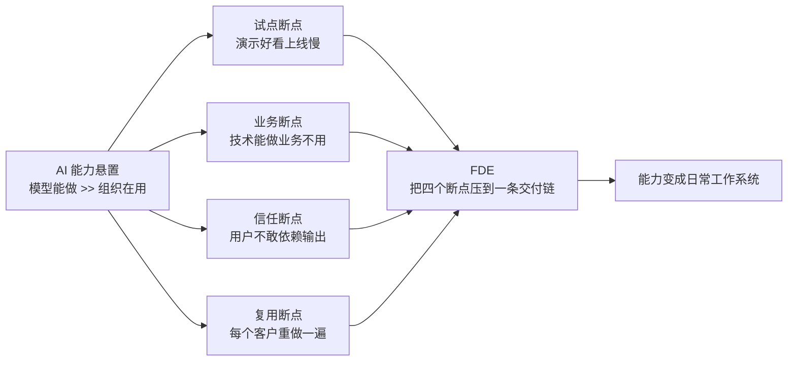

# AI Capability Overhang（AI 能力悬置）

> **模型能力已经存在，但还没有被组织流程、工具、治理和人员充分释放。** —— OpenAI 2026-04 企业 AI 叙事的关键判断，解释了 FDE 为何在此时出现。

来源：黄奕彬《FDE 深度分析 v4》（[[FDE 深度分析 v4：AI 能力悬置时代的现场工程组织接口]]）对 OpenAI 企业 AI 叙事的提炼。

## 定义

**AI Capability Overhang（AI 能力悬置）** 指：前沿 AI 模型已经具备的能力，**超过了多数企业当前真实使用的范围**。瓶颈不在"模型够不够强"，而在"如何让模型可信、合规、可控地嵌入日常工作"。

OpenAI 据此判断企业 AI 已进入新阶段：企业问的不再是如何购买单个 copilot，而是如何让 AI 进入整个业务、成为日常工作的一部分。DeployCo 的设计就是把模型接入客户数据、工具、控制和业务流程。

## 为何重要：它解释了 FDE 的出现

能力悬置是因，[[Forward-Deployed-Engineering]]（FDE）这类"现场工程组织接口"是果。能力悬置意味着存在巨大的**采用缺口（adoption gap）**——模型能做的事远多于组织在用的事。FDE 的全部价值就是填补这个 gap：把悬置的能力翻译成组织日常工作系统。

《FDE 深度分析 v4》用**四个断点**刻画这个 gap 在企业里的具体表现：

FDE 解决的不是某一个断点，而是把四个断点压到同一条交付链里。

## 与 Compensation Surface 的同构

[[Harness Engineering 综述：14 篇工程文章里的 15 个月]] 的核心概念"补偿面（compensation surface）"——harness 每个组件都在补偿模型做不到的事。能力悬置是它的**镜像**：

| | 聚焦 | gap 方向 | 对策 |
|--|------|---------|------|
| **补偿面** | 技术 harness | 模型**做不到**的 | 加 harness 组件 |
| **能力悬置** | 组织采用 | 模型**做得到但组织没用上**的 | 加 FDE / 采用基础设施 |

两者都描述"模型能力与实际使用之间的 gap"，只是一个聚焦技术 harness，一个聚焦组织采用。

## 退出机制：能力悬置如何收敛

能力悬置不会永远存在。它通过组织的**采用基础设施（adoption infrastructure）**逐步消化：
- 评测与回归测试（信任断点）
- 复用手册与可复用组件（复用断点）
- 工作流重设计（业务断点）
- 权限/数据/治理接入（试点→生产）

案例显示这种消化的实际成本：Morgan Stanley 技术脚手架只需 6-8 周，但让财务顾问信任、试点、评测、迭代又花了 ~4 个月——**消化能力悬置的组织成本，远高于技术接入成本**。

## 与现有概念

- [[Forward-Deployed-Engineering]] — 能力悬置的组织解法
- [[Harness Engineering 综述：14 篇工程文章里的 15 个月]] — 补偿面是能力悬置的技术镜像
- [[Agent Macro Evaluation]] — 评测是消化能力悬置（信任断点）的核心机制
- [[FDE 深度分析 v4：AI 能力悬置时代的现场工程组织接口]] — 概念来源
