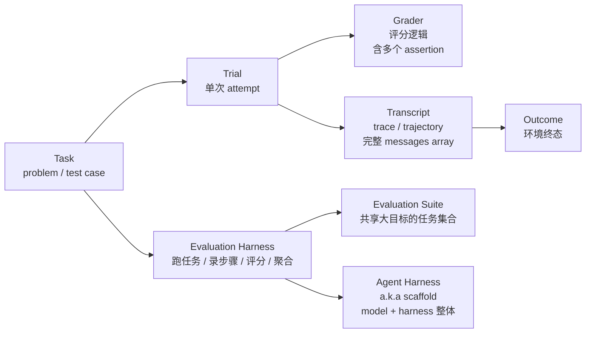

# Agent Evaluation Methodology

> **Agent evaluation methodology**：评估 AI agent 的**元方法论**——定义核心抽象（task/trial/grader/transcript/outcome/harness）、grader 三大类（code-based/model-based/human）、四类 agent 范式（coding/conversational/research/computer-use）、非确定性度量（pass@k vs pass^k）、8 步 0→1 roadmap，以及与其他质量保障方法的 swiss cheese model。代表来源：[Anthropic "Demystifying evals for AI agents"](https://www.anthropic.com/engineering/demystifying-evals-for-ai-agents)（2026-01-09, Mikaela Grace 等 4 人）。

## 定义

Agent evaluation methodology（AEM）= 评估"AI agent 系统"的**元方法论**：它**定义词汇、划分类别、给出路径、连接方法**——是比 [[Eval-Driven Development]]（策略层）和 [[Agent Macro Evaluation]]（诊断层）都更基础的**机制层框架**。

**核心论断**（Anthropic 文章）：

> "Good evaluations help teams ship AI agents more confidently... Evals make problems and behavioral changes visible before they affect users, and their value compounds over the lifecycle of an agent."

> **关键提醒**："When we evaluate 'an agent,' we're evaluating the **harness and the model working together**."——本方法论适用于 agent 系统整体，不是单一模型。

## 核心抽象（Anthropic 定义）



| 抽象 | 定义 | 关键提醒 |
|------|------|----------|
| **Task** | 单次测试，有定义输入 + 成功条件 | a.k.a. problem / test case |
| **Trial** | 单次 attempt；多次 trials 抵消模型随机 | "consistent results" 的来源 |
| **Grader** | 评分逻辑；任务可有多个 grader，每个多个 assertion/check | weighted / binary / hybrid 组合 |
| **Transcript** | 完整 trial 记录（输出 / 工具调用 / 推理 / 中间结果 / 交互）；API 的 messages array | "agent 实际做了什么" 的唯一可信源 |
| **Outcome** | 终态（env 中实际状态） | **与 transcript 分离**：可能 transcript 说"booked"但 outcome 是 DB 中 reservation 不存在 |
| **Evaluation Harness** | 跑 eval 端到端的基础设施 | 提供 instructions/tools，并发跑任务，记录步骤，评分，聚合 |
| **Agent Harness** | a.k.a. scaffold；让 model 表现为 agent 的系统 | **评估 harness + model**——Claude Code 是 flexible agent harness，Anthropic 通过 Agent SDK 复用其 primitives 造"长时运行 agent harness" |
| **Evaluation Suite** | 共享大目标的任务集合 | 客服 suite 可能含 refund / cancellation / escalation |

## Grader 三大类

| 类 | 方法 | 优势 | 弱点 |
|----|------|------|------|
| **Code-based** | string match (exact/regex/fuzzy) · binary test · 静态分析 · outcome verification · tool call verification · transcript analysis | fast / cheap / objective / reproducible / easy to debug | brittle / 缺 nuance / limited for subjective |
| **Model-based** | rubric-based scoring · NL assertions · pairwise comparison · reference-based · multi-judge consensus | flexible / scalable / handles open-ended / captures nuance | 非确定 / 贵 / 需 calibration with humans |
| **Human** | SME review · crowdsourced · spot-check · A/B · inter-annotator agreement | gold standard / matches expert / calibrates model grader | 贵 / 慢 / coverage 受限 / 一致性挑战 |

**每任务评分**三种组合：

```text
Weighted  →  组合分数过阈值
Binary    →  所有 grader 过
Hybrid    →  局部 weighted + 关键点 binary
```

### 选择判据（Step 5 推荐顺序）

**deterministic > LLM > human**——按可用性递降，按成本递增。

反模式：**严格 sequence-of-tool-calls 检查**——agent 经常找合法但 eval 设计者没预料的路径，"**as not to unnecessarily punish creativity, it's often better to grade what the agent produced, not the path it took**"。

**多 component task 给 partial credit**：

> "A support agent that correctly identifies the problem and verifies the customer but fails to process a refund is meaningfully better than one that fails immediately."

**LLM grader 校准技巧**：

1. **给 LLM "Unknown" 出口**——避免幻觉
2. **per-dimension 独立 LLM judge**——避免"一个 judge 评全部"的相互干扰
3. **自然语言 assertions**——比 binary 更 scalable
4. **Pairwise comparison**——captures nuance 但需 calibrate with human

## Capability vs Regression（核心二分）

| 类型 | 问什么 | 起始通过率 | 目标 |
|------|-------|-----------|------|
| **Capability / quality** | "agent 能把什么做好？" | **低** | 给团队"可攀登的山" |
| **Regression** | "agent 还能处理以前能做的吗？" | **接近 100%** | 防后退 |

**生命周期**：launch 后，capability eval 高通过率可"毕业"为 regression suite 持续跑——"Can we do this at all?" 过渡到 "Can we still do this reliably?"。

**与 [[Eval-Driven Development]] 的对应**（Madhuguru 4 类 ladder）：

```text
Hill-climb eval   ↔  Capability eval（持续刷新）
Regression eval   ↔  Regression eval（每次改动）
Smoke test        ↔  Binary critical-path 评估（错不起）
Launch eval       ↔  接近线上流量的真实场景
```

## 4 类 Agent 评估范式

| 范式 | 评估难点 | 核心方法 | 代表 benchmark |
|------|----------|----------|---------------|
| **Coding agents** | 软件天然 deterministic | unit tests 为主 + LLM rubric for code quality | SWE-bench Verified（40% → >80% 一年内）, Terminal-Bench |
| **Conversational agents** | interaction quality 本身是评估对象 | outcome + transcript constraint + LLM rubric；**需第二个 LLM 模拟用户** | 𝜏-Bench → τ2-Bench（retail / airline booking） |
| **Research agents** | 质量相对性最强 | groundedness + coverage + source quality + exact match + LLM judge；**rubric 频繁 calibrate with expert** | BrowseComp（needle in haystack） |
| **Computer use agents** | GUI 交互的复杂性 | 真实/sandbox 环境 + outcome check | WebArena（browser）, OSWorld（full OS） |

### Coding agents 详解

**Why simple**：软件天然 deterministic——code 跑得通 + test 过 = 通过。

**SWE-bench Verified 给 agents GitHub issues of popular Python repos + grades solutions by running test suite**；LLMs 一年内从 40% → >80%。

**Terminal-Bench 不同 track**：端到端技术任务（从源码构建 Linux kernel / 训练 ML 模型）。

**Coding eval YAML 模板**：

```yaml
task:
  id: "fix-auth-bypass_1"
  graders:
    - type: deterministic_tests
      required: [test_empty_pw_rejected.py, test_null_pw_rejected.py]
    - type: llm_rubric
      rubric: prompts/code_quality.md
    - type: static_analysis
      commands: [ruff, mypy, bandit]
    - type: state_check
      expect:
        security_logs: {event_type: "auth_blocked"}
    - type: tool_calls
      required:
        - {tool: read_file, params: {path: "src/auth/*"}}
        - {tool: edit_file}
        - {tool: run_tests}
  tracked_metrics:
    - type: transcript
      metrics: [n_turns, n_toolcalls, n_total_tokens]
    - type: latency
      metrics: [time_to_first_token, output_tokens_per_sec, time_to_last_token]
```

### Conversational agents 详解

**Anthropic 内部对齐审计 agents**（[alignment auditing agents](https://alignment.anthropic.com/2025/automated-auditing/)）：用第二个 LLM 模拟用户，**延长对抗对话压力测试模型**。

**多维度评估样例**（support refund 场景）：

```yaml
graders:
  - type: llm_rubric
    rubric: prompts/support_quality.md
    assertions:
      - "Agent showed empathy for customer's frustration"
      - "Resolution was clearly explained"
      - "Agent's response grounded in fetch_policy tool results"
  - type: state_check
    expect:
      tickets: {status: resolved}
      refunds: {status: processed}
  - type: tool_calls
    required:
      - {tool: verify_identity}
      - {tool: process_refund, params: {amount: "<=100"}}
      - {tool: send_confirmation}
  - type: transcript
    max_turns: 10
```

### Research agents 详解

**复合 grader 策略**：

```text
Groundedness check:  claims 是否被 sources 支持
Coverage check:      good answer 必须包含的关键事实
Source quality check: consulted sources 是否权威（而非"第一个检索到"）
Exact match:         "Q3 营收 = $X" 这种客观题
LLM judge:           flag unsupported + 检查 gaps + 评估 coherence
```

**关键**：**LLM rubric 必须频繁 calibrate against expert human judgment**。

### Computer use agents 详解

**Browser use 的效率 trade-off**（Claude for Chrome 内部发现）：

```text
DOM-based:   快 / token 重
Screenshot:   慢 / token 轻
Wikipedia 摘要 → DOM 提取
Amazon 找笔记本壳 → screenshot（DOM 太重）
```

**OSWorld 检查清单**：文件系统状态 / 应用配置 / 数据库内容 / UI 元素属性。

## 非确定性度量：pass@k vs pass^k

| 度量 | 测什么 | 公式直觉 | 何时用 |
|------|------|---------|-------|
| **pass@k** | *k* 次内至少 1 次成功的概率 | "shots on goal" | coding 等"对一次就行"；k=1 = 首次成功率 |
| **pass^k** | *k* 次全部成功的概率 | per-trial p^k；75% × 3 = 42% | 客户面向 agent 等"必须可靠" |

**两者都重要**——选哪个取决于产品要求。

**与 [[Agent Reliability vs Capability]] 关系**：pass^k 是固定 k 的 reliability 切片，RDC（reliability decay curve）是 k → ∞ 的 reliability 极限。

## 8 步 Roadmap（0 → 1）

### Step 0–3：早期数据集搭建

| 步 | 关键动作 |
|-----|---------|
| **Step 0: Start early** | **20-50 个真实失败的简单 task = 良好起点**——不要等"几百个 task"；早期 impact 大，小样本足够；产品要求直接翻译为 test cases |
| **Step 1: Start with what you already test manually** | release 前手动检查 + bug tracker + support queue → 转化为 test cases；按 user impact 排序 |
| **Step 2: Write unambiguous tasks with reference solutions** | **两个 domain expert 独立给出相同 pass/fail 判定 = 好 task**；每个 task 应有 reference solution 证明 task 可解 + grader 配置正确；"0% pass@100 是 task 坏了不是 agent 蠢"——重新检查 task spec |
| **Step 3: Build balanced problem sets** | 单边 eval = 单边优化；class-imbalanced 警惕——Claude.ai web search eval 同时测"该搜的"（天气）和"不该搜的"（"Apple 谁创立"），反复 refine |

### Step 4–5：Harness + Grader 设计

| 步 | 关键动作 |
|-----|---------|
| **Step 4: Build robust eval harness with stable environment** | 每次 trial = isolated 干净环境；共享 state（leftover files / cached data / resource exhaustion）引入基础设施噪声；**警告**：agent 通过看 git history 获取不公平优势已观察到 |
| **Step 5: Design graders thoughtfully** | 推荐顺序：**deterministic > LLM > human**；避免 rigid sequence check；多 component task 给 partial credit；LLM grader calibrate with humans；给 LLM "**Unknown**" 出口；per-dimension 独立 LLM judge |

**Eval 失真经典案例**：

- **Opus 4.5 CORE-Bench 42 → 95%**：grading bug 期望 "96.124991…" 但评分严格等于 "96.12" 的也算错 + 任务 spec 模糊 + 任务不可复现
- **METR time horizon benchmark**：misconfigured tasks 要求"超阈值"但模型按指令 optimize 到阈值就被罚分；Claude 因遵循指令被罚，"忽略目标的"模型拿更高分

→ **Make your graders resistant to bypasses**——task + grader 设计要让"通过"真正需要"解决问题"。

### Step 6–8：长期维护

| 步 | 关键动作 |
|-----|---------|
| **Step 6: Check the transcripts** | **失败是否"公平"**——是 agent 真错还是 grader 拒了合法解；不读 transcripts 就不知道 eval 在测什么 |
| **Step 7: Monitor for capability eval saturation** | 100% 通过 = regression only；SWE-Bench Verified 30% → >80% 接近饱和；Qodo 案例：自建 agentic eval framework 才看清进步 |
| **Step 8: Keep eval suites healthy** | 专门 evals 团队管核心基础设施 + 领域专家 / product teams 贡献 task 并自跑；**eval-driven development = 默认** |

**Eval-driven development 实践**：

> "Capability evals that start at a low pass rate make this visible. When a new model drops, running the suite quickly reveals which bets paid off."

**组织配置**：

> "With current model capabilities, product managers, customer success managers, or salespeople can use Claude Code to contribute an eval task as a PR—let them! Or, even better, actively enable them."

## Swiss Cheese Model（与其他方法组合）

无单一方法能 catch 所有问题；多层组合：

| 方法 | 优势 | 弱点 |
|------|------|------|
| **Automated evals** | 快 / 完全可复现 / 无用户影响 / 每个 commit 可跑 / 大规模 | 前置投入 / 需随产品演进维护 / 可能 false confidence |
| **Production monitoring** | 揭示真实用户行为 / 抓合成 eval 漏的 / 真实性能 ground truth | 被动 / 用户先碰到问题 / 信号噪声 / 缺 ground truth |
| **A/B testing** | 真实用户 outcome / 控制混淆 / 可规模化系统化 | 慢 / 只测 deploy 了的 / 不能直接看 "why" |
| **User feedback** | 暴露未预料问题 / 真实例子 / 关联产品目标 | 稀疏 / 偏严重问题 / 不解释 why |
| **Manual transcript review** | 培养 failure mode 直觉 / 抓 subtle / 校准"好"标准 | 时耗 / 不 scalable / 覆盖不一致 |
| **Systematic human studies** | gold standard / 处理模糊任务 / 改进 model grader | 贵 / 慢 / 域专长要求 |

**生命周期映射**：

```text
Pre-launch / CI/CD:     Automated evals (首选 + 模型升级第一道防线)
Post-launch:            Production monitoring (drift 检测)
Significant changes:    A/B testing (足够流量后)
Ongoing:                User feedback + transcript review (sample weekly)
Subjective calibration: Systematic human studies (reserve)
```

**与 [[Harness Cybernetics]] 的对偶**：swiss cheese 各层 ≈ harness 各 feedback Sensors——前馈 Guides（preventive）+ 反馈 Sensors（calibrative）组合覆盖各类失败。

## 附录：Eval Frameworks

| 框架 | 定位 | 何时选 |
|------|------|--------|
| **Harbor** | containerized agent + 大规模 trial + Terminal-Bench 2.0 标准 | 跨云跑大规模 trial |
| **Braintrust** | offline eval + production observability + experiment tracking；autoevals library | 同一平台兼顾开发 + 生产 |
| **LangSmith** | tracing + offline/online eval + dataset 管理；LangChain 紧集成 | 已在 LangChain 生态 |
| **Langfuse** | self-hosted 开源版 | 数据驻地 / 合规要求 |
| **Arize Phoenix** | 开源 LLM tracing/debug/offline+online eval；AX 是 SaaS 扩展 | 开源 + 调试场景 |

**关键提醒**："**Frameworks are only as good as the eval tasks you run through them.**"——快速选个 fit 的，把精力投入 task + grader 本身。

## 与本 Wiki 的关联

| AEM 概念 | 关联 Wiki |
|---------|----------|
| **核心抽象（task/trial/grader/transcript/outcome/harness）** | [[Stateless Reducer]]——两者都把 agent 当 reducer；AEM 是"评估 reducer"的元方法论 |
| **"评估 harness + model 而非 model"** | [[Agent Runtime]] 98.4% 基础设施法则的官方呼应 |
| **Grader 三大类** | [[Worker Verifier 对抗循环]]——Verifier 是 agent 式 grader，Anthropic LLM judge 是 grader；model-based 评 model-based 是核心递归 |
| **Capability vs Regression** | [[Eval-Driven Development]]（Madhuguru）——4 类 ladder 对应；[[Agent Reliability vs Capability]]——RDC 与 capability decay |
| **pass@k vs pass^k** | [[Agent Reliability vs Capability]]——RDC（reliability decay curve）是 pass^k 的极限形式 |
| **Step-level transcript** | [[Trajectory Handoff]]——传 context window 不传 plan 的同源；step-level eval 是 trajectory 评估的核心 |
| **Coding agents eval (SWE-bench)** | [[Agent Runtime]]——Cline 74.2% vs Claude Code 69.4% benchmark 实证；[[Dive into Claude Code（论文）]]——Claude Code 架构 |
| **Conversational agents 模拟用户** | [[Multi Agent 协作模式]]——Orchestrator-Worker 评估场景；[[Tournament Mode]]——pairwise 比较的对话版 |
| **Research agents 复合 grader** | [[Agent Macro Evaluation]]——trace + LLM judge + 聚类的复合策略；研究 vs 客服研究模式 |
| **Computer use agents** | [[Agent Secure Runtime]]——sandbox 隔离 + 权限分级；DOM vs screenshot 效率 trade-off 与 [[Context Engineering]] 的"token budget"同源 |
| **Opus 4.5 CORE-Bench 案例** | [[Anthropic]] entity 页——产品演化叙事；与 [[Agent Evaluation Methodology]] 自身的"eval 失真"研究问题 |
| **Swiss cheese model** | [[Harness Cybernetics]]——双层对偶的工程化实现；本 wiki [[Agent Harness 治理协议]] 双层验证 + CI wiki quality gate |
| **Eval-driven development** | [[Building Verification Loops in Claude Code]]——verification loop 是 eval-driven 的产品实现 |
| **Eval task = spec stress test** | [[Forward Deployed Engineering]]——deploy before spec final 在质量层 |
| **Eval task PR by PM/CSM/sales** | [[Finding Your Unknowns]]——reduce unknowns 的工程化实现 |

## 落地清单

把 AEM 迁移到自己的 Agent 系统：

1. **建立 8 个核心抽象的清晰词汇表**——task / trial / grader / transcript / outcome / eval harness / agent harness / suite
2. **每个 eval 任务有 reference solution**——证明 task 可解 + grader 配置正确
3. **从 20-50 个真实失败起步**——避免"几百个 task"起步陷阱
4. **建 balanced problem sets**——避免单边 eval 制造单边优化
5. **每次 trial isolated 干净环境**——避免共享 state 引入基础设施噪声
6. **Grader 设计遵循：deterministic > LLM > human**——按可用性递降
7. **给 multi-component task partial credit**——避免"全有或全无"信号丢失
8. **LLM judge 给 "Unknown" 出口 + per-dimension 独立 judge**——避免幻觉与相互干扰
9. **每个改动跑 regression eval**——保证"今天的产品没坏"
10. **定期读 transcripts**——失败是否"公平"靠 transcripts 验证
11. **监控 capability eval 饱和**——饱和时升级难度 / 换任务
12. **维护 eval suite**——专门 evals 团队 + 领域专家贡献
13. **把人 / 产品团队拉进 eval task 贡献**——Claude Code PR 流程
14. **组合多层方法**——swiss cheese model：automated + production + A/B + feedback + transcript + studies

## 关键洞察

1. **"评估 harness + model 而非 model"是核心世界观**——和 [[Agent Runtime]] 98.4% 法则、[[Dive into Claude Code（论文）]] 的"minimal scaffolding + maximal operational harness" 是同一论点。
2. **8 步 roadmap 把"评估"从"测试"提升为"开发循环"**——eval-driven development 是产品 spec 的 stress test，把"我们以为产品该做什么"变成"可验证的"。
3. **Grader 三大类的递归性**：model-based grader 评 model-based agent——**LLM judge 自身需要 calibration with humans**——这是 eval 系统永远存在的 calibration chain。
4. **Transcript 是评估的唯一可信源**——outcome 可能与 transcript 矛盾（"booked" vs DB reservation）；读 transcripts 是 "eval 是否公平" 的唯一验证——与 [[Trajectory Handoff]] 的"trajectory 是 contract" 同源。
5. **Opus 4.5 CORE-Bench 案例的价值**：42 → 95% 不是模型进步——**是 eval 修复**——揭示了 AI 评测领域的"**eval 失真**"是隐性失败模式，需要主动管理。

## Open Research Questions

- **Eval calibration chain 能否形式化？** model judge → human judge → SME judge 的多层 calibration 与 [[ESAA]] boundary contracts 的对应
- **Step-level transcript 与 step-level eval 的 token 成本平衡？** 与 [[Multi Model Ensemble]] "增益扣算力" 研究问题
- **Eval task 与产品 spec 的边界？** eval task 太细 → 维护成本；太粗 → 失真——与 [[Eval-Driven Development]] 的 Goldilocks 同向
- **Capability vs Regression 是否存在第三类？** "**Stability eval**"（同一 task 多次 trial 的结果分布）——pass^k vs pass@k 的第三维
- **Eval saturation 的自动化检测与升级？** 当前主要靠人工；与 [[Agent Reliability vs Capability]] 的"reliability 探测" 同源
- **AEM 是否可工程化为 schema？** 类似 [[ESAA]] boundary contracts；与 [[Agent Harness 治理协议]] 的概念节点演化同向

## Related Concepts

- [[Eval-Driven Development]] — Madhuguru 系列的核心方法论；AEM 是机制层，EDD 是策略层
- [[Agent Macro Evaluation]] — OpenAI 群体诊断视角；AEM 是元方法论，Macro Eval 是诊断层
- [[Agent Reliability vs Capability]] — pass@k vs RDC 与 AEM 的 pass@k vs pass^k 同源
- [[Worker Verifier 对抗循环]] — Agent 式 grader；AEM 的 LLM judge 是 model 式 grader
- [[Harness Cybernetics]] — 双层对偶的工程化实现，swiss cheese 的 harness 版
- [[Trajectory Handoff]] — step-level transcript 评估的同源
- [[Building Verification Loops in Claude Code]] — AEM 的产品实现（Anthropic 内部）
- [[Andrew Ng AI Engineering Skills Map (5 篇)]] — EDD / eval-driven 是 Ng 自评"最区分优秀 AI 工程师的技能"
