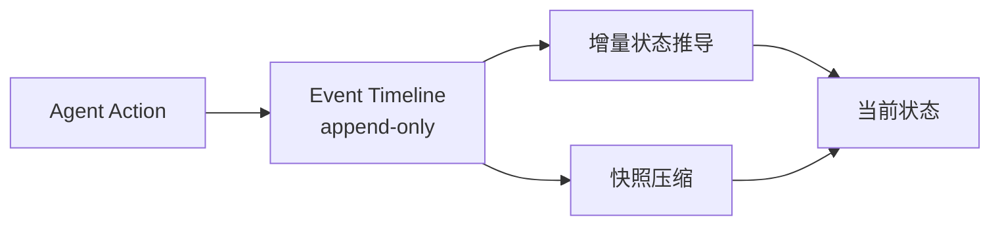
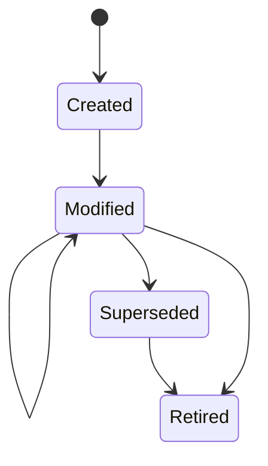
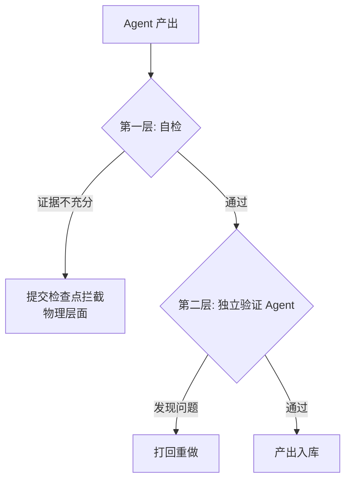
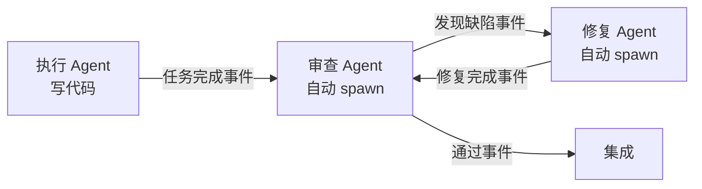

# Agent Harness 治理协议

## 定义

Agent Harness 治理协议解决的核心问题是：**跨 session、跨 agent 的长期一致性**。

现有工具（[[wow-harness]]、Claude Code、Superpowers）都在优化单次体验。但真实项目跑几十次、几百次，不同的 session 和 agent 之间怎么保持一致？治理协议就是这个层面的工程方案。

> "Dive into Claude Code"论文（[[Dive into Claude Code（论文）]]）源码级分析证实：Claude Code 98.4% 是运行基础设施，只有 1.6% 是 AI 决策逻辑。套具比模型重要。

## 五个核心机制

### 1. 事件时间线（Event Timeline）

所有 agent 产出作为事件写入只追加、不可篡改的时间线。时间线是系统的唯一真相来源。

配套机制：
- **增量状态推导** -- 不需要每次从头扫描全量事件
- **定期快照压缩** -- 保留可追溯性，减少存储负担

与 "Dive into Claude Code" 论文识别的 **append-only durable state** 设计原则一致：Claude Code 的 session transcripts 也是 mostly append-only JSONL。

ESAA 论文（[[ESAA]]）从学术角度验证了这一机制：ESAA 的 event store (`activity.jsonl`) 同样是 append-only immutable log，当前状态通过 deterministic projection 从日志推导，并通过 SHA-256 hash 验证投影一致性。

### 2. 概念节点生命周期（Concept Lifecycle）

每个工程概念（API 定义、数据结构、命名约定、架构决策）是一个独立节点，拥有生命周期状态机：

两个关键约束：
- **自动传播** -- 概念被替换时，系统自动扫描"谁还在用旧版本"并通知
- **新颖性检查** -- 替换操作必须说明引入了什么之前没有的新信息，"我觉得新名字更好"不算

新颖性检查直接解决**振荡问题**：同一个设计在两个版本之间来回改，每次改回去的 agent 都不知道之前为什么改走。

### 3. 双层验证（Dual-Layer Verification）

与 [[Worker Verifier 对抗循环]] 的区别：

| 维度 | Worker/Verifier 对抗循环 | 双层验证 |
|------|-------------------------|----------|
| 验证者 | 对抗角色（挑刺） | 独立角色（交叉验证） |
| 权限控制 | 角色分离 | Schema 级限制（无写权限） |
| 拦截方式 | 状态机流转 | 物理拦截提交检查点 |
| 与 Superpowers 关系 | N/A | 替代 prompt 层面的"建议自检" |

**物理拦截 vs prompt 层面**：Superpowers 在提示词层面要求 Claude 遵守纪律，Claude 理论上可以"合理化"自己不遵守。v3 的检查点是物理拦截：自检不过就提交不了。

ESAA 的 **boundary contracts** 机制与双层验证的 schema 级权限限制同构：ESAA 通过 `AGENT_CONTRACT.yaml` 硬禁止 agent 直接写文件（`file.write`），agent 只能 emit structured intentions 由 orchestrator 验证后执行。

### 4. 自动扩张任务图（Auto-Expanding Task Graph）

核心设计：
- **事件触发驱动** -- 节点完成产出事件，系统自动检查应触发哪个下游节点，自动 spawn 新 agent session
- **无状态 session** -- 每个 agent 不继承前一个 session 的偏见，拿到上下文胶囊独立判断
- **上下文胶囊** -- 系统为每个 agent 精确组装的上下文（概念、约束、引用关系），从 artifact 出发工作

与 [[Multi-Agent 协作模式]] 现有模式的区别：

| 维度 | Orchestrator/Specialist | Worker/Verifier | 自动扩张任务图 |
|------|------------------------|-----------------|---------------|
| 调度 | 中央协调 | 状态机 | 事件驱动自动扩张 |
| 并行 | 部分支持 | 批次并行 | 天然支持 |
| 回路 | 无回头 | 打回重做 | 修复 → 闭合验证循环 |
| 跨任务感知 | 无 | 无 | 概念冲突检测 |

### 5. 人机决策分层（Human-AI Decision Splitting）

| 决策类型 | 处理方式 | 交互方式 |
|---------|---------|---------|
| 工程实施（怎么写、怎么测、怎么部署） | AI 自己做，不问人 | 无需人工 |
| 语义判断（产品方向、不可逆操作、价值取向） | 升级到系统所有者 | 用产品语言描述，列出选项和代价 |

系统所有者的判断本身也是事件，写入时间线、永久留痕。

## Related concepts

- [[Agent Runtime]] -- 单 Agent 执行环境，治理协议的上层建筑
- [[Multi-Agent 协作模式]] -- 多 Agent 协作的基础模式
- [[Worker Verifier 对抗循环]] -- 双层验证的对比参照
- [[wow-harness]] -- 治理协议的具体实现
- [[Dive into Claude Code（论文）]] -- 源码级逆向分析，验证 append-only / minimal scaffolding 等设计原则
- [[ESAA]] -- Event Sourcing + CQRS 应用于 agent 生命周期的学术验证，与事件时间线和 boundary contracts 同构
