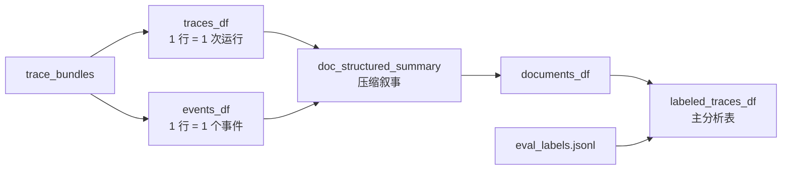
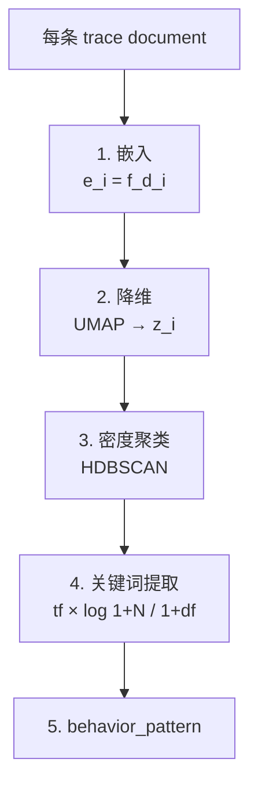

# Agent Macro Evaluation

> **宏观评估**：当一个多智能体系统出问题时，不只看某一次回答错在哪里，而是把成百上千次运行轨迹放在一起，找出反复出现的系统性行为模式。

## 定义

Agent Macro Evaluation（宏观评估）是把**底层评估的局部信号**聚合成**群体行为模式**的方法论。它与传统的 per-response 评分（micro-eval）形成互补：

| 层级 | 单位 | 回答的问题 | 工具 |
|------|------|-----------|------|
| **底层评估** (Lower-level / Micro) | 单次运行 | 这一次输出哪里有局部风险？ | Promptfoo、规则评分、LLM-as-Judge |
| **宏观评估** (Macro) | 多次运行的群体 | 系统级反复出现什么行为模式？哪个模式优先排查？ | 聚类（BERTopic-style）+ 图回溯（AgentTrace-style） |

> 核心论断：**底层评估提供信号；宏观评估判断这些信号是否组成系统性模式。**

## 四层标签心智模型

```text
case_type → run_outcome → eval_finding → behavior_pattern
业务场景  → 运行结局   → 局部症状   → 群体模式
```

| 标签 | 含义 | 在工作流中的角色 |
|------|------|-----------------|
| `case_type` | 业务场景（如简单订单 / 定价异常 / 供应替换 / 区域合规） | 描述 agent 行动前的设置 |
| `run_outcome` | 运行如何结束（completed / awaiting_review / blocked / failed） | 描述结局 |
| `eval_finding` | 来自 Promptfoo 或运行时证据的局部信号 | 描述局部症状 |
| `behavior_pattern` | 通过聚类发现的群体级反复模式 | 描述宏观模式 |

## 数据基础

宏观评估依赖完整的运行证据，不是聊天记录：

| 文件 | 内容 | 作用 |
|------|------|------|
| `trace_results.jsonl` | 每次运行的结果摘要（run_id, scenario, status 等） | 主元数据源 |
| `run_summary.json` | 整批运行的整体摘要 | 批次级对账 |
| `trace_bundles.zip` 或 `trace_bundles/` | 每次运行的完整证据包 | 主分析输入 |
| `eval_labels.jsonl` | Promptfoo 的底层评分结果 | 底层信号 |
| `trace_snapshot.sqlite` | 可选 SQLite 快照 | 元数据增强 |

每个 `bundle` 包含：

- **`run`** — 运行/trace 编号、终态、订单上下文
- **`events`** — 标准化事件流（状态变化、交接、工具调用、模型响应、findings）
- **`spans`** — 底层 SDK trace 片段（用于还原模型/工具/handoff 结构）
- **`environment_events`** — 外部环境信号（关税、促销、缺货、竞品压力、产能）
- **`review_packet`** — 复核记录（findings、推荐动作、允许动作、复核状态）
- **`snapshots`** — 可选库存/产能快照

> 关键：宏观评估能发现的模式 ≤ 文档保留下来的信息。如果 trace 文档里没有 handoff，就发现不了路由模式；没有环境信号，就发现不了市场漂移问题。

## 分析数据集结构



`doc_structured_summary` 是为聚类算法设计的压缩文档，保留：业务场景、运行结局、激活的专家、关键交接、外部环境信号、复核/失败标记、状态转移摘要。

## 严重度与影响分

```text
trace_impact_score = severity_weight × (1 + findings_count) × (1 + loop_count / 4)
```

| 终态分组 | 严重度标签 | 权重 |
|---------|-----------|------|
| `successful_completion` | low | 1.0 |
| `review_escalation` | medium | 2.0 |
| `in_progress` | medium | 1.5 |
| `blocked` | high | 2.5 |
| `hard_failure` | high | 3.0 |

Trace 级影响分用于**排查优先级**，不是风险证明。

## BERTopic 风格的模式发现



**步骤详解**：

1. **嵌入**：`e_i = f(d_i)`，每条 trace document 转成向量
2. **降维**：UMAP 把高维向量映到低维，让相似 trace 靠近
3. **聚类**：HDBSCAN 找密度簇，离群点标为 topic id `-1`
4. **关键词**：`score(t, k) = tf(t, k) × log((1 + N) / (1 + df(t)))`，提取簇 k 中区分性词
5. **解释**：把每个簇命名为一个 `behavior_pattern`

**模式级影响分**：

```text
impact_score(k) = prevalence_share(k) × severity_weighted_prevalence(k)
```

- `prevalence`：模式有多常见
- `severity_weighted_prevalence`：模式中运行的平均严重度
- 高 impact 模式 = 又常见又可能有后果，**值得优先让人看**

## 切片与 Lift：模式集中在哪里

```text
lift = slice_pattern_share / overall_pattern_share
```

| `lift` | 含义 |
|--------|------|
| `> 1` | 模式在该切片里集中 |
| `= 1` | 模式在该切片里和整体差不多 |
| `< 1` | 模式在该切片里不突出 |

常见切片：`case_type`、`agent_version_set`、`orchestrator_mode`、`market_regime`、`price_regime`、`schedule_regime`、`review_status`。

> **业务含义**：一个履约路由模式如果集中在 `supplier_substitution_compound` → 检查供应商替换工具与履约策略；如果集中在 `clean_simple` → 系统对简单订单过度复杂化。

## AgentTrace 风格的根因诊断

发现高影响模式后，对其代表性 trace 做执行图回溯：

```text
G = (V, E)
V = 事件节点（状态变化 / 工具调用 / 交接 / 模型响应 / 复核标记）
E = 时序、交接、工具调用上下文
```

**Focus event（诊断锚点）**——常见类型：

| 锚点 | 含义 |
|------|------|
| review finding | 复核或评分发现问题 |
| review required / awaiting_review | 流程暂停等待复核 |
| failed / blocked | 终态降级 |
| triage route / reroute | 工作流换路或换 owner |
| tool warning / policy marker | 结构化工具暴露风险 |

**Suspect score（嫌疑分）**：

```text
suspect_score = 0.4 × proximity + 0.3 × frequency + 0.2 × bridge + 0.1 × role
```

| 分量 | 含义 |
|------|------|
| `proximity` | 离锚点越近越值得看 |
| `frequency` | 在同模式多条 trace 中越常出现越值得看 |
| `bridge` | 是否连接执行图关键路径 |
| `role` | 节点 agent/工具角色与问题相关性 |

> 这不是因果证明，是**排查排序**。把"模式很重要"推进到"先查哪些 agent / 工具 / 交接 / 复核策略"。

## 阅读诊断结果的原则

如果嫌疑榜首是 `eval/review signal`，它通常**只是问题被发现的位置，不是根因**。真正可操作的是周围的业务事件：

1. 编排器是否把订单交给了正确专家？
2. 某个工具输出风险信号但后续没用？
3. 某次 handoff 发生得太早或太晚？
4. 某专家响应误导了后续决策？
5. 复核标记触发时机不合理？

辅助可视化：

- **story strip** — 进入锚点前的代表性路径
- **swimlane** — 按 agent 或 lane 展示锚点前后时间窗口

## 与现有 Wiki 概念的关系

| 本概念 | 关联 Wiki |
|--------|----------|
| 宏观评估补充底层评估 | [[concepts/Worker-Verifier-对抗循环]]——Verifier 是单运行的对抗，宏观评估是跨运行的群体诊断；两者**正交互补** |
| `behavior_pattern` 作为系统反馈 | [[concepts/Meta-Reflection-Techniques]]——4 象限中"反馈"象限的工程化实现 |
| 完整 trace 是分析基础 | [[entities/ESAA]]——Event Sourcing 提供 immutable audit trail，宏观评估在其上做 OLAP 式分析 |
| Multi-agent trace 来源 | [[concepts/Multi-Agent-协作模式]]——专家 swarm + Orchestrator 的执行轨迹 |
| Trace 是治理协议的底层 | [[concepts/Agent-Harness-治理协议]]——事件时间线 + 双层验证为宏观评估提供数据 |
| 自检评审组 | [[concepts/Autonomous-AI-System]]——阳志平 12 技巧中的"自检评审"在群体规模上的对应 |

## 落地清单

把方法迁移到自己的 Agent 系统时：

1. 定义业务场景标签 `case_type`，覆盖普通和高风险场景
2. 每次运行保存完整 trace（模型响应、工具调用、handoff、复核标记、外部环境信号）
3. 建立底层评估，至少覆盖：决策质量 / 政策正确性 / 路由合理性 / 环境感知 / 复核适当性
4. 标准化为 `traces_df` 和 `events_df`
5. 构建 `doc_structured_summary` 让每条运行变成可比较短文档
6. 对失败 / 复核 / 阻塞 / 底层评估失败的 trace 聚类
7. 把聚类结果解释为 `behavior_pattern` 并按影响排序
8. 用切片和 `lift` 判断模式集中在哪些业务条件 / 版本 / 编排模式
9. 对最高影响模式做 AgentTrace 风格回溯
10. 把已确认问题样例加入回归集，避免改动让同类问题复发

## 关键洞察

- **从"评分"到"诊断"**：传统评估给单次输出打分；宏观评估给系统反复出现的行为模式排序，从**评分文化**转向**诊断文化**。
- **聚类只能发现文档保留的信息**：`doc_structured_summary` 的设计决定了能发现什么模式；这是 macro eval 工程化的最大设计点。
- **嫌疑分 ≠ 因果证明**：`suspect_score` 是排查排序的启发式，不能直接归因。
- **跨工程与业务的共享地图**：`case_type → run_outcome → eval_finding → behavior_pattern` 流向图让工程团队和业务团队围绕同一张图讨论。

## Open Research Questions

- `MACRO_EVALS_DISCOVERY_MIN_CLUSTER_SIZE` 这一聚类粒度超参数的最优取值如何确定？
- BERTopic 风格 vs 直接用 LLM 做主题归纳，哪种在 agent trace 场景下更稳定？
- `suspect_score` 的 `0.4 / 0.3 / 0.2 / 0.1` 权重在不同 agent 系统上是否需要重新校准？
- 宏观评估能否反过来驱动**自动生成新的底层评估 rubric**（self-extending eval）？
- 当 `behavior_pattern` 与 [[concepts/Agent-Harness-治理协议|事件时间线]] 的 concept node 演化结合，能否实现"系统级自我反思循环"？
