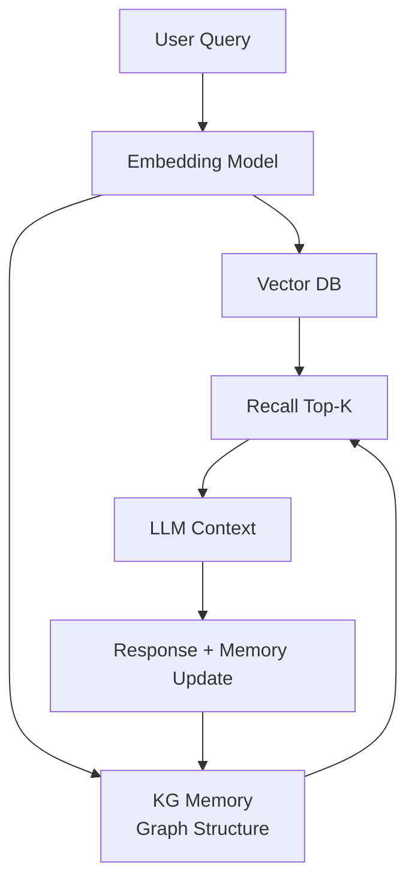

# Agent Memory

Agent Memory 是指 AI Agent 在多轮对话和跨会话场景中保持上下文连续性的能力。区别于传统 LLM 的无状态特性，具备记忆能力的 Agent 能累积经验、保留偏好、跨时间线追综任务状态。

## What it is

当前大多数 LLM 应用本质是无状态的——每次请求独立，模型不保留会话间的任何信息。Agent Memory 试图解决这个问题，让 AI 能够像人类一样积累和使用经验。

主流实现路径：

- **向量数据库检索**（RAG-style）：将历史内容分块嵌入，检索时召回相关片段
- **图谱记忆**（Knowledge Graph）：以实体+关系的形式存储，天然支持推理和多跳查询
- **混合模式**：向量检索 + 图谱结构结合，兼顾语义相似性和结构化推理

## How it works

新加坡外長的助理使用 **Mnemon**（图谱记忆）+ **Ollama 本地嵌入模型**做语义搜索，实现个人知识库的长期累积。Nous Research 的 Hermes 则将自我进化作为记忆的核心机制——自动封装操作并生成透明可查的技能文件。

## Key properties

- **持久性**：跨会话保留，非随模型调用结束而消失
- **可查询**：语义搜索 + 结构化推理
- **可演化**：随使用累积，自动提炼高价值信息
- **隐私边界**：本地部署 vs 云端存储的权衡

## Relationship to other concepts

- [[concepts/Agent-Runtime]] — Memory 是 Runtime 的关键能力缺口，Hermes 和 NanoClaw 都把记忆作为核心卖点
- [[entities/NanoClaw]] — Mnemon 图谱记忆 + Ollama 嵌入的本地实现
- [[entities/Nous-Research]] — Hermes 的自我进化是记忆演化的极端形式

## Open questions

- 记忆的「遗忘」机制如何设计？全量保留会导致上下文膨胀
- 个人隐私数据在记忆系统中的隔离问题
- 自我进化型记忆（Hermes）的监管合规路径

## Sources

- [[summaries/raw/articles/2026-05-17-nanoclaws-second-brain.md]] — Mnemon 图谱记忆 + 边缘部署案例
- [[summaries/raw/articles/2026-05-02-hermes-agent-nous-research.md]] — Hermes 自我进化型记忆系统
