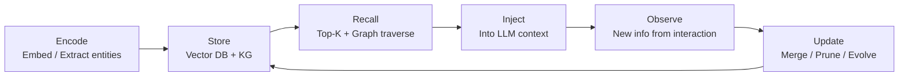

# Architecture

Agent Memory 的架构层定义了记忆系统如何编码、存储、检索和更新信息。当前主流实现围绕三种存储后端展开，常以混合模式组合使用。

## 向量数据库检索（RAG-style）

将历史对话、文档和操作记录分块嵌入为高维向量，存入向量数据库（如 Pinecone、Chroma、Qdrant）。查询时通过余弦相似度召回 Top-K 最相关片段，注入 LLM 上下文窗口。

**优势**：语义匹配能力强，适合模糊回忆和长尾查询。
**局限**：缺乏结构化推理能力，无法回答"我上周和谁讨论过这个主题？"之类的关系型查询。

## 知识图谱存储（Knowledge Graph）

以实体-关系-实体的三元组形式存储记忆。新加坡外长的 NanoClaw 系统使用的 **Mnemon** 就是典型的图谱记忆实现——将联系人、话题、文件等作为节点，通过类型化边连接，天然支持多跳推理。

**优势**：结构化查询、关系推理、可解释性强。
**局限**：构建和维护成本高，冷启动需要人工或 LLM 辅助抽取实体关系。

## 混合模式

向量检索和图谱结构结合，兼顾语义相似性和结构化推理。典型流程：向量检索负责粗筛候选记忆，图谱负责精排和关系扩展。

## 记忆更新循环

循环的四个阶段：

1. **Encode**：将新交互内容编码为向量嵌入，同时抽取实体和关系
2. **Store**：写入向量数据库和图谱结构，处理冲突和去重
3. **Recall**：收到查询时从两条路径同时检索，合并排序
4. **Update**：基于新信息更新已有记忆——合并相似条目、淘汰过期信息、强化高频使用节点

## 部署模式对比

| 模式 | 代表实现 | 隐私 | 延迟 |
|------|----------|------|------|
| 本地嵌入 + 本地图谱 | NanoClaw (Ollama + Mnemon) | 最高 | 低 |
| 云端嵌入 + 云端图谱 | 企业级 RAG 方案 | 取决于供应商 | 中 |
| 本地嵌入 + 云端图谱 | 混合部署 | 中 | 中 |
