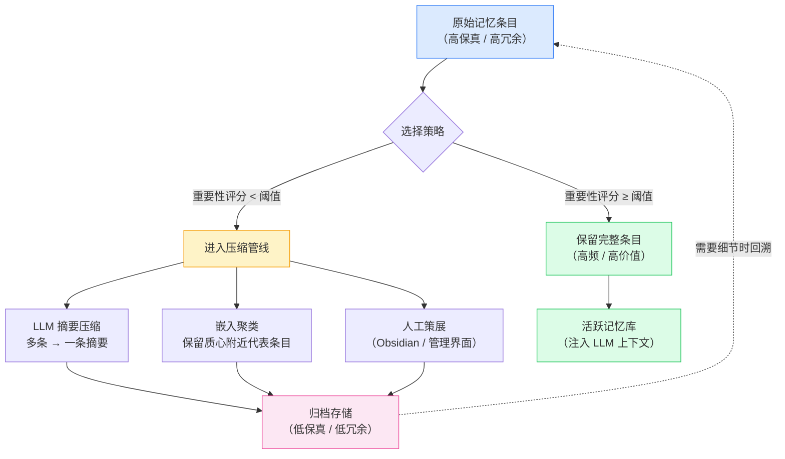

# Forgetting & Compaction

记忆系统不能只增不减——全量保留会导致检索精度下降、存储成本线性增长、上下文窗口被低价值信息占据。遗忘（Forgetting）和压缩（Compaction）是 Agent Memory 从"能记"走向"好用"的关键能力。

## 为什么需要遗忘

1. **上下文窗口有限**：即使最长的上下文窗口（1M+ tokens）也无法容纳全部历史，注入窗口的记忆必须经过筛选
2. **检索精度退化**：记忆库膨胀后，向量检索的 Top-K 召回中噪声比例上升，相关信息被稀释
3. **成本控制**：嵌入计算、向量存储、图谱维护的算力和存储成本随记忆量线性增长
4. **认知负荷**：过多的记忆条目增加 LLM 推理时的干扰信息，可能导致注意力分散

## 当前遗忘策略

### 基于时间（Recency-based）

最近使用的记忆权重最高，超过阈值的旧记忆自动衰减或归档。实现简单，但可能丢弃低频但重要的长尾知识。

### 基于重要性（Importance-based）

由 LLM 或规则引擎对每条记忆打分，低于阈值的条目被淘汰。重要性可来自：用户显式标记、交互中的情感强度、后续引用次数。

### 基于使用频率（Usage-frequency-based）

类似缓存淘汰策略（LRU/LFU）：记录每条记忆被召回和使用的次数，低频条目优先淘汰。在个人知识库场景中效果较好——新加坡外长的 NanoClaw 系统天然受益于高频使用带来的自然选择。

## 压缩策略

遗忘的补充手段是压缩——不删除，而是将多条相关记忆合并为更紧凑的表示：

- **摘要压缩**：用 LLM 将一组相关记忆总结为一条摘要，丢弃原始细节但保留核心信息
- **嵌入聚类**：对向量空间中的记忆做聚类，每个簇保留质心附近的代表条目，其余归档
- **人工策展**：用户定期审查和清理记忆库——NanoClaw 的 Obsidian 界面支持这种手动管理模式

## 开放问题

记忆的"遗忘机制"如何设计尚无公认最佳实践。全量保留导致上下文膨胀的实际代价、重要性评分的校准方法、压缩导致的信息丢失可接受边界——这些问题在学术和工程上都缺乏系统性的量化研究。遗忘策略的选择高度依赖具体应用场景：医疗 Agent 需要完整审计轨迹，个人助理则可以激进淘汰。
