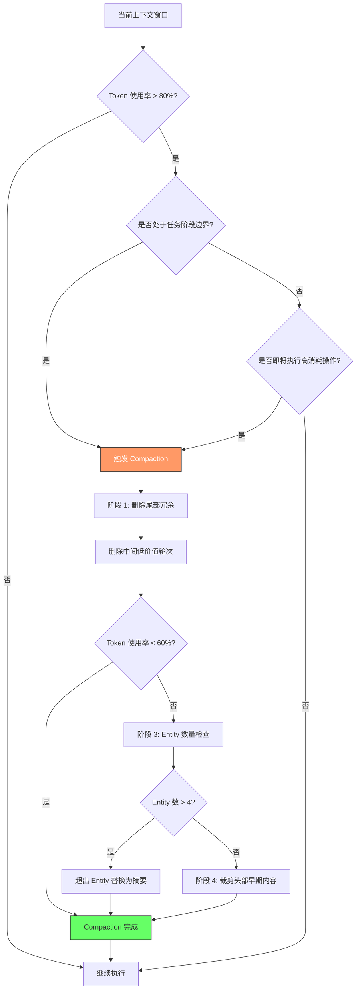

# Agent Runtime

## 定义

**Runtime** = 单 Agent 的执行环境，是比模型层高一级、比应用层低一级的整个执行平台面。

包含四个组件：
- **Prompt 设计** — system prompt 定义模型角色和行为
- **工具定义** — 参数描述、返回值格式、调用时机
- **上下文管理** — 何时压缩、删什么保什么
- **错误处理** — 错误消息质量决定模型能否自我修正

## 性能差异

同一模型在不同 runtime 上可以差出 **10 个百分点**（Cline 实验数据）。

| 发现 | 数据 |
|------|------|
| Cline vs Claude Code (同一模型 opus-4.7) | 74.2% vs 69.4% |
| Cline hill climbing (opus-4.5) | 47% → 57%，+10pp 全部来自 runtime |
| LangChain harness profile | 10-20pp 差异 |

## 四个设计决策

### 1. Prompt 设计

Cline 重写了 system prompt — 不是措辞调整，而是重新定义了模型如何理解自己的角色、如何使用工具、如何判断任务完成。

迭代方式：每次改一个变量然后跑完整 benchmark，用分数而非直觉来判断 prompt 的有效性。

### 2. 工具定义

工具定义的详细程度、参数描述方式、返回值格式直接影响模型调用工具的正确率。

Cline 把 provider 逻辑隔离在 `@cline/llms` 层，agent loop 本身不感知模型差异。

**工具 Schema 设计模式**：

- **详细 vs 精简参数描述**：详细的参数描述能减少幻觉调用（模型不会猜参数含义），但过长的 schema 会挤占宝贵的上下文窗口。实践中的平衡点是：必填参数提供枚举值 + 示例，可选参数提供默认值，避免在 schema 中写使用教程。
- **返回值格式影响下一步行动**：工具返回结构化 JSON（含 `status`、`error_code`、`next_action_hint` 字段）比纯文本更能引导模型做出正确的后续决策。特别是当工具返回错误时，`next_action_hint` 可以显式告诉模型"下一步应该尝试 X"。
- **Provider 抽象层**：Cline 的 `@cline/llms` 模式将所有模型差异（token 计数、tool call 格式、streaming 行为）隔离在 agent loop 之外，使得 runtime 层可以跨模型复用。类似地，[[Claude Code Subagent]] 的 subagent 定义也采用了工具无关的接口抽象。

### 3. 上下文管理

什么时候 compact、按什么顺序删除、哪些信息值得保留 — 这些决策直接影响任务后期的表现。

**反直觉设计**：为了维持 cache 的 prefix 稳定性，compaction 时应该优先删除尾部的最新内容而非头部的旧内容。因为 prefix 稳定性决定 cache 命中率。

**Compaction 策略**：

- **Prefix 稳定性优先**：LLM API 的 prompt caching 基于 prefix 匹配。删除头部（system prompt、早期对话）会导致整个 cache 失效，而删除尾部只影响最近几轮。因此 compaction 顺序应为：尾部冗余内容 → 中间低价值轮次 → 头部仅在极端情况下裁剪。
- **Entity 数量上限**：来自 [[Meta Reflection Techniques]] 的经验法则 — 单 session 中涉及的实体（概念、文件、函数）不超过 4 个。超过此上限时，模型容易混淆实体间的映射关系。compaction 时可将超出的实体引用替换为摘要。
- **Compaction 触发条件**：不只在 token 阈值触发（如达到 80% 上下文窗口时），还应结合**任务阶段边界**触发 — 在子任务完成后立即 compact 中间推理过程，保留结论和决策，既释放空间又不丢失关键信息。

### 4. 错误处理

好的错误消息不只是说"出错了"，而是告诉模型：
- 具体错在哪
- 当前状态是什么
- 有哪些可选路径

## 上下文压缩策略

Compaction 不是一个简单的"满了就删"操作，而是一个涉及 cache 经济性、信息价值和任务阶段感知的多维决策。以下流程图展示了完整的 compaction 决策逻辑：

关键设计原则：

- **Cache 经济性**：每次删除头部内容都会导致 prompt cache 完全失效，相当于额外支付一次完整的 prompt token 费用。因此头部删除是最后手段。
- **Entity 边界约束**：[[Meta Reflection Techniques]] 指出，当 session 涉及超过 4 个核心实体时，模型的实体追踪能力显著下降。compaction 时应将超限实体的具体引用替换为高层摘要，保留语义而不保留细节。
- **任务阶段感知**：在子任务边界触发 compaction 优于在任务执行中途触发 — 此时模型的中间推理已完成其使命，可以安全压缩，只保留结论和决策链。

与 Subagent 的协同：[[Claude Code Subagent]] 通过为每个 subagent 提供独立上下文窗口，天然缓解了主 session 的上下文膨胀问题。将大型任务拆分为 subagent 后，每个 subagent 的上下文窗口只包含该子任务的上下文，compaction 压力大幅降低。这是一种"用并行窗口换 compaction 频率"的策略。

## 25/75 法则

- **25%** 的失败是模型能力天花板，换什么 harness 都救不了
- **75%** 可以通过 prompt 调整、工具定义优化、错误处理改进来修复

## 行业重心转移

行业正在从"**写 prompt**"转向"**维护控制面**"。

> "Harness 不是万能的 — 如果你的模型选错了（用 haiku 跑复杂重构），harness 再强也救不回来。但它也不是可有可无的 — 75% 的失败都可以在 runtime 层修复。"

"Dive into Claude Code"论文（[[Dive into Claude Code（论文）]]）通过源码级逆向工程分析印证了这一点：整个代码库中 98.4% 是运行基础设施，只有 1.6% 是 AI 决策逻辑。论文进一步揭示了 7 组件高层结构和 5 层子系统架构，确认 Claude Code 的设计哲学是 **minimal scaffolding + maximal operational harness**。

## 行业实现

- [[NVIDIA Agent Toolkit]] 的 **OpenShell** — 在 Runtime 基础上增加三层安全检查（Policy Engine → Network Guardrail → Privacy Router），参见 [[Agent Secure Runtime]]
- [[wow-harness]] — 在 Runtime 之上构建跨 session、跨 agent 的治理协议，参见 [[Agent Harness 治理协议]]

## Related concepts

- [[Agent Secure Runtime]] — Agent Runtime 的安全增强模式，增加沙箱和护栏层
- Claude Code Subagent — Subagent 的执行环境属于 Runtime 层的一部分；独立上下文窗口缓解 compaction 压力
- [[Agent Harness 治理协议]] — Runtime 之上的治理层，解决跨 session 长期一致性
- [[Dive into Claude Code（论文）]] — Claude Code 源码级逆向分析，98.4% 基础设施数据的来源
- Meta Reflection Techniques — 元反思技巧，提供了 Entity 数量上限（≤4）等 Runtime 设计约束
