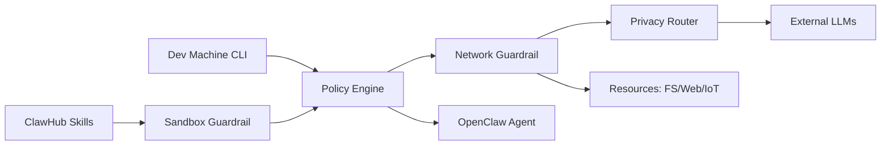

# Agent Secure Runtime

## 定义

**Agent Secure Runtime** = 在 [[Agent-Runtime]] 基础上增加安全层的执行环境，确保自主 Agent 在安全边界内运行。

核心问题：Agent 需要访问文件系统、网络、外部 API、甚至直接操控计算机（Computer Use），但这些能力也带来了数据泄露、越权操作、不可控行为等风险。Secure Runtime 通过多层护栏在"能力"和"安全"之间取得平衡。

## 三层安全架构

以 [[entities/NVIDIA-Agent-Toolkit]] 的 OpenShell 为例：

### 1. Policy Engine（策略引擎）

Agent 命令的入口关卡。基于预定义规则决定 Agent 可以执行哪些操作。

- 白名单机制：只允许已授权的操作类型
- 权限分级：不同 Agent/任务授予不同权限集
- 来源验证：区分开发者直接指令和 Agent 自主决策

### 2. Network Guardrail（网络护栏）

控制 Agent 对外部网络、API、数据源的访问。

- 出站过滤：限制 Agent 可访问的域名/IP
- API 调用审计：记录所有外部请求
- 资源隔离：Filesystem / Web Search / IoT 等通过 API/CLI/MCP 统一接入

### 3. Privacy Router（隐私路由）

数据发送到外部云模型前的最后一道关卡。

- 敏感信息检测与脱敏
- 数据分类路由：本地模型处理敏感数据，云端模型处理非敏感数据
- 合规审计：确保数据流向符合隐私政策

## 沙箱隔离

对于不可信的第三方 Skills（如 ClawHub 中的社区贡献），需要额外的 **Sandbox Guardrail**：

- 容器化执行：Skills 在隔离容器中运行
- 资源限制：CPU / 内存 / 网络访问受限
- 终端隔离：Agent 的 Terminal 层与宿主系统分离

## 与其他概念的关系

- [[Agent-Runtime]] — Secure Runtime 是 Agent Runtime 的超集，增加了安全约束层
- [[entities/NVIDIA-Agent-Toolkit]] — OpenShell 是目前最完整的 Secure Runtime 实现之一
- MCP 协议 — 作为工具连接的统一接口，天然适合接入安全检查点

## Open questions

- 三层安全检查的性能开销有多大？对 Agent 响应延迟的影响？
- Privacy Router 如何处理上下文中的隐式敏感信息（如用户在 prompt 中无意透露的私人数据）？
- 不同安全级别（开发/测试/生产）是否需要不同的护栏配置？

## Sources

- [[summaries/raw/articles/nvidia-agent-toolkit.md]] — (2026-05-19) OpenShell 架构图分析
