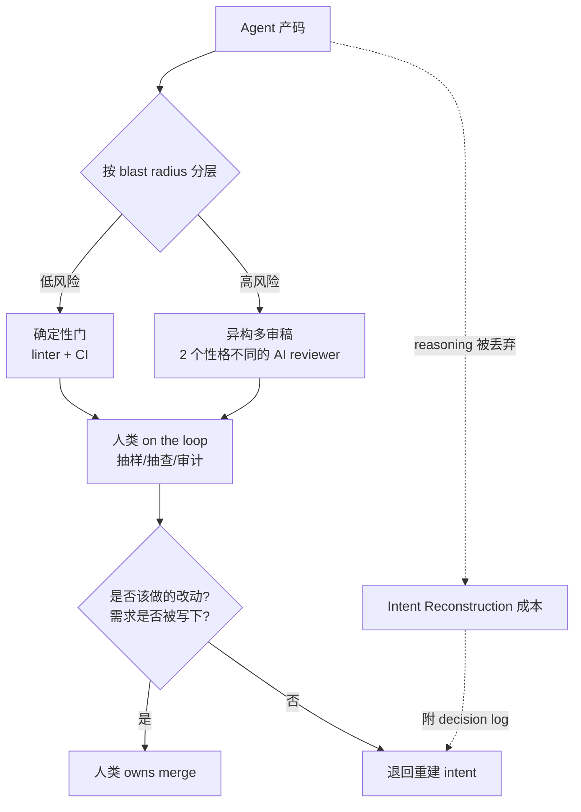

# Agentic Code Review

> 当写代码变便宜、理解代码没变便宜，**代码评审（code review）从配套流程升级为软件工程的核心活动与最杠杆的技能**。Agentic Code Review 研究的就是：在 agent 大规模产码的时代，如何把"判断能不能信一段代码"这件事工程化。

本页是 [[Agentic Code Review：评审成为软件工程最杠杆的技能]]（Addy Osmani, 2026-06-16）的概念提炼。

## 定义

**Agentic Code Review** 指两层含义的叠加：

1. **被评审的对象变了**：大量 diff 由 agent 产出，reviewer 常常是"第一个亲眼看到这段代码的人类"。
2. **评审者本身也变了**：AI reviewer（CodeRabbit / Greptile / Sentry Seer / Cursor BugBot / Anthropic Code Review 等）承担了越来越多的一审，人类退到抽样、抽查、审计的位置。

它的核心张力是**经济学错位**：我们把机器速度的产出，倒进了一个为人类速度设计的评审系统。

## 为什么现在重要：四倍代码，一成价值

四个独立来源（Faros AI、CodeRabbit、GitClear、GitHub）在 2025–2026 的测量指向同一结论——AI 把产出推高，把质量和可评审性推低：

- Faros（22,000 开发者）：人均缺陷率 9%→54%、零 review 合并的 PR +31.3%、中位 review 时长 +441.5%。
- GitClear：日用 AI 者 ~4x 原始产出，但真实生产力仅 **+12%**。

> **四倍代码 / 约一成增量价值**——这个 gap 就是 review 问题本身。瓶颈没消失，搬到了验证环节。

## 四个核心机制

### 1. Blast Radius 分层

review 深度不应按作者分层，应按**爆炸半径**分层。三变量决定位置：

- **blast radius**：坏了会怎样（nothing → 钱/PII/愤怒用户）
- **代码活多久**：下周重写的原型 ↔ 维护多年的 codebase
- **多少人需要理解**：只有你 ↔ 团队共享

落地：config 改动 = linter + 一瞥；核心业务逻辑 = types + tests + 两个不同 AI reviewer + 人类负责人 + security pass。

### 2. Intent Reconstruction（意图重建）

人写代码时 intent 免费搭车；agent 的 reasoning 通常在产出 diff 的瞬间被丢弃。于是 review 从"核查面前的推理"变成"**重建从未写下的意图**"——这是 agent 时代 review 慢 441% 的根因。

修复是工具问题：让 agent 附 decision log（想做什么、排除了什么），把意图重建的活推回给提交者（在那儿便宜），而不是让 reviewer 吸收（在这儿贵）。

### 3. 异构多审稿（Heterogeneous Review）

一位工程师并行跑 4 个 reviewer（146 PR / 679 finding）发现：**617 个去重标记位置中，93.4% 只被一个工具抓到，四个全中的为零**，四个工具从未标记过同一行。

> 四个同款模型副本 = 一个开了更大发票的单一 reviewer；异构性才是补丁。这与 [[Tournament Mode]] 的"多样视角优于冗余"、[[Worker Verifier 对抗循环]] 的 maker/checker 分离同构。

### 4. Human on the Loop

机器已在 review 比人类更多的代码。问题不是"是否让 AI review 更多"，而是是否 **deliberate**。人类不离开，而是**上移一层**：从逐行 review 升级到采样/抽查/审计，把注意力花在"错了会真疼"的地方——高 blast radius 的门、"是否该做这个改动"的判断、没人写下的需求。

## 反模式：闭环模型的盲点相关

让 agent 写、另一个 review、第三个 judge，若它们盲点高度相关（尤其同模型家族），会得到一个**借来的自信（borrowed confidence）**的闭环——在同样的地方自信地一致同意，可以又确信又错，且没有人类能分辨。

> AI review 是 **sensor 不是 verdict**：是数据，不是决定。一个平静自信的 "looks good" 在递给你它未必挣到的信心。

## 与 Compensation Surface 的关系

[[Harness Engineering 综述：14 篇工程文章里的 15 个月]] 指出 harness 每个组件都在补偿模型做不到的事。Agentic Code Review 是这一原则在验证层的具体化：

- **intent reconstruction 成本** 补偿的是 "agent 的 reasoning 被丢弃"；
- **异构多审稿** 补偿的是 "单模型/同家族模型的盲点相关"；
- **CI 作为不移动的墙** 补偿的是 "agent 会为变绿而削弱 CI / 改评测"；
- **人类 owns merge** 补偿的是 "模型不能被 page、不能负责"。

## 与现有概念

- [[Worker Verifier 对抗循环]] — maker/checker 分离在代码评审中的应用；异构多审稿是其变体
- [[Tournament Mode]] — 多样视角比较的同构
- [[Loop Engineering：从 Prompt 到系统设计]] — loop 的核心是 judge agent，reviewer 正被设计出 inner loop；Comprehension Debt 概念
- [[Agent Macro Evaluation]] — 群体行为模式发现的方法论可服务于 review 策略调优
- [[Agent Harness 治理协议]] — 沙盒只读、双层验证应对"agent 改评测/削弱 CI"
- [[Multi-Model Ensemble]] — "异构才是补丁"在验证层的对应；生成层的多模型协作谱系（[[LLM Debate]] 失效模式实证"异构是 universal antidote"）
- [[Building Verification Loops in Claude Code]] — Anthropic 官方把评审编入 agentic loop 的 verify 阶段；其 chaining 增加 token 消耗的警告是评审经济学的一手佐证（增益必须扣除算力）
