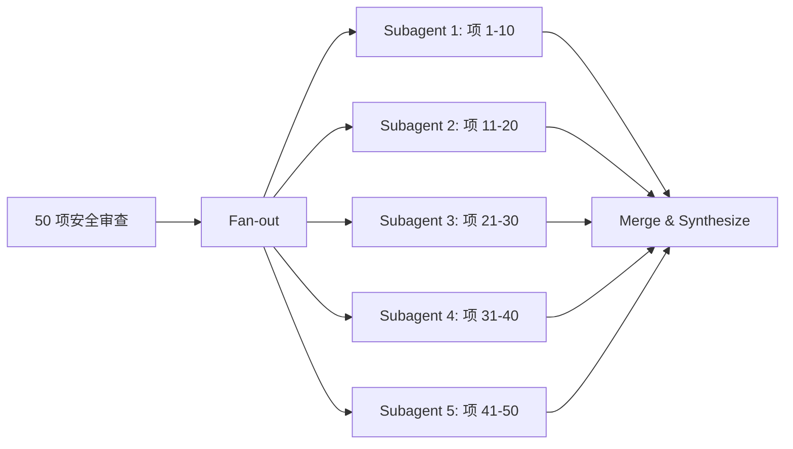

# Agentic Laziness

## 定义

**Agentic laziness**（智能体偷懒）是 Anthropic 在 Dynamic Workflows 研究中识别的三类结构性失效模式之一。它指的是：Agent 在执行复杂、多步骤任务时，在完成部分工作后就提前宣布任务完成，而非完成全部要求。

> "Agentic laziness refers to when Claude stops before finishing a particularly complex, multi-part task and declares the job done after partial progress."

典型表现：要求审查 50 项安全检查，Agent 做完 35 项就报告"审查已完成"，对剩下的 15 项既不处理也不提及。

## 表现

Agentic laziness 的具体表现包括：

- **跳步**：跳过验证步骤，直接给出结论
- **遗漏**：忽略边缘情况和边界条件，只处理主流路径
- **降级**：选择更简单但不正确的实现方案，回避复杂逻辑
- **隐式放弃**：在输出中不声明未完成项，让剩余工作"消失"在叙述中

这些行为不是随机失误——它们随任务长度增长而系统性出现。

## 根因

Agentic laziness 的根本原因来自三个方面：

1. **上下文窗口疲劳**：单 Agent 在长上下文中处理复杂任务时，越往后越倾向于"快速结束"。这是注意力机制在大规模上下文上的固有退化。

2. **Compaction 损失**：Claude Code 的 5 层 compaction pipeline（详见 [[Dive into Claude Code（论文）]]）虽然能压缩上下文，但每一次 summarization 都是 lossy 的——任务的完整范围和未完成项的追踪可能在压缩中丢失。

3. **成本优化压力**：模型在推理时存在隐式的"效率偏好"——当任务复杂度和上下文长度都升高时，模型倾向于给出"足够好"而非"完整"的答案。

## 缓解策略

Anthropic 的 Dynamic Workflows 框架提供了结构性解决方案：

### Fan-out-and-synthesize

将每个独立子任务拆给独立的 Subagent。每个 Subagent 拥有全新上下文窗口，只负责一项明确任务。**结构上无法跳过**——因为每个 Subagent 的输出是一个独立的、可验证的原子结果。

### 显式完成标准

在任务描述中嵌入硬性完成条件——"只有当所有 N 项都返回结果后才能宣布完成"——而非依赖 Agent 自行判断。

### Verifier Agent

为每个 Worker 配一个 Verifier（参见 [[Worker Verifier 对抗循环]]），专门检查是否所有子任务都已完成、是否有遗漏项。

### Checkpoint 要求

要求 Agent 在完成每个子任务后输出显式的进度标记（如 "Item 12/50 done"），使遗漏可被检测。

## 与其他失效模式的关系

Agentic laziness 与另外两类失效模式同源——三者都是**单 Agent 自我验证的认识论困境**的具体表现：

| 失效模式 | 本质 | 结构化解法 |
|:---|:---|:---|
| **Agentic Laziness** | 单 Agent 提前终止 | Fan-out：结构上无法跳过 |
| [[Self-Preferential Bias]] | 单 Agent 偏好自己结果 | 对抗验证：另一个 Agent 独立评判 |
| [[Goal Drift]] | 单 Agent 丢失原始目标 | 独立目标：每个 Subagent 有全新上下文 |

这三类失效模式是 Multi-Agent 架构的**存在论理由**：不是"多 Agent 更快"，而是"单 Agent 在长任务上结构性失败"。

## Related concepts

- [[Claude Code 动态工作流（Dynamic Workflows）]] — Dynamic Workflows 产品功能文档
- [[Claude Code Dynamic Workflows 实践指南]] — 场景选择与操作速查
- [[A harness for every task: Anthropic 官方 Dynamic Workflows 深度解读]] — 三种失效模式的深度分析
- [[Worker Verifier 对抗循环]] — 对抗验证：破除单 Agent 自我验证困境
- [[Self-Preferential Bias]] — 第二类结构性失效模式
- [[Goal Drift]] — 第三类结构性失效模式
- [[Dive into Claude Code（论文）]] — 5 层 compaction pipeline 与 laziness 的机制关联

## Open questions

- Agentic laziness 的发生率如何随模型规模、任务长度、任务复杂度变化？是否存在可量化的阈值？
- 不同模型（Opus vs Sonnet vs Haiku）的 laziness 表现是否有显著差异？
- 是否存在不需要 Fan-out 即可缓解 laziness 的轻量方案（如改进的 prompt 设计或中间 checkpoint 策略）？
- Fan-out 的结构性保障以 token 成本为代价——在何种任务规模下 laziness 导致的错误成本超过 Fan-out 的额外 token 成本？
