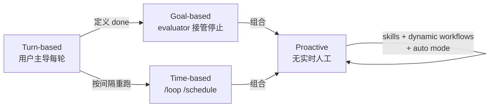

# Claude Code Loops

> Claude Code 团队官方的 **loop 类型分类法**：loops = agents repeating cycles of work until a stop condition is met，按 trigger / stop / primitive / task 四维度分为四类。与 [[Loop Engineering：从 Prompt 到系统设计]]（通用模块视角）、[[Claude Code Dynamic Workflows 实践指南]]（单原语视角）互补——那两篇讲"loop 由什么组成"和"动态工作流怎么用"，这篇讲"loop 有哪几种、何时用哪种"。

## 核心定义

> **Loops are agents repeating cycles of work until a stop condition is met.**

分类维度：

- **How they are triggered** — 谁触发每一轮
- **How they are stopped** — 什么条件结束循环
- **What Claude Code primitive is used** — 用哪个原语
- **What type of task is most appropriate** — 适合哪类任务

## 四类 Loop

| Loop | Triggered by | Stop criteria | Primitive | Best for |
|------|-------------|---------------|-----------|----------|
| **Turn-based** | 用户 prompt | Claude 判断完成或需更多上下文 | 默认 agentic loop | 短的、非规律性任务 |
| **Goal-based** | 实时手动 prompt | goal 达成 或 最大 turn 数 | `/goal` + evaluator model | 有可验证 exit criteria 的任务 |
| **Time-based** | 时间间隔 | 取消或工作完成 | `/loop`（本地）/ `/schedule`（云端） | 周期性工作、与外部系统交互 |
| **Proactive** | 事件或 schedule，无实时人工 | 每任务 goal 达成即退出；routine 运行到关闭 | `/schedule` + `/goal` + skills + dynamic workflows + auto mode | 周期性 well-defined 工作流（bug triage、migration、dependency upgrade） |

### Turn-based loops

最基础的 agentic loop：每个 prompt 启动一个手动循环，用户主导每一轮。Claude 收集上下文 → 行动 → 自检 → 必要时重复 → 回复。

管理用量：写明确 prompt + 用 [[Claude Code Skills|skills]] 强化验证步骤，减少 turn 数。验证越量化（测试通过数、Lighthouse 分数），Claude 越容易自检。

### Goal-based loops (/goal)

单轮不够时，用 `/goal` 定义"done 长什么样"。Claude 每次试图停止时，**evaluator model** 检查条件，未达成就打回继续，直到 goal 达成或达到 turn 上限。

```bash
/goal get the homepage Lighthouse score to 90 or above, stop after 5 tries.
```

确定性 criteria（测试通过数、分数阈值）最有效——避免 Claude 自行判断"够好了"而过早结束（cf. [[Agentic Laziness]]）。evaluator model 与写代码的 agent 分离，是 [[Worker Verifier 对抗循环]] 的 maker/checker 模式应用到停止条件本身。

### Time-based loops (/loop, /schedule)

周期性工作或与外部系统交互：`/loop` 按间隔重跑 prompt，`/schedule` 把 routine 移到云端（电脑关机也不停）。

```bash
/loop 5m check my PR, address review comments, and fix failing CI
```

管理用量：设较长间隔，或基于事件而非时间触发。

### Proactive loops

事件/schedule 触发、无实时人工的长时间运行工作。把上述原语与 **auto mode**、**dynamic workflows**（research preview）组合：

1. `/schedule` 跑 routine 检查新报告
2. `/goal` 定义 done + skills 文档化验证方式
3. dynamic workflows 编排 triage → fix → review
4. auto mode 让 routine 无需逐次确认

```bash
/schedule every hour: check the project-feedback channel for bug reports. /goal: don't stop until every report found this run is triaged, actioned, and responded to. When fixing a bug, use a workflow to explore three solutions in parallel worktrees and have a judge adversarially review them.
```

管理用量：routine 路由到小快模型，判断调用最强模型。

## 横切主题

### Maintaining code quality

loop 输出质量取决于它周围的系统：

- **保持 codebase 干净** — Claude 跟随已有 pattern 与 convention
- **给 Claude 自检手段** — 用 skills 编码"good 长什么样"
- **让 docs 触手可及** — 框架/库 docs 有最新最佳实践
- **第二个 agent 做 code review** — fresh context 的 reviewer 偏见更少（[[Agentic Code Review]]）

单个结果不达标时，不止修单个 issue，而是编码进系统改善未来所有迭代（→ [[Thin Harness, Fat Skills]] 的 self-rewriting skill）。

### Managing token usage

loop 需有清晰边界：

- 选对 primitive 与 model（小任务不必多 agent/loop，可用更便宜更快的模型）
- 定义清晰 success 与 stop criteria
- 大规模跑前先小范围 pilot（dynamic workflows 可 spawn 数百 agent）
- 确定性工作用 script（跑脚本比推理便宜）
- 间隔匹配所观察事物的变化频率
- 用 `/usage`（按 skill/subagent/MCP 拆分）、`/goal`（无参显示 turn 与 token）、`/workflows`（每 agent token，可随时停）review 用量

## 四类 Loop 的演进关系



演进方向：人逐步交出 **check → stop condition → trigger → prompt**，每交出一层都需更强的验证与治理。

## Related Concepts

- [[Loop Engineering：从 Prompt 到系统设计]] — Addy Osmani 的通用 loop 5 模块架构，本文是 Claude Code 官方类型学视角
- [[Claude Code Dynamic Workflows 实践指南]] — Proactive loop 的 dynamic workflows 原语详解与场景决策树
- [[Claude Code 动态工作流（Dynamic Workflows）]] — dynamic workflows 产品功能文档
- [[Claude Code Skills]] — Turn-based 的 verification skill、Goal-based 的 done 定义都靠 skills 编码
- [[Worker Verifier 对抗循环]] — `/goal` 的 evaluator model = maker/checker 分离应用到停止条件
- [[Agentic Code Review]] — second agent code review，fresh context 减少主 agent 偏见
- [[Agentic Laziness]] — Goal-based loop 的确定性 criteria 直接对治提前终止
- [[Heartbeat Watchdog]] — Time-based / Proactive loop 长期运行的独立守护层
- [[Autonomous AI System]] — Proactive loop = 阳志平"自动续航"组的 Claude Code 实现
- [[Thin Harness, Fat Skills]] — verification skill 即 skill-as-method-call
- [[Building Verification Loops in Claude Code]] — 2026-07 官方深化：agentic loop 三阶段中的 verify 阶段展开为六种内置验证机制 + standalone/embedded/chained/on-every-PR 四种调用模式
