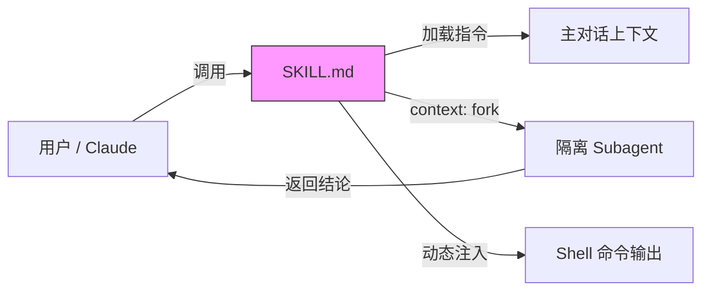

# Claude Code Skills

## 定义

**Skill** 是 Claude Code 的扩展机制：一个以 `SKILL.md` 为入口点的目录，包含 YAML frontmatter（元数据配置）+ Markdown 正文（指令内容）。Skill 的正文仅在被调用时加载到上下文中，未调用时几乎零成本。

Skill 遵循 [Agent Skills](https://agentskills.io) 开放标准，Claude Code 在此基础上扩展了调用控制（`disable-model-invocation`）、subagent 执行（`context: fork`）和动态上下文注入（`` !`command` ``）。

## 核心价值



1. **按需加载** — 长参考资料在需要之前不消耗 token，与 CLAUDE.md 中的常驻内容形成对比
2. **调用控制** — 可限制为仅用户调用（有副作用的操作）或仅 Claude 调用（背景知识）
3. **Subagent 隔离** — `context: fork` 让 skill 在独立上下文中运行，不污染主对话
4. **动态上下文** — Shell 命令在 Claude 看到内容之前预处理并注入结果

## Skill 与 CLAUDE.md 的区别

| 维度 | CLAUDE.md | Skill |
|------|-----------|-------|
| 加载时机 | 始终在上下文中 | 仅在调用时 |
| 适用场景 | 事实、约定、规则 | 程序、流程、多步骤操作 |
| token 成本 | 每轮都消耗 | 仅调用时消耗 |
| 触发方式 | 自动 | 用户 `/skill-name` 或 Claude 自动 |

**判断标准**：如果 CLAUDE.md 的某部分已经演变成"程序"而非"事实"，就该抽成 Skill。

**Compaction 行为（官方确认，2026-06）**：session start 只加载 name+description，body 按调用加载。压缩时已调用 skills 按**共享 token 预算**重注入——超出预算时**最旧先丢**。因此一个 session 里连续调用大量 skill 时，早先调用的 skill 正文可能已被挤出上下文。完整七机制选型框架见 [[Steering Claude Code: Seven Instruction Mechanisms]]。

## Skill 与 Subagent 的区别

| 维度 | Skill | Subagent |
|------|-------|----------|
| 本质 | 可复用的指令包 | 独立上下文的工作者 |
| 跑在哪 | 主对话上下文内（除非 `context: fork`） | 自己独立的上下文窗口 |
| 什么时候用 | 复用一套流程 | 隔离上下文、并行、限权 |

口诀：**要隔离用 Subagent，要复用用 Skill。** 两者可以组合——Skill 通过 `context: fork` 在 Subagent 中运行。

## Skill 文件结构

每个 Skill 是一个目录，`SKILL.md` 为必需入口：

```
my-skill/
├── SKILL.md           # 主要说明（必需）
├── template.md        # Claude 要填写的模板
├── examples/
│   └── sample.md      # 示例输出
└── scripts/
    └── validate.sh    # Claude 可执行的脚本
```

支持文件从 `SKILL.md` 中引用，Claude 按需加载。建议 `SKILL.md` 保持在 500 行以下。

## Skill 内容的两种类型

**参考内容** — 添加 Claude 应用于当前工作的知识（约定、模式、风格指南）。内联运行，与对话上下文一起使用。

**任务内容** — 为 Claude 提供特定操作的分步说明（部署、提交、代码生成）。通常配合 `disable-model-invocation: true`，由用户通过 `/skill-name` 手动触发。

## 捆绑 Skills

Claude Code 内置一组捆绑 skills，包括 `/simplify`、`/batch`、`/debug`、`/loop`、`/claude-api` 等。与内置命令不同，捆绑 skills 是基于提示的——它们为 Claude 提供详细说明，让 Claude 使用工具编排工作。

三个捆绑 skills 协同工作来启动和验证应用：

| Skill | 目的 |
|-------|------|
| `/run` | 启动并驱动应用以查看更改是否有效 |
| `/verify` | 构建并运行应用以确认代码更改是否按预期工作 |
| `/run-skill-generator` | 教 `/run` 和 `/verify` 如何构建和启动项目 |

## Skill 的存放位置

| 位置 | 路径 | 适用于 |
|------|------|--------|
| 企业 | 托管设置 | 组织中的所有用户 |
| 个人 | `~/.claude/skills/<skill-name>/SKILL.md` | 你的所有项目 |
| 项目 | `.claude/skills/<skill-name>/SKILL.md` | 仅此项目 |
| 插件 | `<plugin>/skills/<skill-name>/SKILL.md` | 启用插件的位置 |

优先级：企业 > 个人 > 项目。插件 skills 使用 `plugin-name:skill-name` 命名空间，不与其他级别冲突。

**自动发现**：项目 skills 从起始目录到仓库根目录的每个父目录中加载。编辑子目录中的文件时，Claude Code 也会从嵌套的 `.claude/skills/` 目录中发现 skills（支持 monorepo）。

**实时变更检测**：在会话中添加、编辑或删除 skill 文件会立即生效，无需重启。

## 快速入门示例

创建一个总结未提交更改的 skill：

```yaml
---
description: Summarizes uncommitted changes and flags anything risky.
---

## Current changes

!`git diff HEAD`

## Instructions

Summarize the changes above in two or three bullet points,
then list any risks such as missing error handling or hardcoded values.
```

`` !`git diff HEAD` `` 是动态上下文注入——Claude Code 运行该命令，将输出替换到 skill 内容中，再发送给 Claude。

调用方式：
- 自动触发："What did I change?"（匹配 description）
- 手动调用：`/summarize-changes`

## 详细文档

- [[Claude Code Skills — Frontmatter 参考]] — 完整的 frontmatter 字段、字符串替换、参数传递
- [[Claude Code Skills — 动态上下文与 Subagent 执行]] — Shell 注入、Subagent 中运行、共享与分发

## Related concepts

- [[Claude Code Subagent]] — Skill 可通过 `context: fork` 在 Subagent 中运行
- [[Agent Runtime]] — Skill 的执行依赖 Runtime 层的工具调用和上下文管理
