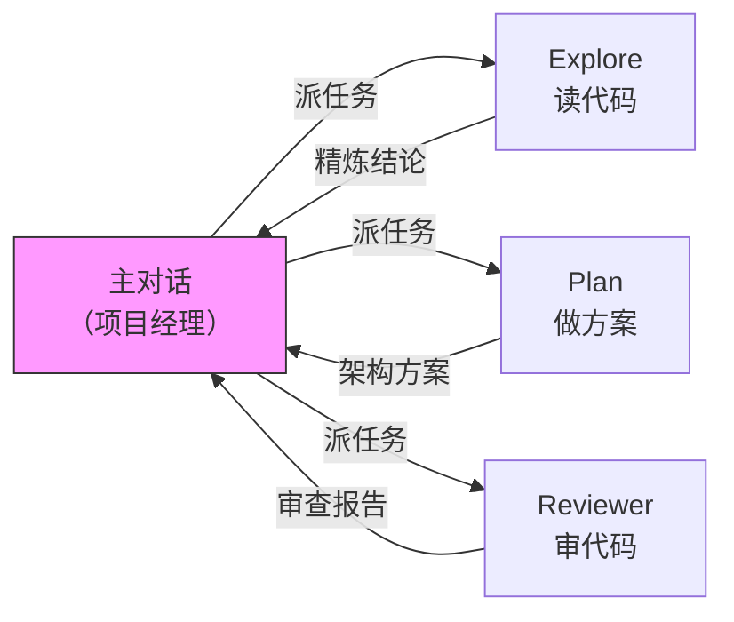

# Claude Code Subagent

## 定义

**Subagent** 是 Claude Code 中的独立上下文工作者，跑在自己专属的上下文窗口里，完成任务后只把结论汇报回主对话。

主对话（项目经理）负责全局决策；Subagent（工程师）负责具体执行。Subagent 读过的文件、跑过的日志全部留在自己的上下文中，不污染主对话。

## 核心价值



1. **上下文保护** — Subagent 处理 50 个文件的噪音，主对话只收到一句结论
2. **并行执行** — 多个 Subagent 同时研究不同模块，互不干扰
3. **权限隔离** — 通过 `tools` 字段限制能力范围，只读任务不给写权限

## 三个内置 Subagent

Claude Code 自带三个 Subagent，不需要用户配置：

| 类型 | 模型 | 能力 | 触发场景 |
|------|------|------|---------|
| **Explore** | Haiku（默认） | 只读搜索 | "研究一下""理解一下""帮我看下" |
| **Plan** | inherit | 只规划不动手 | 动手前的架构方案 |
| **General-purpose** | inherit | 兜底 | 没有专门定位的任务 |

用户说"研究一下"或"理解一下"时，Claude 经常已经在用 Explore，只是没明说。

## 自定义 Agent 定义

自定义 Subagent 是一个带 YAML 头部的 Markdown 文件，放在两个位置：

- `.claude/agents/` — 项目级
- `~/.claude/agents/` — 全局

创建方式：在 Claude Code 里敲 `/agents` 按引导走，或手写文件。

```yaml
---
name: code-reviewer
description: 代码审查专家。写完或修改代码后立即主动使用。
tools: Read, Grep, Glob, Bash
model: inherit
---
你是一位资深代码审查员。被调用时：
1. 跑 git diff 看最近改动
2. 只聚焦修改过的文件
3. 按优先级反馈：严重问题 → 警告 → 建议
```

### 三个关键字段

**`description`** — 整个文件里最关键的一行。Claude 靠这段话决定什么时候自动委托。必须包含触发条件 + "主动"关键词。写得太抽象（如"一个代码助手"）等于没写。

**`tools`** — 权限闸门。只读任务只给 `Read, Grep, Glob`，不给 `Edit, Write`。这不只是为了简洁，更是安全围栏。

**`model`** — 按需分级。探索用 Haiku（便宜、快），深度审查用 Sonnet 或 Opus。

## 调用方式

| 方式 | 示例 | 保险程度 |
|------|------|---------|
| 自然语言 | "用 code-reviewer 看一下 auth 模块" | 不保险，Claude 可能选别的 |
| `@` 提及 | "@code-reviewer 看下最近的改动" | 一定会用，不会跑偏 |
| CLI 绑定 | `claude --agent code-reviewer` | 整个会话绑死在这个 agent |

## 典型使用场景

### 跑测试 / 处理日志

`npm test` 一跑几千行，塞进主对话直接窒息。交给 Subagent："跑完整测试套件，只报告失败的测试和错误"——它处理掉所有噪音，只把信号发回来。

### 并行研究

用三个独立的 Subagent 同时研究认证、数据库、API 模块——比顺序调研快，且三个模块的细节不会互相污染。

### 链式工作流

"用 code-reviewer 找性能问题，然后用 optimizer 修复它们"——前一个的输出当作后一个的输入，整条链不用手动搬运结论。

## Agent Memory

Subagent 可以积累项目记忆。在指令中加入：

> 完成任务后，把你学到的东西保存到记忆里。

跑一段时间后，这个 Subagent 会变成项目里的"老员工"——审查质量越来越高，因为它知道哪些地方曾经出过事。

## 限制

- **不支持递归** — Subagent 不能再派 Subagent。需要嵌套委托时，要么把流程写成 [[Claude Code Skill|Skill]]，要么从主对话里手动串多个 Subagent。

## 与 Skill 的区别

| 维度 | Skill | Subagent |
|------|-------|----------|
| 本质 | 可复用的指令包 | 独立上下文的工作者 |
| 跑在哪 | 主对话上下文内 | 自己独立的上下文窗口 |
| 什么时候用 | 复用一套流程 | 隔离上下文、并行、限权 |

口诀：**要隔离用 Subagent，要复用用 Skill。**

## Related concepts

- [[Claude Code Agent Teams]] — 更高级的多 Agent 协作模式，Team Lead + Teammates + 共享任务队列
- [[Agent-Runtime]] — Subagent 的执行环境属于 Runtime 层的一部分
