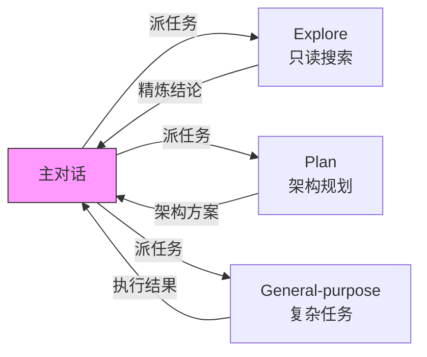

# Claude Code Subagent

## 定义

**Subagent** 是 Claude Code 中的独立上下文工作者。每个 subagent 在自己的 context window 中运行，具有自定义系统提示、特定工具访问权限和独立权限。当 Claude 遇到与 subagent 描述匹配的任务时，委托给该 subagent，它独立工作并返回结果。

核心价值：

1. **上下文保护** — Subagent 处理 50 个文件的噪音，主对话只收到一句结论
2. **并行执行** — 多个 Subagent 同时研究不同模块，互不干扰
3. **权限隔离** — 通过 `tools` 字段限制能力范围，只读任务不给写权限
4. **成本控制** — 将任务路由到更快更便宜的模型（如 Haiku）
5. **跨项目重用** — 用户级 subagents 在所有项目中可用



## 内置 Subagents

Claude Code 自带三个内置 subagent，不需要用户配置：

| 类型 | 模型 | 工具 | 用途 |
|------|------|------|------|
| **Explore** | Haiku | 只读工具（无 Write/Edit） | 文件发现、代码搜索、代码库探索。支持 quick/medium/very thorough 三种彻底程度 |
| **Plan** | inherit | 只读工具 | Plan mode 期间的代码库研究，在呈现计划之前收集上下文 |
| **General-purpose** | inherit | 所有工具 | 复杂研究、多步骤操作、代码修改 |

**关键区别**：Explore 和 Plan 跳过 CLAUDE.md 和父会话的 git 状态，以保持研究快速且成本低廉。所有其他内置和自定义 subagent 都会加载两者。

其他辅助代理：`statusline-setup`（Sonnet，配置状态行）、`claude-code-guide`（Haiku，回答 Claude Code 功能问题）。

## 快速入门

使用 `/agents` 命令创建用户级 subagent：

1. 运行 `/agents`，切换到 **Library** 选项卡
2. 选择 **Create new agent** > **Personal**（保存到 `~/.claude/agents/`）
3. 选择 **Generate with Claude**，描述 subagent 的功能
4. 选择工具（只读审查者只保留 Read-only tools）
5. 选择模型（如 Sonnet 平衡分析能力和速度）
6. 配置持久内存（User scope = 跨项目积累见解）
7. 按 `s` 保存，立即可用

也可以手动创建为 Markdown 文件：

```yaml
---
name: code-reviewer
description: Reviews code for quality and best practices
tools: Read, Glob, Grep
model: sonnet
---

You are a code reviewer. When invoked, analyze the code and provide
specific, actionable feedback on quality, security, and best practices.
```

## 调用方式

| 方式 | 示例 | 确定性 |
|------|------|--------|
| 自然语言 | "用 code-reviewer 看一下 auth 模块" | Claude 自行决定是否委托 |
| `@` 提及 | `@"code-reviewer (agent)" look at auth changes` | 保证该 subagent 运行 |
| `--agent` 标志 | `claude --agent code-reviewer` | 整个会话使用该 agent 的配置 |
| `agent` 设置 | `.claude/settings.json` 中 `"agent": "code-reviewer"` | 项目默认 |

`--agent` 使 subagent 的系统提示完全替换默认 Claude Code 系统提示。CLAUDE.md 文件和项目内存仍正常加载。

## Subagent 定义的存放位置

| 位置 | 范围 | 优先级 |
|------|------|--------|
| 托管设置 | 组织范围 | 1（最高） |
| `--agents` CLI 标志 | 当前会话 | 2 |
| `.claude/agents/` | 当前项目 | 3 |
| `~/.claude/agents/` | 所有项目 | 4 |
| Plugin 的 `agents/` 目录 | 启用 plugin 的位置 | 5（最低） |

Claude Code 递归扫描 agents 目录，子目录路径不影响识别——身份仅来自 `name` frontmatter 字段。

## 前台与后台运行

- **前台** — 阻塞主对话直到完成，权限提示传递给用户
- **后台** — 并发运行，使用已授予权限，自动拒绝需提示的工具调用

Claude 根据任务决定，也可要求 "run this in the background" 或按 **Ctrl+B** 将运行中的任务放到后台。

## Fork 模式（实验性）

Fork 是一种特殊的 subagent，继承到目前为止的整个对话上下文，而非从头开始。启用方式：`CLAUDE_CODE_FORK_SUBAGENT=1`。

| 维度 | Fork | 命名 Subagent |
|------|------|-------------|
| 上下文 | 完整对话历史 | 新鲜上下文 + 委派提示 |
| 系统提示和工具 | 与主会话相同 | 来自定义文件 |
| 模型 | 与主会话相同 | 来自 `model` 字段 |
| Prompt cache | 与主会话共享 | 单独缓存 |

Fork 的第一个请求重用父级的 prompt cache，比生成新 subagent 更便宜。使用 `/fork` 命令启动。

## 典型使用场景

### 隔离高容量操作

跑测试、获取文档、处理日志——委托给 subagent，详细输出留在 subagent 上下文，只把摘要返回主对话。

### 并行研究

用多个 subagent 同时研究认证、数据库、API 模块——比顺序调研快，模块细节互不污染。

### 链式工作流

"用 code-reviewer 找性能问题，然后用 optimizer 修复它们"——前一个的输出当后一个的输入。

## 限制

- **不支持递归** — Subagent 不能再派 Subagent。需要嵌套委托时，使用 Skills 或从主对话串多个 Subagent。
- **单会话** — Subagent 在单个会话中工作。并行运行多个独立会话请使用 background agents；会话间通信用 agent teams。

## 详细文档

- [[concepts/Claude-Code-Subagent/Configuration|配置参考]] — 完整 frontmatter 字段、模型选择、工具限制、MCP 服务器、权限模式
- [[concepts/Claude-Code-Subagent/Invocation-And-Context|调用与上下文管理]] — 调用模式、上下文加载、持久内存、Hooks、恢复 Subagent

## Related concepts

- [[concepts/Claude-Code-Skills/index|Claude Code Skills]] — Skill 可通过 `context: fork` 在 Subagent 中运行；Subagent 可通过 `skills` 字段预加载 Skills
- [[Agent-Runtime]] — Subagent 的执行环境属于 Runtime 层的一部分
