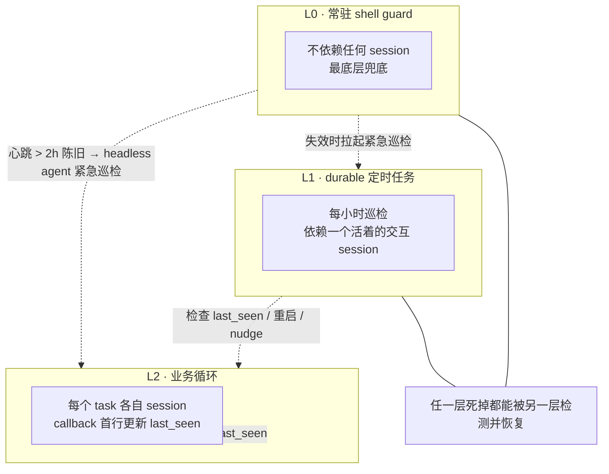

# Heartbeat Watchdog（心跳看门狗）

## 定义

**心跳看门狗**（Heartbeat Watchdog）= 一种**独立于业务循环之外**的守护层，用于检测并恢复自主 agent 的两类静默失败：

1. **运行时脆弱**——context 压缩静默打断循环；关闭一个 session 会连带杀死寄生在它上面的计时器，失败默认无人察觉。
2. **停滞**——agent 干完一段、输出摘要、然后等反馈；外部看 session 还活着、polling 还在跑，但活儿已经停了。

核心命题：**业务循环本身不可靠，必须有一层独立的、与它解耦的守护。** 来源：Deli_AutoResearch 框架（[[Deli_AutoResearch：长时间自主任务的协议框架（Victor Chen）]]），是 [[Autonomous AI System]]"四·自动续航 / 看门狗"技巧的工程化深化。

## 三层互检架构

| 层 | 形态 | 依赖 | 职责 |
|----|------|------|------|
| **L0** | 常驻 shell guard | **不依赖任何 session** | 心跳时间戳陈旧 > 2h → 经 headless agent 拉起一次紧急巡检 |
| **L1** | durable 定时任务（每小时） | 依赖**一个活着的交互 session** | 检查每个 loop 的 `last_seen`、重启超时 loop、检测停滞并 nudge |
| **L2** | 业务循环 | 各自独立 session | 每个 callback 的**第一行**更新自己的 `last_seen`，再查存活性，失败立刻重启 |

## 为什么必须三层（失效链推理）

这是该概念最关键的部分——分层不是冗余堆叠，而是对一条**失效链**的逐级兜底：

| 如果只有… | 它会怎么失效 |
|----------|-------------|
| 只 L2（业务自报） | context 压缩后循环静默死亡，`last_seen` 停止更新，但没人察觉 → 失败被吞 |
| L2 + L1（定时巡检） | L1 寄生在一个活 session 上；**关掉那个 session，L1 的计时器一起死** → 守护随宿主同归于尽 |
| L2 + L1 + L0（常驻兜底） | L0 不依赖任何 session，即使所有交互 session 都关了，它仍能发现 L1 的心跳也停了，经 headless agent 把整个守护链重新拉起 |

> 推理链的精髓：**守护层的依赖关系必须比被守护对象更弱。** L2 依赖 session（最易死）→ L1 也依赖一个 session（中等）→ L0 不依赖 session（最稳）。越往底层，依赖越少，存活越久。这与 [[Dive into Claude Code（论文）]] 揭示的"运行时基础设施占比 98.4%"同源——可靠性来自分层脚手架，不是模型。

## 停滞检测阈值与 nudge 协议

| 阈值 | 判定 | 动作 |
|------|------|------|
| 进度 > 2h 无更新 **且** 最后输出是问题 | 停滞（stalled） | 启动 **nudge** 子 agent：注入该任务的 `task_spec` 和 `progress`，指示继续并更新状态 |
| 连续 **3 次** nudge 无进展 | 结构性卡死（structurally stuck） | 停止 nudge，以**新方向**重开 |
| 进度 > 4h 无更新 | 任务卡死（stuck-task） | 上层介入 |

**关键设计：2h 阈值故意短于 4h。** 停滞是"自愿停止"（agent 选择等反馈），修起来便宜（一次 nudge），值得更早抓；卡死是"非自愿失败"，代价更高。早抓廉价问题，避免它恶化为昂贵问题。

## Guardian / Worker 分离（巡检边界约束）

心跳巡检对**不是自己的任务**只能做三件事：

1. **存活性检查**（liveness-check）
2. **重启**（restart）
3. **轻推**（nudge）

**禁止**：读任务数据、改任务状态文件、代任务向用户汇报。

> 起因是一次真实越界：一个巡检 agent 伸进别的任务里"帮忙"，导致**上下文污染、汇报漂移、并发写风险**。这与 [[Agent Harness 治理协议]]"双层验证（验证者无写权限）"、[[ESAA]] 的 boundary contracts（agent 只能 emit intentions，由 orchestrator 验证后执行）同构——**最小权限是结构约束，不是模型自觉**。作者明确：去掉约束，越界就回来。

## 与"callback 报活"的配合

业务循环（L2）的每个 callback 第一行必须更新 `last_seen`——这是看门狗能工作的前提。context 压缩后，agent 重新进入时如果忘了这一步，看门狗会误判它死亡并重启，造成无谓中断。因此"callback 即报活"被定为**硬行为约束**（见 summary）。

## 与现有 Wiki 概念的关联

| 维度 | 关联 |
|------|------|
| 看门狗（基础形态） | [[Autonomous AI System]] 技巧 10（CronCreate + 定时读状态文件）——本页给出"为什么三层"的失效链深化 |
| 事件时间线 / append-only | [[Agent Harness 治理协议]] 事件时间线、[[ESAA]] event store——`last_seen` 和巡检日志都是 append-only |
| 角色分离 / 最小权限 | [[Worker Verifier 对抗循环]]、[[Agent Harness 治理协议]] 双层验证、[[wow-harness]] |
| 看门狗摆脱人在回路 | [[Meta Reflection Techniques]] 技巧 7（看门狗模式：让 AI 自己定时启动反思） |
| 永不停摆 / 单条绕行 | [[Autonomous AI System]] 意外处理矩阵——横向绕行 vs 本页的纵向自愈 |
| 停滞 > 崩溃 | [[Agentic Laziness]]——"过早宣布完成"是停滞的一种伪装形态 |
| 工程实现参考 | [[wow-harness]] v3、[[Multi-Agent 协作模式]] |

## Open research questions

- 三层架构在真实多租户/容器化部署中，L0 常驻 shell guard 的跨平台实现与资源开销如何量化？（对比 [[Agent Secure Runtime]] 沙箱隔离）
- 2h/4h 阈值与"连续 3 次 nudge"判据是作者经验值，在不同任务复杂度、不同模型规模下如何重新校准？是否可用 [[Agent Macro Evaluation]] 的运行模式聚类自动发现最优阈值？
- Guardian/Worker 的三权限边界（liveness-check / restart / nudge）能否形式化为 [[ESAA]] boundary contracts 那样的 schema 级硬约束，而非靠 prompt 纪律？
- L1"依赖一个活着的交互 session"在现代 headless/CI 部署中是否成立？纯后台场景下 L0 是否足以单独兜底？

## Related concepts

- [[Deli_AutoResearch：长时间自主任务的协议框架（Victor Chen）]] — 原始来源（summary 35）
- [[Autonomous AI System]] — 同谱系中文视角，本概念是其"自动续航"组的工程化深化
- [[Agent Harness 治理协议]] — 跨 session 治理层，看门狗是其"运行时脆弱"对策
- [[ESAA]] — append-only event store + boundary contracts，巡检日志与最小权限的形式化版本
- [[wow-harness]] — 治理协议工程实现
- [[Worker Verifier 对抗循环]] — Guardian/Worker 分离的角色分离参照
- [[Meta Reflection Techniques]] — 看门狗摆脱人在回路
- [[Agentic Laziness]] — 停滞的伪装形态之一
