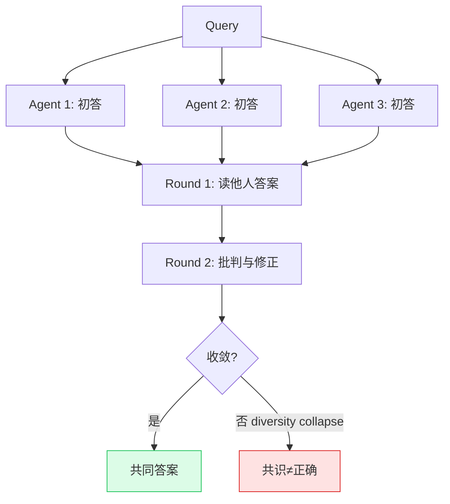

# LLM Debate（多模型辩论）

## 定义

**LLM Debate**（Multi-Agent Debate, MAD）：多个 LLM 实例各自生成候选答案，然后**多轮互相批判与修正**，最终收敛到共同答案。是 [[Multi-Model Ensemble]] 四架构中最复杂、也最容易翻车的一种。

奠基工作 Du et al.（ICML 2024）称之为 "society of minds"。失效模式详见 [[LLM Debate 失效模式：多 Agent 协作何时翻车（2025 综述）]]。

## 机制

理想情况下，debate 让模型互相纠错、逼近更优解。但 2025 年的系统性研究发现，它有四种结构性失效模式。

## 四大失效模式

### 1. Bias reinforcement（偏差放大）
同模型 agent 辩论时，debate **放大**而非纠正偏差（2503.16814）。根因：agent 共享同一推理模式，"辩论"变成"互相壮胆"。这是 [[Self-Preferential Bias]] 从"单模型自审"扩展到"同质多模型互审"——同表征空间无法产生真正独立的纠偏。

### 2. Diversity collapse + manufactured overconfidence（多样性塌缩 + 制造过度自信）
agent 互相阅读后，inter-agent correlation 趋向 1。结果：**"一致"从证据变成了结果**（OpenReview）。terminal confidence 方差比 accuracy 小 **17×**——表面信心与真实误差脱钩。这是 [[Agentic Code Review]]"借来的自信闭环"的学术版本，并给出方差度量。

> 基于共识的停止准则在 18–47% 案例上犯"自信的错误"。

### 3. 弱拖垮强 + sycophancy（谄媚）
引入弱 agent 会拖垮强 agent，即使强占多数（2509.05396）。模型常**从正确转向错误**，偏好一致（sycophancy / social conformity）而非挑战错误推理。对应 [[Worker Verifier 对抗循环]] 的 Worker 博弈退化。

### 4. Test-time compute 混淆
debate 消耗的算力（多 agent × 多轮）远高于单 agent。Single-Agent Outperforms MAS（2604.02460）用 Data Processing Inequality 证明：**等 token 预算下单 agent 更 information-efficient**。很多 debate 的"增益"是未被计入的算力。

## 收益条件（debate 何时才有效）

基于 Revisiting MAD as Test-Time Scaling（2505.22960）：
- **任务越难**，debate 收益越大（与 More Agents 一致）；
- **模型能力越低**，debate 相对收益越大；
- **跨异构模型辩论**（如 ChatGPT + Bard）比同模型辩论强——Du et al. 实证 ChatGPT+Bard 能解出两者单独都解不出的 GSM8K；
- Stop Overvaluing MAD（2502.08788）：**异构性是 universal antidote**。

## 缓解策略

| 策略 | 出处 | 做法 |
|------|------|------|
| **异构模型组合** | 2502.08788 | 用真正不同的模型（不同家族 / 规模），而非同模型多副本 |
| **Prompt 制造多样视角** | 2503.16814 (DReaMAD) | 单模型内通过 prompt 变体制造视角多样性 |
| **Calibrated 停止** | OpenReview | split-conformal certificate，控制 set coverage，而非用共识停止 |
| **与聚合 / 验证结合** | 本 wiki | debate 只作 proposer 层，最终由独立 aggregator / verifier 收口 |

## 与 [[Tournament Mode]] 的区分

两者都是"同级竞争"，但：
- **Tournament**：N 个 agent 各自完成，judge **pairwise 比较**选最好的一份——**择优**。
- **Debate**：agent 互相批判，**收敛**到一个共同答案——**融合**。

Tournament 靠 judge 的相对判断（更可靠），debate 靠 agent 间的收敛（易 diversity collapse）。

## Related concepts

- [[Multi-Model Ensemble]] — debate 是其四架构之一
- [[Self-Preferential Bias]] — 同质 debate 无法纠偏的根因
- [[Agentic Code Review]] — "借来的自信闭环"（diversity collapse 的验证层对应）
- [[Worker Verifier 对抗循环]] — maker/checker 角色分工（debate 是同级，无角色分离）
- [[Tournament Mode]] — 同级择优 vs 同级融合
- [[Agent Reliability vs Capability]] — debate 算力混淆 reliability 度量

## Open questions

- debate 的**最优轮数**：Du et al. 用 2 轮，但多轮触发 diversity collapse——拐点在哪？（与 [[Tournament Mode]] 的最优 N 同构）
- 跨**异构模型辩论**的增益，扣除算力后还剩多少？（2604.02460 的公平比较框架）
- Calibrated MAD 的 split-conformal certificate 能否工程化为 [[Agent Harness 治理协议]] 的双层验证？
- debate 与 [[Harness Cybernetics]] 的反馈环：debate 本质是一个 feedback loop，其稳定性条件是什么？
