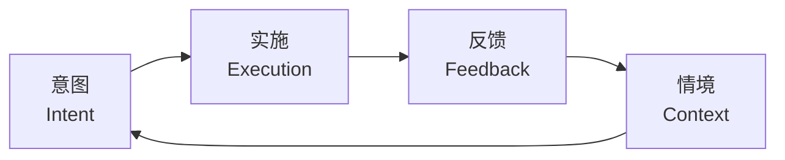

# Meta Reflection Techniques（元反思技巧）

## 定义

**元反思（meta-reflection）** = **反思的反思**。在 AI 协作语境中，指在关键环节**强制 AI 重新审视自己的实现、目标、逻辑与对旧功能的影响**。

> 认知科学中已有"元认知""元记忆""元语言"等先例；元反思把这个思路工程化到 AI 协作流程。

## 核心论点

1. **只要让 AI 元反思，必然会发现新问题**。神经网络擅长发现人类未注意到的连接，但也必然存在"激活不精确"的加工局限；元反思 = 利用前者 + 补偿后者。
2. **AI 的"情境" = 上下文（Context）**。这意味着：上下文设计（约束实体、重新定义问题、强制元反思）决定了 AI 行动的质量边界。
3. **对齐 = 利用大模型的补全能力**。人类与 AI、模块与模块、版本与版本之间相互补全，"找到相对完善的那点"是工作流设计的起点。

## 12 技巧 × 4 象限

### 通用类（Context）

| # | 技巧 | 指令示例核心 |
| :---: | :--- | :--- |
| 1 | **元反思** | 使用「深度思考」对实现做一轮自检：是否正确、是否破坏旧功能、是否有重大逻辑错误 |
| 2 | **约束实体** | 单 Session 处理的实体 ≤ 4 个；超出则用 TaskCreate 拆分 |
| 3 | **重新定义问题** | 深度思考：问题是否存在？能否缩小边界或转换为已有成熟解的问题？ |

### 意图类（Intent）

| # | 技巧 | 指令示例核心 |
| :---: | :--- | :--- |
| 4 | **设置兜底** | 显式问"搞砸了怎么办"，补足 AI 默认只考虑"如何成功"的盲点 |
| 5 | **三重防护** | 关键场景连续三道防线，避免"祸不单行" |
| 6 | **自我校验** | 执行前先写校验脚本/标准；执行后自动比对循环优化（ralph-loop 思想） |

### 实施类（Execution）

| # | 技巧 | 指令示例核心 |
| :---: | :--- | :--- |
| 7 | **看门狗** | 用 CronCreate 周期性读取 memory，推进未完成步骤——**摆脱人在回路** |
| 8 | **完整性** | 显式检查原子性/事务一致性/幂等性 |
| 9 | **对齐！对齐！对齐！** | 反复对照 plan/spec 文档——**对齐 = 利用大模型补全能力** |

### 反馈类（Feedback）

| # | 技巧 | 指令示例核心 |
| :---: | :--- | :--- |
| 10 | **倍速测试** | 强制 AI 思考 10×/100×/1000× 时方案是否仍成立；高频提醒考虑并发/异步 |
| 11 | **同类扫描** | 强制 AI 举一反三、扫描同类 bug 变式 |
| 12 | **积累飞轮** | 把新发现的模式追加到 `memory/dev-loop-patterns.md`，构建长期记忆 |

## 整体框架：行动之环

四象限对应"行动之环"四要素：



| 行动之环要素 | 对应技巧 |
| :--- | :--- |
| 意图 | 4. 兜底 / 5. 三重防护 / 6. 自我校验 |
| 实施 | 7. 看门狗 / 8. 完整性 / 9. 对齐 |
| 反馈 | 10. 倍速测试 / 11. 同类扫描 / 12. 积累飞轮 |
| 情境（Context） | 1. 元反思 / 2. 约束实体 / 3. 重新定义问题 |

**闭环断点分析**：
- 意图缺位 → 方案脆弱，单点失败即全局失败
- 实施缺位 → 上下文爆炸、无主推进
- 反馈缺位 → 错误重复、模式无法沉淀
- 情境缺位 → 跨域知识无法迁移

## 关键派生概念

### "对齐 = 补全"（Align = Complete）

```text
A 不完善，B 来补全 A
B 不完善，A 来补全 B
人类不完善，AI 补全人类
AI 不完善，人类补全 AI
项目 1 不完善，项目 2 来补全
模块 1 不完善，模块 2 来补全
```

> **找到相对完善的那点，就是设计整个工作流的起点**。判断"完善"的标尺："确认成本"与"确认系数"。

### 看门狗模式（Watchdog Pattern）

- **机制**：用 CronCreate 或心跳监控周期性读取 memory 文件 → 找到下一个未完成步骤 → 自动执行
- **目的**：**摆脱人在回路（human in loop）**，让 AI 长时间自主干活
- **变体**：心跳监控（`HEARTBEAT_OK` / `HEARTBEAT_EXECUTE`）与看门狗互补
- **工程实证**：作者直播中让 AI 在户外跑步时连续自主干活 90 分钟

### 实体数约束（Entity Count Bound）

- **经验值**：单 Session ≤ **4 个**实体
- **类比**：数据库 ≤ 4 个表
- **原因**：神经网络架构的天然漏洞，与模型能力无关
- **违反代价**：超出 4 个实体，AI "多数时候必然出错"

### dev-loop 循环

- **起源**：作者对 ralph-loop 循环的工程化改进
- **机制**：执行 → 校验 → 优化 → 沉淀
- **关键文件**：
  - `memory/dev-loop-patterns.md` — 新发现的模式
  - `memory/dev-loop-metrics.md` — 关键指标

## 与现有 wiki 概念的关联

| 关联概念 | 关联方式 |
| :--- | :--- |
| [[Agent Harness 治理协议]] | "双层验证"是"自我校验"（技巧 6）的物理拦截实现；"事件驱动自动 spawn"是"看门狗"（技巧 7）的多 agent 化 |
| [[Worker Verifier 对抗循环]] | "强制元反思"（技巧 1）与 Worker/Verifier 对抗循环在目标层同构：多视角加权后的信任 |
| [[Agent Runtime]] | "约束实体 ≤ 4"（技巧 2）是 Agent Runtime 上下文窗口管理的具体经验值 |
| [[Multi-Agent 协作模式]] | "重新定义问题"（技巧 3）与 Specialist 分工思想一致：跨域知识迁移 |
| [[Claude Code Subagent]] | "积累飞轮"（技巧 12）依赖 Subagent 的持久内存机制 |
| [[Claude Code Skills]] | 12 技巧可被编排为 Skill / Command / Agent，让 AI 自主干活 |
| [[12 个元反思技巧]] | 本概念的源 summary |

## 实施指引

把 12 技巧编排为 Skill / Command / Agent 的两种范式：

### 范式 A：流程型（按"行动之环"组织）

```text
Skill: action-loop
  1. 意图阶段：自动问 4 兜底 / 5 三重防护 / 6 自我校验
  2. 实施阶段：自动启用 7 看门狗 / 8 完整性 / 9 对齐
  3. 反馈阶段：自动启用 10 倍速 / 11 同类扫描 / 12 积累飞轮
  4. 情境阶段：自动启用 1 元反思 / 2 约束实体 / 3 重新定义
```

### 范式 B：单点型（按需触发）

```text
/meta-reflect      → 触发技巧 1
/bound-entities   → 触发技巧 2
/redefine         → 触发技巧 3
/fallback         → 触发技巧 4
/triple-guard     → 触发技巧 5
/self-verify      → 触发技巧 6
/watchdog         → 触发技巧 7
/integrity        → 触发技巧 8
/align            → 触发技巧 9
/10x-test         → 触发技巧 10
/scan-similar     → 触发技巧 11
/accumulate       → 触发技巧 12
```

## 关键观察

1. **元反思不是可选项**——它是利用神经网络的优点（向量矩阵发现连接）+ 补偿其缺点（激活不精确）的工程化操作。
2. **"AI 的情境 = 上下文"是连接 prompt engineering 与 multi-agent 架构的桥梁**——所有上下文设计技巧本质上都在工程化"情境"要素。
3. **"看门狗 + 完整性 + 积累飞轮"是 AI 长时间自主干活的最小可用集**——把"AI 单次聪明"升级为"AI 跨 session 越来越聪明"。
4. **"对齐 = 补全"是一个极具杠杆的认知重构**——把"对齐"从哲学概念降维到工程动作，让 10× 工作流有了可操作起点。

## 相关资源

- 原始来源：`D:\03resource\_Projects\work\harness-lab\context\references\2026-03-17-meta-reflection-techniques.md`（阳志平）
- 源 summary：[[12 个元反思技巧]]
