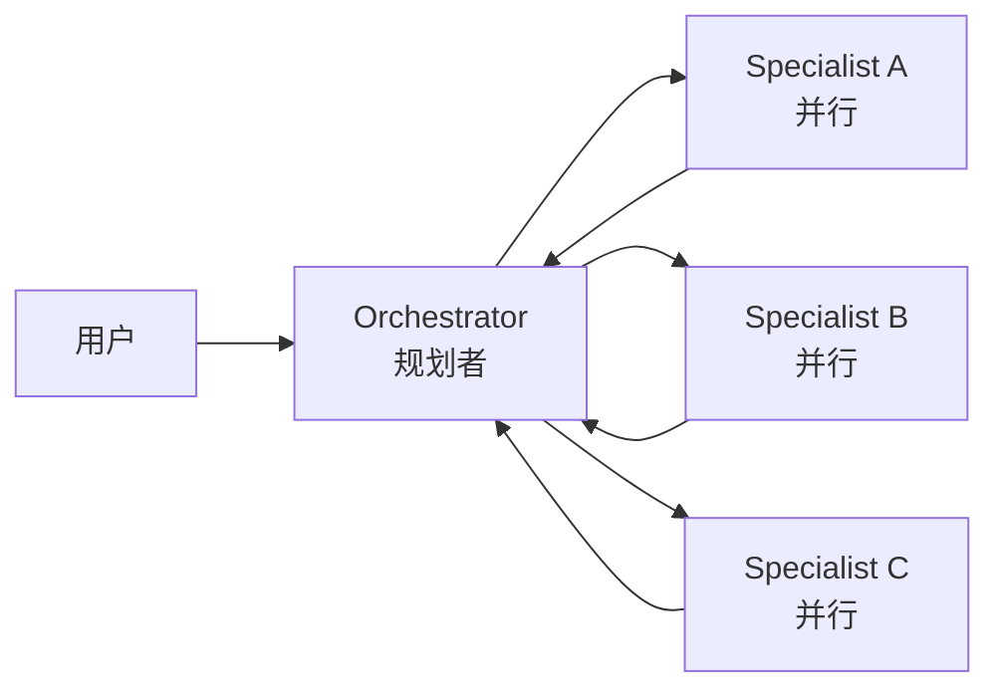
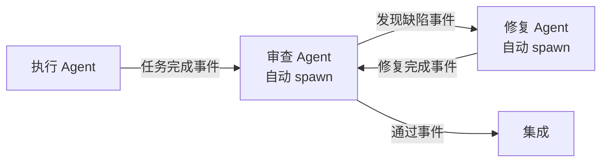

# Multi-Agent 协作模式

## 四种核心模式

### 1. Orchestrator / Specialist

中央协调者分发任务，专业 Agent 执行。

代表：
- **Anthropic Multi-Agent Research System** — Lead Agent 规划，并行 Subagent 搜索
- **Anthropic Managed Agents** — Coordinator 协调，多个 Specialized Agent

### 2. Worker / Verifier 对抗循环

Worker 干活，Verifier 挑刺，自动打回重做。

代表：
- **MiniMax Mavis** — Team Engine 调度，Worker/Verifier 直接对抗

详见 [[concepts/Worker-Verifier-对抗循环]]。

### 3. Team Engine 状态机

确定性的状态机调度程序，不依赖某个 AI 的实时状态。

代表：
- **MiniMax Mavis** — 写死的程序调度，不是 AI 决策

### 4. 自动扩张任务图

事件触发驱动 agent spawn，多个 agent 组成自运转的开发组织。不需要人调度，图自己根据事件流决定下一步做什么、spawn 谁、通知谁。

代表：
- **[[entities/wow-harness]] v3** — 事件驱动、无状态 session、上下文胶囊

与前三者的区别：支持并行（5 个 agent 同时做 5 个任务）、支持回路（审查 → 修复 → 闭合验证循环）、支持跨任务概念冲突检测。详见 [[Agent-Harness-治理协议]]。

## 模式对比

| 模式 | 验证方式 | 调度方式 | 并行 | 代表 |
|------|----------|----------|------|------|
| Orchestrator/Specialist | Lead 判断 | 中央协调 | 部分支持 | Anthropic、Claude Code Teams |
| Worker/Verifier | 直接对抗 | 状态机 | 批次并行 | MiniMax Mavis |
| Handoff (接力式) | 无回头 | 链式传递 | 不支持 | OpenAI Agents SDK |
| 自动扩张任务图 | 交叉验证 | 事件驱动 | 天然支持 | wow-harness v3 |

## 关键权衡

| 模式 | 优点 | 缺点 |
|------|------|------|
| Orchestrator/Specialist | 简单，中央控制 | 中心化，Lead 成为瓶颈 |
| Worker/Verifier | 真正的质量控制 | 收敛条件难定，可能死循环 |
| Team Engine | 确定性，可靠 | 灵活性低 |
| 自动扩张任务图 | 自运转，可并行，可回环 | 系统复杂度高 |

## 适用场景

- **Orchestrator/Specialist**：研究、多方向并行探索
- **Worker/Verifier**：需要严格质量控制的创作/代码场景
- **Team Engine**：生产环境，需要确定性调度的场景
- **自动扩张任务图**：长期项目，多 agent 并行协作，需要跨 session 一致性
