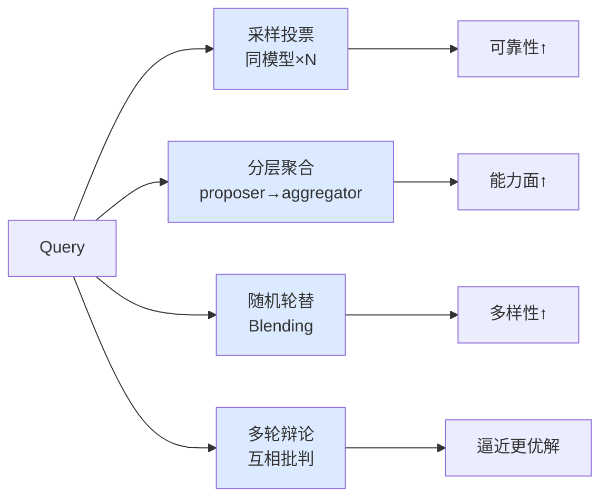

# Multi-Model Ensemble（多模型协作）

## 定义

**Multi-Model Ensemble** 指让多个 LLM（常为较弱 / 中等模型）协作产出单一最终答案的方法谱系。核心问题：**一堆中等模型协作，能否超过单个更强的模型？**

学术答案是**条件性的"能"**——取决于架构、异构性、任务难度、算力公平性。实证综述见 [[多模型协作如何超过单强模型：正面证据综述]]（正面）与 [[LLM Debate 失效模式：多 Agent 协作何时翻车（2025 综述）]]（反面）。

## 四种架构谱系

| 架构 | 机制 | 代表 | 收益来源 |
|------|------|------|---------|
| **采样投票** | 同一模型多次采样，取多数 / 一致 | Self-Consistency, More Agents | 降低单次随机性（可靠性） |
| **分层聚合** | 多 proposer 生成 + aggregator 综合，可多层 | Mixture-of-Agents | 异构互补（collaborativeness） |
| **随机轮替** | 每轮随机选一个模型回答，近似 ensemble 分布 | Blending | 风格多样性（用户留存） |
| **多轮辩论** | 多实例互相批判收敛 | [[LLM Debate]] | 互相纠错 |

## 收益的三条件（缺一就翻车）

1. **异构性（heterogeneity）**：模型盲点不重叠才互补。同质堆叠（如同一家族的几个模型）收益骤减，甚至触发偏差放大。这是 [[Agentic Code Review]]"异构才是补丁，不是数量"在生成层的对应——Stop Overvaluing MAD 称其为 "universal antidote"。

2. **任务难度**：More Agents 的 scaling 与任务难度正相关。简单任务堆 agent 几乎无效；难任务才有显著边际收益。

3. **算力公平性**：协作组与单 agent 比较，必须控制 test-time compute。Single-Agent Outperforms MAS（2604.02460）用 Data Processing Inequality 证明：等 token 预算下，单 agent 更 information-efficient。很多"协作更聪明"是"协作组喂了更多算力"的假象。

## 可靠性 vs 能力：两种目标

| 目标 | 含义 | 适用架构 | ensemble 适合度 |
|------|------|---------|-------------|
| **提升可靠性** | 把"偶尔做对"变成"次次做对" | 采样投票、聚合 | ✅ 强（降低方差） |
| **提升能力上限** | 做到单模型做不到的更难的事 | 辩论、异构聚合 | ⚠️ 弱（受单模型上限约束） |

> ensemble 最擅长的是**可靠性**（pass@k 的多采样机制，见 [[Agent Reliability vs Capability]]），而非**突破能力上限**。指望"3 个 7B 模型辩论出 GPT-4 级别的推理"通常落空。

## 与 [[Multi-Agent 协作模式]] 的边界

[[Multi-Agent 协作模式]] 讲的是**任务分工型**协作（orchestrator/specialist、worker/verifier）——不同 agent 干不同的事。Multi-Model Ensemble 讲的是**同级竞争 / 聚合型**协作——多个模型对**同一个问题**给出答案再合并。两者正交：可以分工 + 每个分工节点内部 ensemble。

## Related concepts

- [[LLM Debate]] — 四架构之一，也是最易翻车的一种
- [[Agentic Code Review]] — 异构多审稿，验证层的 ensemble（"异构才是补丁"）
- [[Self-Preferential Bias]] — 同质 ensemble 为何无法纠偏的根因
- [[Tournament Mode]] — 同级竞争择优（judge 选最好的一份，而非聚合）
- [[Agent Reliability vs Capability]] — ensemble 提升的是 reliability，不是 capability
- [[Stateless Reducer]] — 采样取一致可视为把不确定性外移为确定性归约
- [[Worker Verifier 对抗循环]] — 角色分工型协作（对照本页同级协作）
- [[Multi-Agent 协作模式]] — 任务分工型协作（对照本页同级协作）

## Open questions

- 四种架构的**最优组合**（如分层聚合 + 异构辩论）能否叠加收益，还是边际递减？
- 异构性的**量化度量**：如何衡量一组模型的"盲点不重叠度"？（[[Agentic Code Review]] 的 93.4% 互不重叠是审查层的数据，生成层缺类似度量）
- Blending 的"随机轮替"在**非对话任务**（代码、推理）上是否同样有效？
- 与 [[Harness Cybernetics]] 的前馈 / 反馈对偶：ensemble 属于哪种？聚合是前馈，辩论是反馈？
