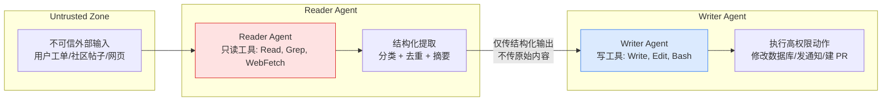
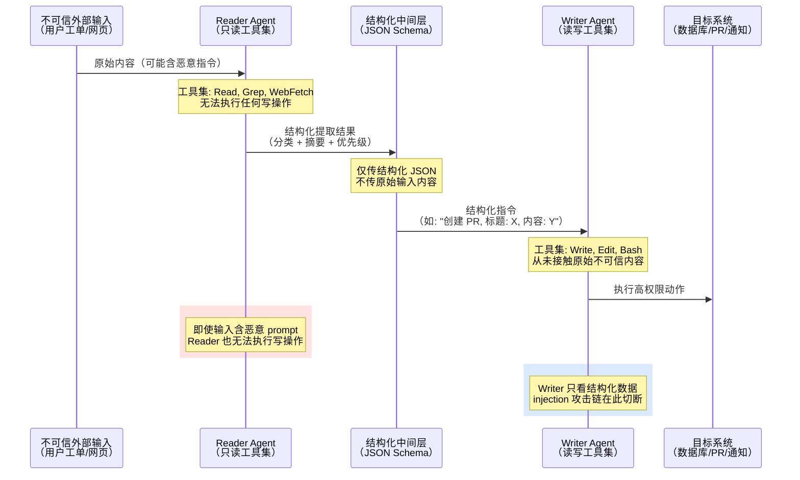

# Quarantine Mode

## 定义

**Quarantine Mode**（隔离模式）是一种 multi-agent 安全模式：将读取未受信外部内容的 agent 与执行高权限操作的 agent 在结构上隔离，前者只能输出结构化数据，后者依据该数据执行动作但不直接接触原始输入。

> "Bar the agents that read untrusted public content from taking high-privilege actions, which are instead done by the agents in charge of acting on the information."

核心思想：把安全边界从单 agent 的"内部权限检查"前移到 agent 之间的"结构隔离"——读 agent 根本**没有**执行写操作的能力，不是"有权限但克制"，而是"无法越权"。

## 工作机制

Reader Agent 的工具集被限定为只读（Read, Grep, WebFetch 等），**无法执行任何修改操作**。即使不可信内容中嵌入了恶意指令（如 prompt injection 尝试），Reader Agent 也无力触发高危动作。Writer Agent 只接收 Reader 产出的结构化输出（如 JSON 分类结果），不接触原始输入，从而切断了 injection 攻击链。

## 隔离时序

Reader 与 Writer 之间通过结构化 JSON 通信，原始不可信内容永不跨越隔离边界。这是"结构上做不到"的安全保证，而非"权限检查后放行"的信任模型。

## 为什么需要

Prompt injection 是当前 LLM 系统最棘手的攻击面之一。当单个 agent 既读取外部不可信内容又拥有写权限时，恶意内容可以直接嵌入指令，诱导 agent 执行非预期操作。传统防御（如 system prompt 加固、输入过滤）都是同一 agent 内部的"自查"——而自查本身就是脆弱的。

Quarantine Mode 的答案是：**不让查，让结构做不到**。读的 agent 天然不能写，写的 agent 天然读不到原始恶意内容。

## 实现方式

在 Claude Code 的 dynamic workflows 中，通过 subagent 的工具权限分离实现：

| 角色 | 工具集 | 接触数据 |
|:---|:---|:---|
| Reader Agent | 只读（Read, Grep, Glob, WebFetch） | 原始不可信输入 |
| Writer Agent | 读写（Write, Edit, Bash, Gh） | 仅 Reader 产出的结构化 JSON |

Reader 产出必须是**机器可解析的结构化格式**（如 JSON schema），而非自然语言摘要——这降低了 Reader 通过措辞微调间接影响 Writer 的风险。

## 与其他安全模式对比

| 模式 | 防御层 | 防御对象 |
|:---|:---|:---|
| [[Agent Secure Runtime]] 三层检查 | 单 agent 内部 | Policy / Network / Privacy 违规 |
| [[Worker Verifier 对抗循环]] | agent 之间 | 输出质量错误（幻觉、遗漏） |
| **Quarantine Mode** | agent 之间 | Prompt injection（恶意输入劫持） |

Quarantine Mode 是 [[Agent Secure Runtime]] 在 multi-agent 场景下的自然延伸——把权限边界从"单 agent 内的 Policy Engine 检查"前移到"agent 间的工具集异构配置"。对抗循环解决的是"做错了没有"，隔离模式解决的是"被劫持了没有"。

## 局限

- **Reader 仍可能通过结构化输出的措辞间接影响 Writer**：如果结构化字段中包含自然语言摘要，Reader 可以选择性措辞来引导 Writer 的行为。这是 [[Claude Code 动态工作流（Dynamic Workflows）]] 深度解读中明确提出的待研究问题："读 agent 能否被诱导把信息以'看似无害'的方式传给写 agent？"
- **适用于 triage/分类类工作流，不适用于需要深度理解内容的场景**：当 Writer 确实需要理解原始输入的 nuance 时，隔离会损失信息。
- **假设 Reader 和 Writer 之间没有侧信道**：如果两者共享文件系统或环境变量，隔离可能被绕过。

## Related concepts

- Agent Secure Runtime — 单 agent 三层安全模型，Quarantine 将其权限边界前移到 agent 之间
- [[Claude Code Subagent]] — Quarantine 通过 subagent 的工具权限分离实现
- [[Claude Code 动态工作流（Dynamic Workflows）]] — Quarantine 作为六种编排模式中的安全模式被提出

## Open questions

- Quarantine 模式对真实 prompt injection 攻击的防御有效性如何？是否有绕过 Reader→Writer 隔离的已知攻击手法？
- 结构化输出（JSON schema）在多大程度上能消除 Reader 对 Writer 的间接影响？自然语言摘要字段是否应完全禁止？
- 能否将 Quarantine 的隔离思想推广到更多 agent 角色组合（如 Reviewer↮Deployer、Planner↮Executor）？
