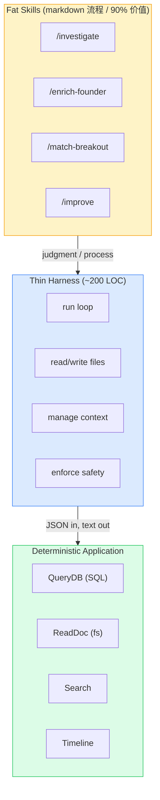
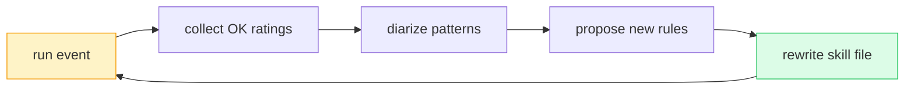

# Thin Harness, Fat Skills

## 定义

**Thin Harness, Fat Skills** 是一种 agent 套具架构原则，主张：

- **Harness（套具）应极薄** — 只做四件事：跑模型循环、读写文件、管理上下文、强制安全。约 ~200 行代码。
- **Skills（技能）应极胖** — 90% 的价值在 markdown 流程文件里：判断、过程、领域知识。
- **应用层（确定性工具）在最底** — SQL 查询、文件读、搜索、时间线、CLI 工具。

$$\text{intelligence} \uparrow \quad \text{execution} \downarrow \quad \text{harness}_{\text{LOC}} \approx 200$$

**核心思想**：模型的每次升级自动惠及所有 skill，确定性层保持完美可靠，harness 不膨胀。

> "套具就是产品。2x 的人和 100x 的人用同样的模型。差距不是智力——是架构——而且写在索引卡上就够。"

## 三个反模式

| 反模式 | 表现 | 后果 |
|--------|------|------|
| Fat Harness + Thin Skills | 40+ 工具定义、MCP 往返、REST 端点全封装 | 3x token、3x 延迟、3x 失败率 |
| 20,000 行 CLAUDE.md | 把所有知识塞进常驻上下文 | 模型注意力退化，Claude Code 主动提示"砍掉" |
| 错的工作放错的位置 | 把组合优化塞进 latent space | 800 人座位图幻觉、看似合理但完全错 |

## 五个核心定义

### 1. Skill 文件

可复用的 markdown 文档，教模型**怎么做**。**Skill 是一种方法调用**：同一份过程 + 不同参数 = 完全不同能力。

> 例：`/investigate` 接收 `TARGET`、`QUESTION`、`DATASET` 三个参数。传 (安全科学家, 沉默了吗, 210 万封邮件) 或 (空壳公司, 协调捐款了吗, FEC 申报) → 两个截然不同的分析师能力。

### 2. Harness

```yaml
responsibilities:
  - run_model_in_loop
  - read_write_files
  - manage_context
  - enforce_safety
```

仅此而已。

### 3. Resolver

上下文的路由表：**任务类型 X 出现时，先加载文档 Y**。Claude Code 的 skill `description` 字段就是内置 resolver——模型把用户意图与 description 自动匹配。

> 自白：作者 20,000 行 CLAUDE.md → 退化 → 缩到 200 行纯指针，resolver 关键时刻加载那一份。2 万行知识按需可达。

### 4. Latent vs. Deterministic

每一步都是其中一种，把两者搞混是 agent 设计最常见错误：

| 空间 | 用途 | 例子 |
|------|------|------|
| Latent | 判断、综合、模式识别 | 8 人晚宴排座（结合性格、社交） |
| Deterministic | 同输入同输出 | 800 人组合优化、SQL、算术 |

**判断标准**：错的工作放到错的一侧是反模式。

### 5. Diarization

模型读尽所有资料，输出**一页判断**——区别于 SQL 查询和 RAG pipeline 的核心能力：

$$\text{diarization}: \text{N documents} \rightarrow \text{1 page of judgment}$$

要求模型**真正读完、同时持有矛盾、注意到何时何物变化**。嵌入相似度搜索和关键词过滤器都做不到。

## 三层架构



## Self-rewriting Skill 循环



实证：YC Startup School 7 月活动 12% "OK" 评级 → 下次活动 4%（8pp 提升，**0 行代码改写**）。

## 零一次性工作纪律

> "你不被允许做一次性工作。如果我让你做某件事，而它属于'还会再做一次'的类型，你必须先在 3–10 个样本上手动做一遍，给我看输出，我批准后**编纂成 skill 文件**。如果应该自动跑，挂到 cron 上。**测试：如果我必须第二次向你请求，你失败了。**"

——这是把人类判断沉淀为系统能力的不二法门。

## 关联

- [[concepts/Claude-Code-Skills/index|Claude Code Skills]] — 具体的 skill 文件格式与加载机制
- [[concepts/Agent-Runtime|Agent Runtime]] — harness = runtime
- [[concepts/Agent-Harness-治理协议|Agent Harness 治理协议]] — 跨 session 一致性（与本概念的"一次 session 形状"互补）
- [[entities/Dive-into-Claude-Code|Dive into Claude Code]] — 98.4% 基础设施数据印证
- [[summaries/13-thin-harness-fat-skills|13-thin-harness-fat-skills]] — 全文摘要与 YC 案例
- [[summaries/10-claude-code-dynamic-workflows|10-claude-code-dynamic-workflows]] — dynamic workflow 是 fat skills 的运行时形态

## 待解决问题

- Markdown 作为"编程语言"的边界在哪？何时 skill 应当被编译成 TypeScript？
- Resolver 在 200+ skill 库规模下的 description 失配率如何控制？
- Self-rewriting skill 的版本控制与回滚机制？
