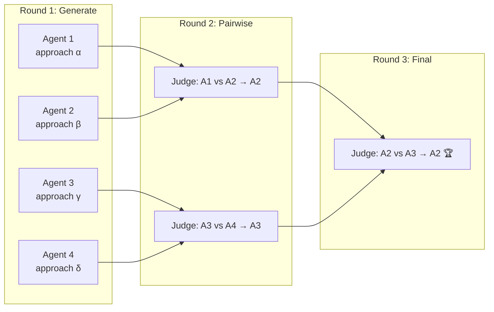
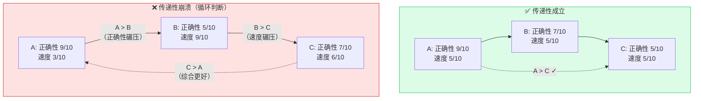

# Tournament Mode

> Dynamic Workflows 六种核心编排模式之一：让多个 agent 竞争同一任务，通过 pairwise 比较选出最优输出。不是分工，是竞争。

## 定义

**Tournament Mode** 是一种质量评估编排模式：对同一任务 spawn N 个 agent，各自用不同策略独立完成，再由评判 agent 对输出进行 **pairwise 比较**，逐轮淘汰，最终选出胜者。

核心区别：[[Claude Code 动态工作流（Dynamic Workflows）]] 中的 Fan-out-and-synthesize 是**分工**（每个 agent 做不同子任务），Tournament 是**竞争**（每个 agent 做同一任务的不同版本）。

## 核心洞察：Pairwise > Absolute Scoring

为什么 Tournament 用 pairwise 比较而非单点打分？

- **相对判断比绝对量纲更可靠**：人对"A 比 B 好"的判断一致性远高于"A 得 7.3 分"。
- **避免尺度漂移**：绝对打分时，评判 agent 的尺度可能在多次评分中漂移；pairwise 每次只比较两个候选，尺度自洽。
- **实践证据**："if you try to sort 1000+ rows in one prompt, quality degrades"——大规模排序场景下，pairwise pipeline 是唯一可行的方案。

这是 [[A harness for every task: Anthropic 官方 Dynamic Workflows 深度解读]] 中首次被 wiki 记录的关键洞察（此前 wiki 未覆盖 pairwise-vs-absolute 的判断学说）。

## 工作机制

### 基本流程

1. **Spawn**：对同一任务启动 N 个 agent，每个使用不同策略/视角/提示词。
2. **Pair**：将输出两两配对，交由评判 agent 比较。
3. **Advance**：胜者进入下一轮，败者淘汰。
4. **Repeat**：直到只剩一个胜者。

### 锦标赛形式选择

| 形式 | 比较轮数 | 适用场景 |
|:---|:---|:---|
| **单败淘汰**（single-elimination） | N-1 | 候选多、成本敏感 |
| **循环赛**（round-robin） | N(N-1)/2 | 候选少、精度要求高 |
| **Bucket-rank** | O(N) | 大规模排序（1000+），先分桶后桶内比较 |

对于大多数代码生成和设计评审场景，单败淘汰已足够。循环赛仅在 transitivity 假设可能崩溃时需要（见下）。

## Transitivity 假设

Tournament 的核心数学假设是**传递性**：若 A > B 且 B > C，则 A > C。

### 何时成立

- 质量维度**单一且清晰**（如"哪个 CLI 命令名更好记"）
- 评判 agent 的评判标准**前后一致**
- 候选数量可控，评判 agent 能保持注意力

### 何时崩溃

- **多维度质量**：A 更快、B 更正确、C 更优雅——无法用单一尺度排序。
- **评判不一致**：同一对候选在不同轮次被不同评判 agent 比较时，尺度不一致导致循环。
- **非线性权衡**：当"好 20% 的正确性"和"好 50% 的速度"无法线性比较时。

循环判断（A>B, B>C, 但 C>A）是 transitivity 崩溃的信号，此时应：
1. 退回到循环赛，收集所有 pairwise 结果。
2. 用 Elo 评分或 Bradley-Terry 模型从 pairwise 结果中推导全局排序。
3. 如果循环判断持续出现，说明任务本身不适合 Tournament——改用 generate-and-filter 模式。

## 何时适用 vs 何时崩溃

| 适用 | 崩溃 |
|:---|:---|
| 排序/排名任务（简历筛选、ticket 优先级） | 多维度质量、无法确定单一排序准则 |
| 设计/命名/品味决策（CLI 命名、API 设计） | 候选数量巨大（1000+ 且不能分桶） |
| 有清晰 rubric 且评判 agent 能一致应用 | 评判 agent 本身在不同轮次中表现不一致 |
| 候选数量适中（N < 50） | 成本极度敏感（N 个 agent + N-1 次比较） |

## 相关概念

- [[Claude Code 动态工作流（Dynamic Workflows）]] — Tournament 是六种核心编排模式之一
- [[A harness for every task: Anthropic 官方 Dynamic Workflows 深度解读]] — 首次在 wiki 中记录 pairwise-vs-absolute 判断学说
- [[Agent Macro Evaluation]] — 宏观评估方法论中的 pairwise 比较与 Tournament 共享"相对判断优于绝对量纲"的哲学
- [[Worker Verifier 对抗循环]] — 同为质量保障机制，但 Worker/Verifier 是合作验证，Tournament 是竞争择优

## 待研究问题

- Pairwise 比较的 transitivity 假设在实践中何时崩溃？(A>B, B>C 但 C>A 的循环判断如何检测和处理？)
- 不同锦标赛形式（单败淘汰 vs 循环赛 vs bucket-rank）在真实任务上的精度-成本 tradeoff 如何量化？
- Tournament 的最优 N 是多少？spawn 更多 agent 的边际收益何时递减？
- 评判 agent 的"口味一致性"如何度量？是否需要多个评判 agent 取共识？
