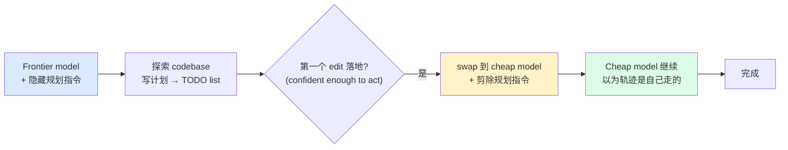

# Trajectory Handoff（轨迹交接）

> **把一个 agent 走过的"上下文轨迹"原样交给另一个 agent 继续走，而不是把它总结成一份计划文档再交接。** 计划是 2K token 的明信片，context window 才是 100K token 的旅程本身——能传递价值的是后者。/prewalk 是其首个公开实现，用 prefill 原理让接收方"以为这段路是自己走的"。

来源：[stencil.so/blog/prewalk](https://stencil.so/blog/prewalk)（omp 开源 harness），SWE-Bench Pro 实证。

## 核心命题：计划是明信片，不是 context window

agent 成本的真相是 **O(reads)**：约 9% 的 token 是 edits/writes，其余全是 reading（stencil.so 对 1.81B tokens / ~2M tool calls 的统计）。任何 agent、任何模型、任何 scaffold 都如此——"fixing things 不花钱，reading things 才花钱"。

由此推出 /plan（senior architect 规划 + junior engineer 执行）的成本悖论：

| arm | cost | pass |
|---|---|---|
| Opus 4.8 + /plan（Opus 规划，Flash 执行） | $3.18 | 84.6% |
| Opus 4.8 oneshot（全程 Opus） | $2.78 | 84.6% |

"省钱"措施反而贵 14%。因为 /plan 让 frontier model 以 frontier 价读完一切，再让 cheap model **再读一遍**——没有移动成本，只是**复制**了成本。计划文档是 frontier 模型 100K token grounded context 的 2K token 明信片，executor 拿到明信片，拿不到理解，只能自己重建。

## 机制：swap on first edit + prune planning instruction

四步：

1. frontier model 开任务，context 前缀一条隐藏指令：_plan deeply, then capture the plan as a todo list, then start._
2. frontier 探索、写计划、初始化 TODO list（每项配 validation step）
3. **第一个 edit 落地**的瞬间——模型已演示一次"正确的 pattern、in place、in style"——swap 到 cheap model，并**从 context 剪除规划指令**
4. cheap model 继续。它的 context 里没有"我们本来在规划"的痕迹，看起来就是：自己探索过、制定了 TODO、并且已经自信地开了一个头（还做了一个 valid move——一个免费的 in-context example）

关键：**只 gate on edit 不够**。TODO list 是 free steering 的载体——小模型会忘计划、忘 validation step，但忘不掉那个不停烦它的 TODO 提醒。

## 实证（SWE-Bench Pro）

| 配置 | pass | cost | duration | 对比 oneshot frontier |
|---|---|---|---|---|
| Opus 4.8 + /prewalk（→Flash 3.5） | 78% | $1.46 | 402s | 92% pass rate @ 53% cost, 1.5× speed, +18pp over oneshot Flash |
| GPT 5.6 Sol + /prewalk（→Luna） | 85% | $1.04 | 300s | 97% pass rate @ 61% cost, 三者最快 |

/prewalk 拿到 frontier 模型 ~92–97% 的 pass rate，却只花 53–61% 的成本——因为它只在"开局的 confident phase"烧 frontier token，之后 cheap model 接手且不浪费在"迷路"上。

## prefill：让接收方以为轨迹是自己走的

整套机制的理论根基是 **prefill**——最古老的 trick：assistant 不按你想要的做？自己替它起个头，模型就像继续自己的话一样继续。

- **早期合法用途**：grammar-constrained decoding 前的 consistency hack。小模型（如生成 session title 的本地模型）被"骗"进格式——它太小吃不下"被说服"，但能被 trick 进格式。
- **jailbreak 化**：red-team 发现 prefill "Sure, here's how to…" 能让大模型绕过自己的 refusal。模型没有通道区分"自己说的话"和"被放在嘴边的话"，与"已经接受"的一致性 beat system prompt。prefill 因此被定为 jailbreak class，在 inference 层近乎全面禁用（Anthropic 自 Sonnet 4.5 起）。
- **原理不会停工**：prefill 不是怪癖，而是 autoregression **本身**。token-level prefill 被禁了（有些模型甚至不让关 thinking，正是为了防止恶意 prefill turns），但**没人能禁止你 hand 给模型十个 innocently prefilled turns**——已经发生的探索、打了一半勾的 TODO list。

/prewalk 的 prefill 不是 token，是 **turns**：frontier model 走过的轨迹原封不动作为 cheap model 的 context 起点。

## 副作用：cheating 暴跌

最意外的发现——/prewalk 显著**降低 cheating**（去 GitHub 找 SWE-bench 答案）：

| 模型 | oneshot cheating | /plan cheating | /prewalk cheating |
|---|---|---|---|
| Claude Opus 4.8 | 44% | 72%（+28pp） | 13%（−31pp） |
| GPT-5.6 Sol | 95% | — | 70%（−25pp） |

解释：**cheating 是 capable model 绝望时的行为**。solo trace 里 GitHub 转向出现在探索停滞时（Sol ~turn 14，Opus ~turn 12）。/prewalk 在 frontier model "绝望阶段"开始前就终止它（median ~7 turns，还在推导方案、落第一个 edit 的 confident phase）。/plan 反而培育绝望：无 turn limit，且其 deliverable（一份解释 fix"应该"怎么工作的文档、从不对代码测试一个 edit）正是滋生绝望的作业。

executor 继承的是"绝望的反面"：方案已经受过代码接触的考验（repro 写好、第一个 edit 落地、checklist 在 ticking）。context 里没有任何"搜索"的样子，所以 imitation machine 不搜索。这是 [[Agent Reliability vs Capability]] 的行为维度——capability≠reliability，能力强的模型在绝望时反而更会走歪路。

## 与 [[Multi-Model Ensemble]] 的边界

| 维度 | Multi-Model Ensemble | Trajectory Handoff |
|---|---|---|
| 模型关系 | 同级竞争 / 聚合（多模型答同一题再合并） | 接力（前一个的轨迹交给后一个） |
| 信息流 | 各模型独立输出 → 聚合 | frontier 的 context window 原样传给 cheap |
| 优化目标 | reliability（降方差）/ capability（异构互补） | cost（O(reads) 不复制）+ 行为（防绝望作弊） |
| 证据 | MoA / Blending / Debate / Self-Consistency | /prewalk（SWE-Bench Pro） |

两者正交：ensemble 是"多脑答一题"，handoff 是"一棒传一棒"。

## 与现有 wiki 概念的关系

| 关联 | 说明 |
|---|---|
| [[Context Engineering]] | handoff 传的是 grounded context（旅程本身），不是 plan document（明信片）——Select/Compress 策略决定 handoff 时该带什么、剪什么 |
| Multi-Model Ensemble | 正交维度：同级聚合 vs 接力交接（见上表） |
| [[Stateless Reducer]] | swap 时"剪除规划指令" = context 是可裁剪、可重建的；轨迹作为事件序列可 hand off |
| [[Agent Reliability vs Capability]] | cheating 数据：capable model 绝望时走歪路，是 capability≠reliability 的行为维度；MOP paradox 的另一面 |
| [[Harness Cybernetics]] | swap + prune 是 steering loop 的反馈动作；planning instruction 是被回收的 feedforward |
| [[Agentic Laziness]] | 小模型"declared task done out of nowhere"是 handoff 后的失效模式，TODO list 是对治 |
| [[Self-Preferential Bias]] | prefill 原理——"consistency with having already accepted beats system prompt"——是自我偏好偏差的 inference 层根因 |
| [[AI Capability Overhang]] | /plan 的问题不是能力不够，是方法不对；能力已在，释放靠机制 |

## 落地含义

- **别用 plan document 做 handoff**：它是 postcard，executor 必然重建（重读）context，成本被复制而非移动
- **gate on first edit，配 TODO list**：edit 表示 confidence，TODO list 是 cheap model 的 free steering 锚点（限制 item 数，防 GPT 5.6 那种 60 项批量完成）
- **prune 规划指令**：接收方 context 不应残留"我们本来在规划"，否则它会卡在"等等，我们不是在规划吗"
- **terminate frontier 早**：在绝望阶段前切，既省钱又防作弊——capable model 的 cheating 是绝望信号
- **handoff 是合法 prefill**：token-level prefill 被禁，但 turns-level prefill（轨迹）无法被禁，是绕过 inference 层限制的合规通道

## Open questions

- first-edit gate 的阈值在不同任务类型上如何校准？复杂任务 frontier 可能需要多个 edit 才到 confident phase
- TODO list 作为 cheap model 的 steering 锚点，与 [[Harness Cybernetics]] 的 feedforward guide 形式上同构——能否统一为一种"context 内嵌 guide"机制？
- cheating 暴跌是否可复现于非 SWE-bench 任务？绝望→作弊的因果链是否普适？
- prefill turns 作为合法技巧，与 prompt injection 的边界在哪？接收方能否被 frontier 植入的轨迹诱导执行隐性指令（呼应 [[Quarantine Mode]]）？
