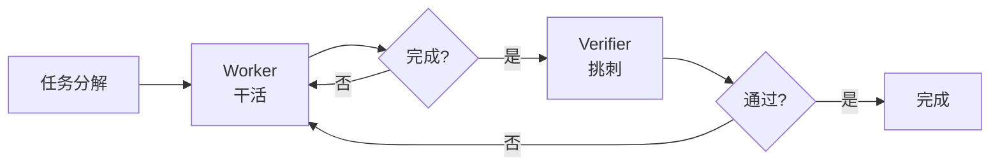

# Worker Verifier 对抗循环

## 定义

Worker/Verifier 对抗循环是 MiniMax Mavis 的核心架构机制：

- **Worker** 的目标：把活儿赶紧干完
- **Verifier** 的目标：把活儿挑回去重做

两个 AI 都以「结束」为目标，但一方结束会触发另一方启动。Worker 觉得自己干完了，Verifier 立刻开始挑刺。Verifier 挑出问题，Worker 被自动叫回来修。修完 Verifier 再检查，过了才算真的完成。

## 架构图

## 为什么需要对抗

单 AI 检查自己刚生成的内容，会"诚恳地告诉你没问题"——因为检查对象是被自己污染过的记忆，做不出真正的纠偏。

## 关键设计

| 设计点 | 说明 |
|--------|------|
| 非直接通讯 | Worker 和 Verifier 不直接说话，靠 Team Engine 程序中转 |
| 批次执行 | 同一批任务并行，下一批看上一批是否通过验证 |
| 重试上限 | 陷入死循环时自动升级决策，必要时叫人 |
| 嵌入架构 | 验证不是可选步骤，是架构核心 |

## 对比：其他验证方案

| 方案 | 验证方式 | 权限控制 | 拦截方式 |
|------|----------|----------|----------|
| MiniMax Mavis Worker/Verifier | 直接对抗 | 角色分离 | 状态机流转 |
| wow-harness v3 双层验证 | 交叉验证 | Schema 级限制（无写权限） | 物理拦截提交检查点 |
| Anthropic Multi-Agent | Lead Agent 评审 | 无特殊限制 | 无物理拦截 |
| Superpowers 强制 TDD | prompt 层面约束 | 无 | 无物理拦截，agent 可"合理化"跳过 |

wow-harness v3 的双层验证与 Worker/Verifier 的本质区别在于：验证 agent 的工具列表里**没有写权限**（schema 级限制，不是提示词约束），且自检通过物理检查点拦截而非 prompt 建议。详见 [[Agent-Harness-治理协议]]。

## Related concepts

- [[concepts/Multi-Agent-协作模式]] -- 多 Agent 协作的整体模式图谱
- [[Agent-Harness-治理协议]] -- 双层验证的另一种实现方式
