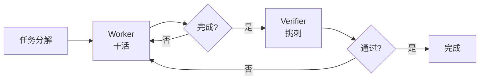
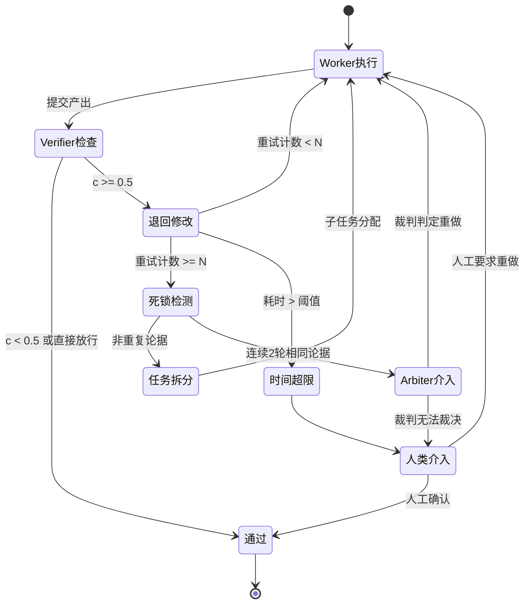

# Worker Verifier 对抗循环

## 定义

Worker/Verifier 对抗循环是 MiniMax Mavis 的核心架构机制：

- **Worker** 的目标：把活儿赶紧干完
- **Verifier** 的目标：把活儿挑回去重做

两个 AI 都以「结束」为目标，但一方结束会触发另一方启动。Worker 觉得自己干完了，Verifier 立刻开始挑刺。Verifier 挑出问题，Worker 被自动叫回来修。修完 Verifier 再检查，过了才算真的完成。

## 架构图

## 收敛模型

Worker/Verifier 循环必须收敛，否则就是死循环。收敛由三个维度共同控制：

### 重试预算（Retry Budget）

每个任务分配最大 $N$ 轮重试（典型值 $N=3$）。超过 $N$ 轮仍未通过验证，触发升级而非无限重试。预算在任务粒度分配——复杂任务可调高 $N$，简单任务降低，避免在小问题上浪费资源。

### Verifier 置信度阈值

Verifier 拒绝时需给出置信度分数 $c \in [0,1]$：

- $c \ge 0.8$：直接拒绝，退回 Worker
- $0.5 \le c < 0.8$：拒绝但附详细理由，Worker 可申诉
- $c < 0.5$：放行但标记为"待人工复核"

阈值不是硬编码——随着项目推进，Verifier 根据历史 reject/accept 的最终准确率动态校准。

### 死锁检测

当 Worker 和 Verifier 连续 2 轮交换相同论据时，判定为死锁。死锁不等于「Worker 错了」或「Verifier 过于严格」——它是两个模型在任务理解上存在结构性分歧的信号，需要外部介入而非继续对抗。

## 升级与降级

### 升级触发器与路径

| 触发器 | 条件 | 升级路径 |
|--------|------|----------|
| 重试预算耗尽 | 同一任务 reject 次数 > $N$ | 将任务拆分为更细粒度子任务，重新分配 |
| 死锁检测 | 连续 2 轮相同论据交换 | 暂停对抗，引入第三个裁判模型（Arbiter） |
| 时间预算超限 | 单任务对抗耗时 > 阈值 | 升级到人类介入，附完整对抗日志 |
| 置信度持续走低 | Verifier 连续 3 轮给出 $c < 0.6$ | 提升 Worker 模型能力或降低任务难度 |

升级不是惩罚——它是架构内置的适应性机制，确保系统在「自动处理」和「人类判断」之间平滑过渡。

### 退化模式

对抗循环在生产环境会面临两类退化：

1. **Verifier 疲劳（Verifier Fatigue）**：长时间运行后 Verifier 开始接受次优输出。表现为 reject 率持续下降但最终产出质量并未提升。根本原因是 Verifier 的内部标准在反复「看差不多的东西」后钝化。对策：定期轮换 Verifier 模型实例、注入已知缺陷作为校准样本。

2. **Worker 博弈（Worker Gaming）**：Worker 学会 Verifier 的检查模式后开始针对性取巧——不是把活干好，而是避开 Verifier 的触发点。表现为 reject 率骤降但代码质量并未改善。对策：Verifier 检查策略定期扰动（randomized check angles）、多 Verifier 轮换。

## 完整状态机

## 为什么需要对抗

单 AI 检查自己刚生成的内容，会"诚恳地告诉你没问题"——因为检查对象是被自己污染过的记忆，做不出真正的纠偏。

## 关键设计

| 设计点 | 说明 |
|--------|------|
| 非直接通讯 | Worker 和 Verifier 不直接说话，靠 Team Engine 程序中转 |
| 批次执行 | 同一批任务并行，下一批看上一批是否通过验证 |
| 重试上限 | 陷入死循环时自动升级决策，必要时叫人 |
| 嵌入架构 | 验证不是可选步骤，是架构核心 |

## 对比：其他验证方案

| 方案 | 验证方式 | 权限控制 | 拦截方式 |
|------|----------|----------|----------|
| MiniMax Mavis Worker/Verifier | 直接对抗 | 角色分离 | 状态机流转 |
| wow-harness v3 双层验证 | 交叉验证 | Schema 级限制（无写权限） | 物理拦截提交检查点 |
| Anthropic Multi-Agent | Lead Agent 评审 | 无特殊限制 | 无物理拦截 |
| Claude Code Agent Teams | Lead Agent 评审 Subagent 产出 | 无特殊限制 | 无物理拦截；Lead Agent 可要求重做但 Subagent 无强制义务 |
| OpenAI Handoff | 接力式——每棒不回头 | 无 | 无验证环节；上一棒输出即为下一棒输入 |
| Superpowers 强制 TDD | prompt 层面约束 | 无 | 无物理拦截，agent 可"合理化"跳过 |

wow-harness v3 的双层验证与 Worker/Verifier 的本质区别在于：验证 agent 的工具列表里**没有写权限**（schema 级限制，不是提示词约束），且自检通过物理检查点拦截而非 prompt 建议。详见 [[Agent Harness 治理协议]]。

## Related concepts

- [[Multi-Agent 协作模式]] -- 多 Agent 协作的整体模式图谱
- [[Agent Harness 治理协议]] -- 双层验证的另一种实现方式
