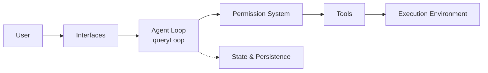

# Dive into Claude Code

## 基本信息

| 属性 | 值 |
|------|-----|
| 标题 | "Dive into Claude Code: The Design Space of Today's and Future AI Agent Systems" |
| arxiv | 2604.14228 |
| 方法 | 源码级逆向工程分析（TypeScript v2.1.88，约 1,884 文件 / 512K 行） |
| 证据层级 | Tier A（产品文档）、Tier B（代码验证）、Tier C（社区分析/推断） |

## 核心发现

### 1.6% / 98.4% 法则

Claude Code 代码库中仅约 **1.6%** 是 AI 决策逻辑，其余 **98.4%** 是运行基础设施（权限、工具路由、上下文管理、恢复逻辑）。这印证了 [[Agent Runtime]] 的核心判断：**套具比模型重要**。

### 5 个设计价值（Design Values）

| 价值 | 核心含义 |
|------|---------|
| Human Decision Authority | 人类保留最终决策权，通过 principal hierarchy（Anthropic > 运营商 > 用户）实现 |
| Safety, Security, and Privacy | 即使人类疏忽也保护代码、数据和基础设施 |
| Reliable Execution | 忠实执行意图，跨 context window / session / subagent 保持一致性 |
| Capability Amplification | 单位投入的物质产出提升，27% 的任务是"没有工具就不会尝试"的新工作流 |
| Contextual Adaptability | 适应用户的特定上下文，信任关系随时间演化（auto-approve 20% -> 40%+） |

### 13 条设计原则

从 5 个价值衍生，覆盖：deny-first escalation、graduated trust spectrum、defense in depth、externalized programmable policy、context as scarce resource、append-only durable state、minimal scaffolding maximal harness、values over rules、composable extensibility、reversibility-weighted risk、transparent file-based memory、isolated subagent boundaries、graceful recovery。

### 7 组件高层结构

1. **User** -- 提交 prompt、审批权限、审查输出
2. **Interfaces** -- Interactive CLI / Headless CLI / Agent SDK / IDE（共享同一 loop）
3. **Agent Loop** -- `queryLoop()` async generator，迭代模型调用 + 工具分派
4. **Permission System** -- deny-first 规则评估 + auto-mode ML 分类器 + hooks
5. **Tools** -- 54 个内置工具（19 无条件 + 35 条件式）+ MCP 工具
6. **State & Persistence** -- append-only JSONL transcripts + CLAUDE.md 层级
7. **Execution Environment** -- Shell（可选 sandbox）+ 文件系统 + MCP + 远程执行

### 5 层子系统架构

| 层 | 职责 |
|----|------|
| Surface | 入口和渲染（CLI、SDK、IDE） |
| Core | agent loop + 5 层 compaction pipeline |
| Safety/Action | 权限系统、hooks、extensibility、工具池、sandbox、subagent spawning |
| State | context assembly、runtime state、session persistence、CLAUDE.md + memory、sidechain transcripts |
| Backend | Shell 执行、远程执行、MCP 连接、42 个工具子目录 |

### 与 OpenClaw 对比

论文在 6 个维度对比 Claude Code 和 OpenClaw（开源多通道个人助手网关）：

| 维度 | Claude Code | OpenClaw |
|------|-------------|----------|
| 系统范围 | CLI/IDE 编码套具，临时进程 | 持久 WebSocket 网关守护进程 |
| 信任模型 | deny-first 逐动作评估 + ML 分类器 | 单一可信操作员 + 网关周边访问控制 |
| Agent 运行时 | `queryLoop()` 是系统中心 | Pi-agent 嵌入网关 RPC dispatch |
| 扩展架构 | 4 机制按 context 成本分层 | Manifest-first 插件 + 12 能力类型 |
| 记忆与上下文 | 4 级 CLAUDE.md + 5 层 compaction | Bootstrap 文件 + 梦想系统 + 混合检索 |
| 多 Agent | 任务委派 subagent + worktree 隔离 | 多 agent 路由 + sub-agent 委派，最大嵌套深度 5 |

关键洞察：两者可组合（OpenClaw 可通过 ACP 托管 Claude Code），说明 agent 设计空间是分层的而非扁平的。

## 评估视角：长期人类能力保持

论文引入第 6 个关注点作为评估透镜（非设计价值）：

- AI 辅助条件下开发者理解力测试得分低 17%
- 93% 审批通过率导致审批疲劳，削弱人类监督能力
- 807 仓库因果分析发现代码复杂度增加 40.7%
- EEG 研究发现 LLM 用户神经连接减弱且移除 AI 后持续

论文结论：未来系统应将可持续性差距视为**一等设计问题**，而非下游评估指标。

## 与本 Wiki 的关联

- [[Agent Runtime]] -- 98.4% 基础设施数据的直接来源
- [[Agent Harness 治理协议]] -- append-only 持久化、最小脚手架原则
- [[wow-harness]] -- 治理协议设计的学术验证基础
- [[ESAA]] -- ESAA 的 event sourcing 与 Claude Code 的 append-only JSONL 共享同一设计哲学
- [[Claude Code Subagent]] -- subagent 隔离边界的源码级证据
