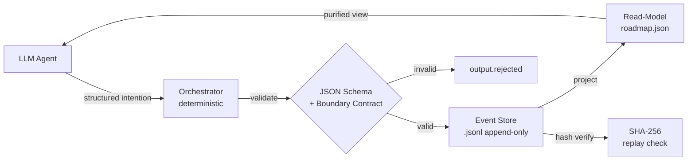

# ESAA

## 基本信息

| 属性 | 值 |
|------|-----|
| 全称 | "ESAA: Event Sourcing for Autonomous Agents in LLM-Based Software Engineering" |
| arxiv | 2602.23193 |
| 方法 | 将 Event Sourcing + CQRS 原则应用于 LLM agent 生命周期管理 |
| 验证 | 两个 case study（单 agent landing page + 四 agent 临床 dashboard） |
| 开源 | 公开仓库提供 clean state 初始化，支持完整 replay 复现 |

## 核心命题

将 Event Sourcing 模式应用于 agent 生命周期管理。Agent 的 **source of truth 不是当前仓库快照**，而是一条不可变的意图、决策、效果日志（event store），当前状态从这条日志**确定性投影**（deterministic projection）。

核心范式转换：**treat LLMs as intention emitters under contract**, rather than "developers" with unrestricted permissions。

## 关键问题

论文识别了现有 agent 系统的三个结构性缺陷：

1. **State drift** -- agent 在 brownfield 场景中误信已修复 bug，实际系统未变；或重写 spec 绕过本地编译失败
2. **Lost-in-the-middle** -- 长 context window 中 facts 被埋没，recency bias 导致 agent 忽略初始 contract
3. **Blast radius unbounded** -- 现有多 agent 框架（AutoGen/MetaGPT/LangGraph）缺乏 immutable audit trail 和 deterministic replay

## ESAA 架构

### 四个 Canonical Artifacts

1. **Event store** (`activity.jsonl`) -- append-only 事件日志，包含 intentions、dispatches、effects、run closures
2. **Materialized view** (`roadmap.json`) -- 纯投影的 read-model，含 tasks、dependencies、indexes、`projection_hash_sha256`
3. **Boundary contracts** (`AGENT_CONTRACT.yaml`, `ORCHESTRATOR_CONTRACT.yaml`) -- 按 task type 定义允许的 actions、output patterns、硬禁止（如 agent 禁止 `file.write`）
4. **PARCER profiles** -- metaprompting 配置，6 维约束（Persona/Audience/Rules/Context/Execution/Response），强制 JSON envelope 输出

### 核心机制

| 机制 | 描述 |
|------|------|
| Trace-first model | 事件在不可逆效果之前记录为 fact |
| Immutability of done | 完成的任务不可回退，缺陷通过 `issue.report` 创建新 hotfix 路径 |
| Deterministic canonicalization | JCS (RFC 8785) + SHA-256 hash 验证投影一致性 |
| Purified view | agent 接收精选上下文而非原始状态，缓解 lost-in-the-middle |

### 与现有框架对比

| 能力 | AutoGen | MetaGPT | LangGraph | CrewAI | ESAA |
|------|---------|---------|-----------|--------|------|
| Immutable event log | - | - | - | - | ✓ |
| Deterministic replay | - | - | - | - | ✓ |
| Boundary contracts | - | Partial | - | - | ✓ |
| Hash-verified projection | - | - | - | - | ✓ |
| Blast radius containment | - | Partial | - | - | ✓ |
| "Done" immutability rule | - | - | - | - | ✓ |

## Case Studies

### CS1: Landing Page（单 Agent）

| 指标 | 值 |
|------|-----|
| Tasks | 9 (T-1000 ~ T-1210) |
| Events | 49 |
| Agents | 3 (composition: GPT-5.3-Codex + Claude Opus 4.6 + Gemini 3 Pro) |
| Phases | 1 pipeline |
| `output.rejected` | 0 |
| `verify_status` | ok |

Event cycle: `attempt.create` -> `orchestrator.dispatch` -> `agent.result` -> `orchestrator.file.write` -> `task.update` -> (repeat) -> `verify.ok` -> `run.end`

### CS2: Clinical Dashboard（四 Agent 并发）

| 指标 | 值 |
|------|-----|
| Tasks | 50 (15 phases) |
| Events | 86 |
| Agents | 4 concurrent (Claude Sonnet 4.6 / Codex GPT-5 / Gemini 3 Pro / Claude Opus 4.6) |
| Components | 7 (DB, API, UI, tests, config, observability, docs) |
| Duration | ~15 hours |
| `output.rejected` | 0 |
| `verify_status` | ok (partial, 31/50 tasks) |

关键发现：同一分钟内 6 个并发 claim（Antigravity + Claude Opus 4.6 同时），证明 append-only event store 天然序列化并发 agent 活动。

## Overhead 分析

| 维度 | 开销 |
|------|------|
| Token | 200-500 tokens/invocation (JSON envelope) |
| Latency | sub-second/event (schema validation + persistence) |
| Storage | ~15 KB (86-event log) |

与 LLM inference 成本相比可忽略。

## 与本 Wiki 的关联

- [[concepts/Agent-Harness-治理协议]] -- 治理协议的事件溯源机制与 ESAA 高度对应
- [[entities/wow-harness]] -- wow-harness v3 事件时间线是 ESAA 理念的工程实践
- [[entities/Dive-into-Claude-Code]] -- Claude Code 的 append-only JSONL transcripts 与 ESAA 事件溯源共享同一设计哲学
- [[concepts/Agent-Runtime]] -- ESAA 重新定义了 agent runtime 中的状态管理范式
