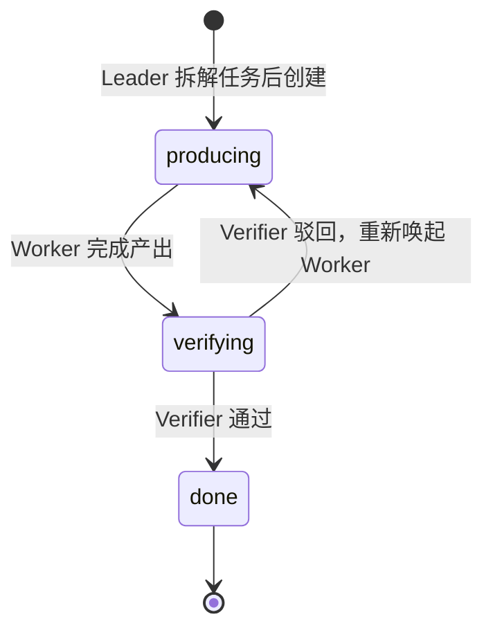

# MiniMax Mavis

MiniMax 的 Agent 产品，名字含义：MiniMax as a Jarvis，你的 AI 管家。Mavis 是一个由确定性代码逻辑驱动的多 Agent 系统，核心设计思想是"多 Agent 系统是 runtime，不是 prompt 编排"。产品形态上支持桌面端、IM（即时通讯）异步控制和 API 调用三种入口，在 IM 场景下通过 Leader 秒级响应用户、后台异步执行长任务的方式解决"Agent 怎么不回我了"的用户体验痛点。

## 核心功能

- **Agent Teams** — 多个 Agent 并行工作，组成团队协作完成任务。用户创建不同角色的 Agent，由 Leader 牵头拆分任务，Worker 执行、Verifier 验收，适合长链路、高风险、可复用经验的复杂任务。
- **TokenPlan 和 Agent Plan 合并** — 一份订阅，CLI、API、Agent 全打通。M2.7、音乐、视频、语音所有模型包含在内，Credits 额度在 Agent 和 API 之间共享。技术含义：Agent 调用和 API 调用走同一套计费与权限体系，Agent 不再是独立产品线，而是 TokenPlan 的一种消费方式——"CLI、API、Agent 全连接"意味着同一个 token 额度可以在写代码（CLI）、调模型（API）、跑 Agent Team 三种场景间自由切换。

## 技术架构

Mavis 的核心是 **Worker/Verifier 对抗循环** + **Team Engine** 状态机调度。

### Team Engine 状态机

Team Engine 是确定性代码，不依赖 AI 实时状态。它对每个任务的运行周期按三个状态管理：

- **producing** — Worker Agent 执行具体子任务（资料检索、代码编辑、文档撰写等）。不同 Worker 拥有不同工具、上下文和输出要求。
- **verifying** — Verifier Agent 独立检查 Worker 产出：事实来源、覆盖清单、风险边界、引用可复查性。Verifier 可提出修改意见，触发状态回退。
- **done** — 任务通过验收，产出可交付。

状态转换的触发者是 Team Engine（确定性代码），而非 AI 自行判断。Leader 在过程中既收到 Team Engine 的自动状态汇报，也可以主动查询任务细节，甚至随时向 producing/verifying 中的 Agent 发送补充 prompt。这种设计将协作关系从"一次函数调用"升级为"主动推送、按需查询的多轮交互"。

### Worker/Verifier 对抗循环

Worker 和 Verifier 是对抗关系：双方都以运行结束为目标，但一方的结束会触发另一方的开始。完整流程：

1. **任务分解** — Leader Agent 将用户目标转化为任务结构，决定拆解粒度、并行策略、重试次数、升级阈值。
2. **Worker 执行** — Worker 在独立上下文中执行子任务，输出不只是自然语言，还包括修改理由、潜在风险和验证建议。
3. **Verifier 检查** — Verifier 独立审查：来源可复查性（优先稳定 URL，搜索缓存只能作线索）、事实一致性、反面证据、风险边界。
4. **重试或通过** — 不通过则 Team Engine 将状态切回 producing，Worker 根据 Verifier 反馈修改；通过则进入 done。
5. **Leader 汇总** — 多个并行任务全部 done 后，Leader 将结果聚合为统一交付物。

关键在于：Verifier 检查的不是"自己刚刚构造出来的现场"（单 Agent 自检的通病），而是独立上下文中的外部视角。

### 非直接通讯设计

Worker 和 Verifier **不直接对话**。所有通讯由 Team Engine 中转：

- Worker 产出写入交接文件，Team Engine 将文件路径加摘要传递给 Verifier。
- Verifier 的反馈同样经 Team Engine 路由回 Worker。
- Agent 之间另有共享"白板"文件用于慢通信——按需获取，避免全部塞入上下文。

这种设计的理由：直接通讯会让两个 AI 的上下文互相污染，且无法审计。Team Engine 作为中介，确保每一条跨 Agent 信息都可追踪、可回放、可拦截。同时，Mavis 采用 **Agent 与人类同权** 的设计——用户对 Agent 的操作（prompt、spawn、abort、kill）被抽象为统一接口，Agent 也能通过同一接口操作其他 Agent，但权限边界由 Team Engine 强制执行。

### 批量执行模型

并行任务的执行和验证策略：

- **分组并行** — Leader 将可并行的子任务分批发给多个 Worker，不同 Worker 有独立上下文和工具，互不干扰。
- **独立验证** — 每个 Worker 产出由独立 Verifier（或同一 Verifier 在不同上下文窗口）分别检查，避免交叉污染。
- **聚合成本** — Leader 将多份结果合成为一份交付物。MiniMax 团队承认聚合昂贵："把 10 份合到 1 份"比"多调几个人补充"更难，这是设计 Team 时必须正视的成本。
- **上下文成本三分类** — 交接成本（信息在 Agent 间重新组织）、共享成本（广播信息的 token 代价）、聚合成本（多结果合一的智力工作量），三者都无法靠"加大 context window"解决。
- **记忆沉淀** — 每次 Agent Team 运行产生长期价值：经验可沉淀为 Agent 记忆（后续同类任务自动收到提示），有价值的动作可固化 Skill。系统通过三种方式维护共享信息：Agent 内记忆（经验广播到运行中/待运行的 Agent）、Agent 间通讯 CLI（打断式直接对话）、共享白板（按需获取大量信息）。
- **Coding Harness 四角色** — 工程化场景下至少包含四类角色：Leader（控制面，判断是否值得启动 Team、拆解粒度、失败策略）、Developer（实现+风险说明）、Tester（工具驱动验证，非自然语言判断）、Reviewer（抽象边界/兼容性/安全审查，不同于 Tester）。三层验收：自动化测试和静态检查 → Agent Reviewer 初审 → 人工签字。

## 设计哲学

> "多 Agent 系统是 runtime，不是 prompt 编排"

多 Agent 经常被简化成"写好几段 prompt 让模型扮演不同角色"，但真实代码复杂度隐藏在状态管理、消息路由、多来源渲染（用户/Agent/Team Engine/IM/定时任务）等工程细节中。承认 Agent Team 是 runtime 意味着：新功能不能只靠 prompt 修补，要在 runtime 里加事件、加可观测；权限和记忆约束不能只靠 Agent 自觉，要靠软硬门禁和拦截。

## 与其他方案对比

| 方案 | 特点 |
|------|------|
| Mavis | Worker/Verifier 直接对抗，Team Engine 确定性状态机调度，Agent 间不直接通讯 |
| Anthropic | Lead Agent 评审 Subagent 结果，任务分配依赖 Lead 自身判断 |
| OpenAI | 接力式 Handoff，每棒不回头，天然并行能力有限 |
