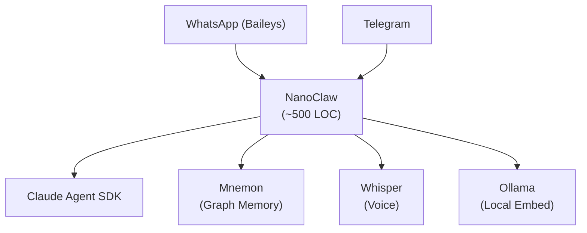

# NanoClaw

NanoClaw 是一个开源的 AI 代理框架，建在 Anthropic 的 Claude Agent SDK 上。核心特点是「小」——整个项目代码约 500 行，可以完整塞进一个 Claude 上下文中。

## Key contributions / features

- **极小代码量**：约 500 行，全部可读，适合不希望被黑盒绑架的开发者
- **容器化隔离**：每个代理运行在隔离的容器中，错误边界清晰——「出事了也要可控」
- **零配置文件**：所有客製化工作交给 LLM 本身，每个运行实例实际上是一套被调出来的、不同长相的系统
- **多平台桥接**：可接入 WhatsApp（通过 Baileys）、Telegram、Slack 等通讯软件
- **记忆与排程**：内置记忆系统，支持定时任务

新加坡外長 Vivian Balakrishnan 選擇 NanoClaw 的原因正是「可读性」——他自称不是工程师，但 500 行代码连他都能读懂，扫过 bash 权限提示时他真的能判断发生了什么。

## Architecture

## Related concepts

- [[concepts/Agent-Runtime]] — NanoClaw 是边缘 Runtime 的典型实现
- [[concepts/Agent-Secure-Runtime]] — 容器化隔离对应其安全设计思路
- [[entities/Dive-into-Claude-Code]] — 同为 Claude SDK 上的框架，对比参考

## Sources

- [[summaries/raw/articles/2026-05-17-nanoclaws-second-brain.md]] — 新加坡外長使用 NanoClaw 的完整案例
