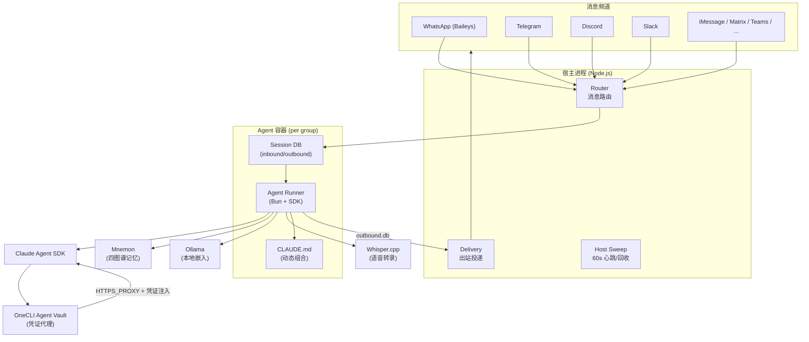

# NanoClaw

NanoClaw 是一个开源的 AI 代理框架，建在 Anthropic 的 [[Dive into Claude Code（论文）|Claude Code]] Agent SDK 上。核心特点是「小」——最初的版本约 500 行 TypeScript，可以完整塞进一个 Claude 上下文中。v2 演进后约 3,900 行（15 个源文件），依赖不到 10 个，仍然是同类框架中最精简的。项目在 GitHub 上获得 29,800+ 星标，MIT 协议开源。

NanoClaw 的定位是 OpenClaw 的极简继承者。OpenClaw 是模块化微服务架构（3,680 个源文件、434,453 行代码、70+ 依赖），而 NanoClaw 走向另一条路：**单进程、零配置文件、真正的 OS 级容器隔离**。它的设计哲学是"小到能读懂"——不是通过应用层权限检查来保证安全，而是通过 Linux 容器的文件系统和进程隔离来缩小攻击面。

## Key contributions / features

- **极小代码量**：约 3,900 行（v2），15 个源文件，8 分钟可读完。适合不希望被黑盒绑架的开发者
- **容器化隔离**：每个 agent group 运行在独立 Docker 容器中，文件系统隔离、非 root 用户（uid 1000）、临时容器（`--rm`）。容器只能看到显式挂载的目录，主机项目根目录以只读挂载，防止 agent 修改应用代码
- **零配置文件**：所有客制化交给 LLM 本身，运行 `bash nanoclaw.sh` 一条命令从裸机到运行。没有 YAML/JSON 手动配置，`container.json` 由数据库自动生成，`CLAUDE.md` 每次 spawn 时由共享基础 + 技能片段动态组合
- **多平台桥接**：可接入 WhatsApp（Baileys 模拟 WhatsApp Web 协议）、Telegram、Discord、Slack、Microsoft Teams、iMessage、Matrix、Google Chat、Webex、Linear、GitHub、WeChat 和邮件。频道通过 `/add-` 技能按需安装，不用的适配器不占代码
- **记忆与排程**：内置 Mnemon 四图谱记忆系统（时间/实体/因果/语义）+ Ollama 本地嵌入语义搜索，支持定时任务
- **凭证隔离**：Agent 容器永远不持有原始 API key。出站 HTTPS 请求通过 OneCLI Agent Vault 代理，在请求时注入凭证并执行 per-agent 策略和速率限制

## 容器化隔离实现

NanoClaw 的安全边界不是应用层权限检查，而是 OS 级容器隔离。架构如下：

- **单主机进程**：一个 Node.js 宿主进程负责消息路由、容器生命周期、IPC 授权和凭证代理
- **Per-agent-group 容器**：每个 agent group 拥有自己的 Docker 容器、文件系统、`CLAUDE.md`、记忆存储和技能。容器之间零共享
- **挂载控制**：容器只能看到显式挂载的目录。主机项目根目录以只读挂载；可写路径（session 目录、group 文件夹、`.claude/` 状态）单独挂载。全局记忆目录以只读挂载给非主 group
- **凭证隔离**：出站 API 请求通过 OneCLI Agent Vault 路由，在代理层注入凭证。Agent 无法在环境变量、stdin、文件系统或 `/proc` 中发现真实 API key
- **错误边界**：一个 agent group 中的失控 agent 无法影响其他 group。容器生命周期与会话活动绑定，空闲超时后自动关闭。宿主 sweep（每 60 秒）通过心跳文件检测卡死容器并回收

NanoClaw 还提供三层灵活隔离模型：

| 隔离级别 | 共享内容 | 独立内容 | 适用场景 |
|----------|---------|---------|---------|
| **共享会话** | 全部——工作区、记忆、会话本身 | 无 | Webhook + 聊天频道联动（如 GitHub + Slack） |
| **同 Agent 独立会话** | 工作区、记忆、个性 | 对话线程 | 同一用户多平台/多群组 |
| **独立 Agent Group** | 无 | 全部 | 不同用户、隐私边界、机密信息隔离 |

## Claude Agent SDK 集成

NanoClaw 不是从零实现 agent 循环，而是作为 Claude Agent SDK 的精简编排层：

- **SDK 负责 agent 逻辑**：agent 循环（递归 `EZ()` 异步生成器）、工具执行、subagent 管理、对话压缩全部由 SDK 的 CLI 子进程处理。NanoClaw 的 `query()` 调用只是一个薄传输封装
- **NanoClaw 负责编排**：消息路由（用户 -> 消息群组 -> agent group -> session）、容器生命周期管理、session 数据库（SQLite）作为容器与宿主之间的唯一 IO 通道
- **Provider 可替换**：默认使用 Claude Agent SDK，也支持 `/add-codex`（OpenAI）、`/add-opencode`（OpenRouter/Google/DeepSeek）、`/add-ollama-provider`（本地开源模型）。Provider 按 agent group 配置
- **Session 管理**：v2 使用 SDK 的 `unstable_v2_createSession` API，通过 `AsyncIterable` 保持 CLI 进程存活，支持 agent teams 的长时间运行和消息流式注入

约 500 LOC 与 SDK 的关系：最初的 NanoClaw 约 500 行是编排层的代码量。Agent 推理、工具调用、多轮对话这些复杂逻辑都在 SDK 内部，NanoClaw 不需要重复实现。这种"瘦编排 + 胖 SDK"的分工正是 [[Thin Harness Fat Skills]] 理念在框架层面的体现。

## Mnemon 图谱记忆机制

NanoClaw 的记忆系统基于 [[Agent Memory|Mnemon]]，一个 LLM 监督的持久记忆引擎：

- **四图谱架构**：时间图（事件顺序）、实体图（人物/概念关系）、因果图（因果链）、语义图（向量相似度）。不是简单的向量检索，而是多维度结构化存储
- **LLM 监督模式**：Mnemon 二进制处理确定性计算（存储、图谱索引、搜索、衰减），宿主 LLM 做判断（记什么、如何链接、何时遗忘）。没有嵌入的中间 LLM，不产生额外推理成本
- **三个原语**：`remember`（存储事实）、`link`（建立关系）、`recall`（语义召回）。命令名映射 LLM 的认知词汇（`remember` 而非 `INSERT`，`recall` 而非 `SELECT`）
- **本地嵌入**：可选 Ollama + `nomic-embed-text`（768 维）做向量+关键词混合搜索（RRF 融合）。不使用嵌入时也能完整工作
- **自动去重**：`remember` 自动检测重复和冲突，跳过或自动替换
- **保留生命周期**：重要性衰减 + 访问计数提升 + 垃圾回收
- **双层存储**：每个 agent group 有自己的本地 mnemon 存储，另有一个全局共享存储（只读），agent 调用时自动从图谱中做语义召回，无需显式决定"要不要查记忆"

记忆的数据流是三层结构：原始来源（对话转录、文章、网页剪辑）→ mnemon 图谱（结构化事实）→ wiki 页面（人类可读的叙事综合）。Agent 每次被调用时自动触发语义召回——用户消息作为查询，相关事实作为系统提醒注入。

## 多平台桥接

NanoClaw 支持 14 个消息频道，全部通过 `/add-` 技能按需安装：

- **WhatsApp**：通过 Baileys 库模拟 WhatsApp Web 协议，不需要 Business API。每个 WhatsApp 群组可以有独立 agent 上下文
- **Telegram、Discord、Slack**：原生适配器
- **Microsoft Teams、iMessage、Matrix、Google Chat、Webex**：企业通讯工具
- **Linear、GitHub**：项目管理/代码平台
- **WeChat、Email**（通过 Resend）

频道与 agent group 的绑定灵活：可以多个频道共享一个 agent（统一记忆），也可以每个频道独立 agent（隐私隔离），或者多个频道折叠进一个共享会话（跨频道上下文）。

## 「零配置文件」哲学

NanoClaw 的设计决策：**不让用户写配置文件**。运行 `bash nanoclaw.sh` 后：

1. 安装脚本检测并安装缺失的依赖（Node.js、pnpm、Docker）
2. 注册 Anthropic 凭证到 OneCLI
3. 构建 agent 容器
4. 配对你的第一个消息频道

如果某一步失败，Claude Code 自动介入诊断并从中断点恢复。没有手动 YAML、JSON 或环境变量文件。`container.json` 由数据库行自动生成，`CLAUDE.md` 由共享基础 + 启用的技能片段 + MCP 服务器指令在每次容器 spawn 时动态组合。

后续定制也一样：用自然语言描述你想要什么，Claude Code 直接修改代码库。NanoClaw 被设计为"被 fork 并定制"的软件，而不是"被配置"的框架。

一个运行中的 NanoClaw 实例长什么样：单个 Node.js 宿主进程 + 多个按需启动的 Docker 容器（每个活跃 agent group 一个）。两个 SQLite 文件 per session（`inbound.db` 和 `outbound.db`），各只有一个写入者。没有微服务、没有消息代理、没有 IPC、没有 stdin 管道。

## 为什么新加坡外长选择了它

新加坡外长 Vivian Balakrishnan 在 AI Engineer Singapore 大会上展示了他用 NanoClaw + Raspberry Pi（8GB）组装的个人 AI 助理，三个月的日常使用后"已经不敢关掉它"。

他选择 NanoClaw 的核心原因就是**可读性**。他自称不是工程师，但 500 行代码连他都能读懂。当他扫过 bash 权限提示时，他真的能判断发生了什么——不是盲目点"允许"，而是基于对代码的理解做出决定。

这背后是一个更深的原则：**"你没办法治理一个你只被简报过的技术"**（这句话本身是 Claude 替他生成的，他在演讲中特别引用）。AI 可以整理信息，但把信息变成判断、把判断变成决定，这段路没有人能替决策者走。有权力的可以授权工作，但不能授权问责——问责的底气来自真正懂得工具在发生什么。

这就是 NanoClaw 的"地面层"价值主张：真正创造价值的不是模型和数据中心，而是一个工作流程接一个工作流程地落地。老师、律师、技师、医生、部长——这些懂自己工作又被工具加持的人，才是为社会创造真实价值的人。

## Architecture

## Related concepts

- [[Agent Runtime]] — NanoClaw 是边缘 Runtime 的典型实现，容器化隔离 + 极小程序码量
- [[Agent Secure Runtime]] — 容器化隔离对应其安全设计思路，OS 级沙箱而非应用层权限
- [[Dive into Claude Code（论文）]] — 同为 Claude SDK 上的框架，对比参考
- [[Agent Memory]] — Mnemon 图谱记忆是 NanoClaw 的记忆后端，LLM 监督 + 四图谱架构
- [[Thin Harness Fat Skills]] — NanoClaw 的"瘦编排 + 胖 SDK"设计是其框架层体现

## Sources

- [[新加坡外长的 AI 第二大脑]] — 新加坡外長使用 NanoClaw 的完整案例
- [NanoClaw 官网](https://nanoclaw.dev/) — 官方文档、架构说明、安全模型
- [NanoClaw GitHub](https://github.com/nanocoai/nanoclaw) — 源码、容器运行器、隔离模型、SDK 深度分析
- [Mnemon GitHub](https://github.com/mnemon-dev/mnemon) — 记忆引擎文档、四图谱架构、LLM 监督模式
