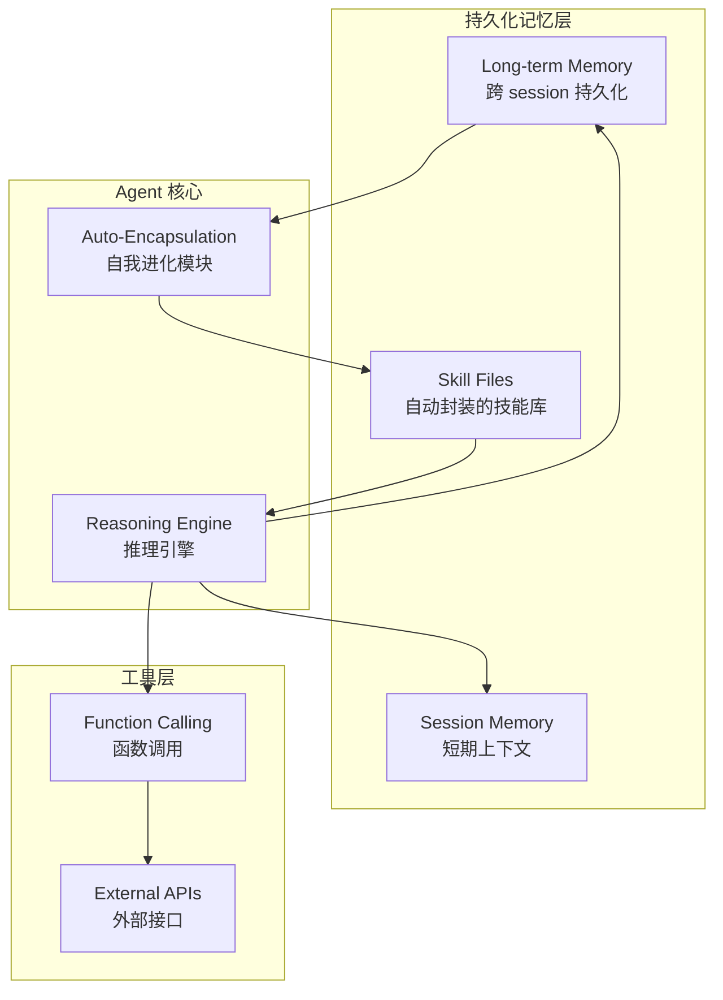

# Nous Research

Nous Research 是硅谷 AI 研究实验室，以开源大语言模型和 Agent 框架闻名。其 GitHub 组织（[github.com/NousResearch](https://github.com/NousResearch)）下托管了 Hermes 系列模型、数据集及工具链，旗舰项目 [hermes-agent](https://github.com/NousResearch/hermes-agent) 于 2026 年 2 月 25 日发布，截至 2026 年 6 月中旬已突破 19 万星，是全球增长最快的 AI Agent 框架之一。

> **数据校验**：通过 GitHub API 拉取 NousResearch 组织下全部 85 个公开仓库（2026-06-15），hermes-agent 单一仓库约 193k 星，hermes-agent-self-evolution 约 4.1k 星，全组织合计约 207k 星。动脉网 2026-05-02 报道中"11 万+星"的说法在报道时是准确的（hermes-agent 在 2026 年 3 月突破 1 万星、4 月突破 5.7 万星、5 月初达 11 万星），但到 6 月中旬已翻近一倍，说明该项目的增长速度远超报道时的预期。

## Key contributions / features

### Hermes Agent 框架

Hermes 是 Nous Research 推出的开源 Agent 框架，对标 OpenClaw。其核心差异化体现在两个维度：

**长期记忆（非无状态）**：传统 Agent 多为无状态设计——每次会话结束后上下文即丢弃，无法跨 session 保持信息连续性。Hermes 引入持久化记忆层，使 Agent 能在多次交互间积累用户偏好、任务历史和领域知识。这与 [[Agent Memory]] 中描述的图谱结构与向量检索机制形成互补：Hermes 的记忆更偏向"会话连续性"，而 Agent Memory 强调结构化知识图谱的自我进化。

**自我进化机制**：Hermes 能够在运行过程中自动将重复性操作封装为可复用的技能文件（skill files）。这些文件具有以下特征：
- **透明性**：技能文件以人类可读格式存储，开发者可直接审查其逻辑
- **可审计**：每次自动封装生成操作日志，追溯技能的来源与演化路径
- **增量式**：不会覆写已有技能，而是通过版本化追加（append-only）实现能力扩展

这种"auto-encapsulation"机制使 Hermes 从被动工具进化为主动学习系统——Agent 不仅执行任务，还在执行中优化自身工具链。

### 社区与生态

Nous Research 的开源生态围绕 Hermes 模型系列构建，主要仓库包括：

| 仓库 | 用途 | Stars（2026-06） |
|------|------|------------------|
| hermes-agent | 旗舰 Agent 框架 | ~193,000 |
| hermes-agent-self-evolution | 进化式自我优化（DSPy + GEPA） | ~4,100 |
| hermes-paperclip-adapter | Paperclip 企业适配器 | ~1,600 |
| Hermes-Function-Calling | 函数调用数据集与模型 | ~1,400 |
| autonovel | 自主小说生成管线 | ~1,100 |
| autoreason | 主观领域自动研究 | ~580 |
| atropos | LLM 强化学习环境框架 | ~1,300 |

此外，Nous Research 还维护了 OpenHermes 数据集、Nous-Capybara 模型等多个开源项目，形成了从数据到模型到 Agent 的完整开源栈。

### 医疗场景重点布局

Hermes Agent 在医疗领域有三个主要落地方向：

1. **慢病管理（Chronic Disease Management）**：利用长期记忆能力追踪患者病程变化，跨多次问诊保持用药记录、症状演变和生活方式数据的连续性。相比无状态 Agent，Hermes 能识别"上次问诊后血压下降了但睡眠质量恶化"这类跨 session 模式。

2. **医生培训（Doctor Training）**：通过自我进化机制积累诊断案例库。每次培训对话后，Agent 自动封装新遇到的病例模式为技能文件，形成可复用的教学知识库。新医生可通过与 Hermes 交互快速接触大量虚拟病例。

3. **科研辅助（Research Assistance）**：在文献检索、实验设计、数据分析等环节提供跨 session 的持续辅助，记忆研究者的兴趣方向和项目进展，避免每次交互从零开始。

### 监管挑战

Hermes 的自我进化特性在医疗器械监管框架下面临根本性冲突：

- **FDA 510(k) / De Novo 路径**要求软件作为医疗设备（SaMD）在上市前锁定算法版本，任何实质性变更需重新提交审查。Hermes 的 auto-encapsulation 机制在运行时持续修改系统行为，使得"上市前锁定"这一前提不再成立。
- **NMPA（中国药监局）**对 AI 医疗器械的《深度学习辅助决策医疗器械软件审评要点》同样要求算法锁定和变更控制，自我进化系统难以满足"软件版本可追溯、变更可控"的合规要求。
- **核心矛盾**：监管框架假定软件行为在部署后保持静态，而 Hermes 的设计哲学恰恰是部署后持续演化。这一问题并非 Hermes 独有——任何具备在线学习或自我修改能力的 AI 医疗系统都面临同样的合规困境，是 [[Agent Harness 治理协议]] 中"概念演化"问题在医疗领域的具象化。

## Architecture insights

基于动脉网报道及 Hermes 模型系列的技术路线推断，Hermes Agent 的架构大致包含以下层次：

- **Session Memory**：处理单次对话的即时上下文（类似传统 Agent 的上下文窗口）
- **Long-term Memory**：跨 session 持久化存储，使 Agent 具备"记住上次对话"的能力
- **Auto-Encapsulation**：监控 Agent 的重复操作模式，触发技能文件的自动生成
- **Skill Files**：作为记忆层和推理引擎之间的桥梁——既是被记忆固化下来的知识，也是可被调用的工具

## Relationship to other concepts

- [[Agent Memory]]：Hermes 的长期记忆与 Agent Memory 的图谱结构是互补视角——前者侧重会话连续性，后者侧重知识结构化和向量检索
- [[Thin Harness, Fat Skills]]：Hermes 的 auto-encapsulation 机制与"技能要胖"原则高度一致——Agent 通过自我进化将操作沉淀为技能，使 harness 保持精简
- [[Worker Verifier 对抗循环]]：Hermes 的自我进化是否可引入 Verifier 角色来审查自动生成的技能文件质量？这是开放研究问题

## Open questions

- Hermes 的长期记忆具体采用何种存储后端？是向量数据库、图谱数据库还是混合方案？
- Auto-encapsulation 的触发条件是什么？重复多少次操作才会触发技能封装？
- 自动生成的技能文件质量如何保证？是否存在"垃圾技能累积"问题？
- "11 万星"数字的具体出处是什么？是单一仓库还是组织合计？是否需要联系动脉网作者核实？

## Sources

- [[Hermes Agent：Nous Research 的开源 Agent 框架]] — 动脉网报道（2026-05-02）
- [NousResearch GitHub 组织](https://github.com/NousResearch) — 仓库列表与星数（2026-06-15 API 实测）
