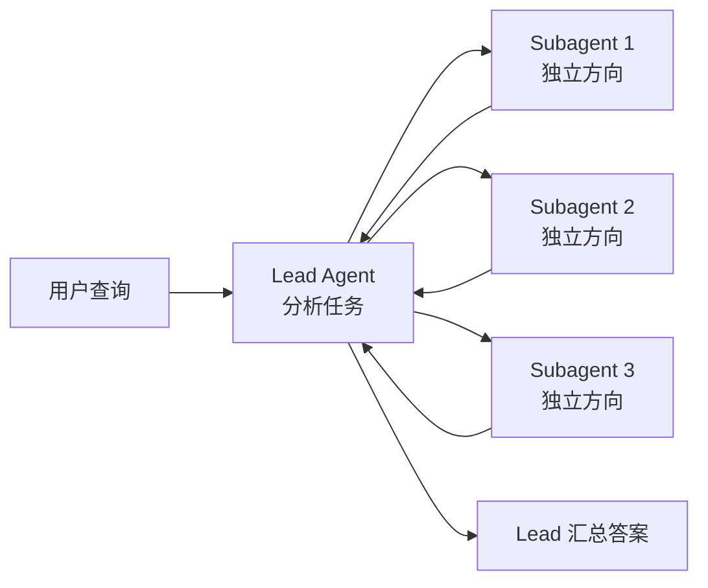

# 摘要

## 核心架构：Orchestrator-Worker

Lead Agent（规划者）协调，多个 Subagent（并行执行者）搜索。

## 关键数据

- **+90.2%** 性能提升（multi-agent Opus Lead + Sonnet Subagent vs 单 Opus）
- **15×** multi-agent 比普通聊天多消耗的 token
- **4×** agent 比普通聊天多消耗的 token
- **80%** BrowseComp 表现差异由 token 使用量解释

## 核心设计原则

### 1. 并行探索

Subagent 在独立 context window 中并行工作，每个探索不同方向，然后压缩最重要的 tokens 回报给 Lead Agent。

### 2. 分离关注点

不同 Subagent 有不同的工具、prompt 和探索轨迹，减少路径依赖。

### 3. Token 是关键资源

多 Agent 系统主要因为帮助花费足够的 tokens 来解决问题。模型升级是比加倍 token 预算更大的效率提升。

## 适用场景

多 Agent 系统擅长的任务：
- 广度优先查询（多方向并行探索）
- 信息量超过单 context window
- 需要与众多复杂工具交互

## 不适用场景

- 需要所有 Agent 共享同一 context 的领域
- Agent 间有强依赖的任务
- 大部分编程任务（并行化程度低）

## Anthropic 的结论

> "Once intelligence reaches a threshold, multi-agent systems become a vital way to scale performance."

即使单个智能体已经很强，智能体组通过集体智能和协调可以实现指数级更强的能力。