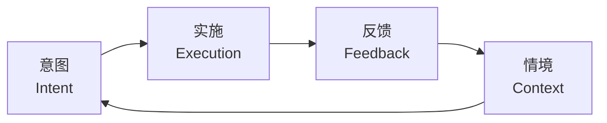
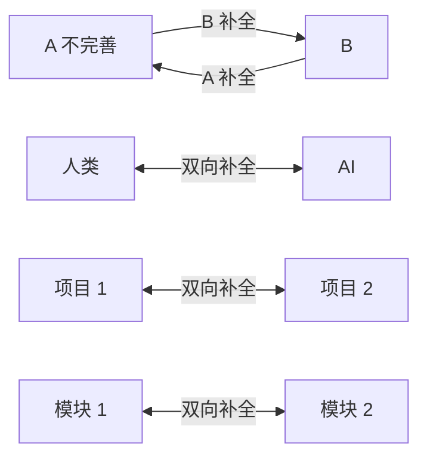

# 摘要

## 核心观点

**元反思**（meta-reflection）= **反思的反思**。认知科学中已有"元认知""元记忆""元语言"等先例；在 AI 协作场景里，元反思指在关键环节**强制 AI 重新审视自己的实现、目标、逻辑与对旧功能的影响**。作者认为：只要让 AI 进行元反思，**几乎必然会发现新问题**——因为神经网络是几千维度的向量矩阵，擅长发现人类未注意到的连接，但也必然存在"激活不精确"的加工局限。

文章给出 12 个分四组的元反思技巧，并把它们汇总到"**行动之环**"框架下：意图 → 实施 → 反馈 → 情境（其中 AI 的"情境" = 上下文 Context）。

## 12 个技巧：四象限速览

| 象限 | 技巧 | 核心机制 |
| :--- | :--- | :--- |
| 通用 | 1. 元反思 | 强制 AI 对自己的实现做一轮自检，几乎必然发现新问题 |
| 通用 | 2. 约束实体 | 限制单个 Session 处理 ≤ 4 个实体；超过则用 TaskCreate 拆任务 |
| 通用 | 3. 重新定义问题 | 跨领域重新定义问题、缩小边界，把无解问题转成有成熟解的问题 |
| 意图 | 4. 设置兜底 | 显式问"搞砸了怎么办"，补足 AI 默认只考虑"如何成功"的盲点 |
| 意图 | 5. 三重防护 | 关键场景连续三道防线，避免"祸不单行"时一道防线崩溃 |
| 意图 | 6. 自我校验 | 执行前先写校验脚本/标准；执行后自动比对，循环优化（ralph-loop 思想） |
| 实施 | 7. 看门狗 | 用 CronCreate 周期性读取 memory 文件、推进未完成步骤，**摆脱人在回路** |
| 实施 | 8. 完整性 | 显式检查原子性/事务一致性/幂等性，避免半成品、脏数据、重复错误 |
| 实施 | 9. 对齐！对齐！对齐！ | 反复对照 plan/spec/规约——**对齐 = 利用大模型补全能力** |
| 反馈 | 10. 倍速测试 | 强制 AI 思考"10×/100×/1000× 时方案是否仍成立" |
| 反馈 | 11. 同类扫描 | 强制 AI 举一反三、扫描同类 bug 变式 |
| 反馈 | 12. 积累飞轮 | 把新发现的模式追加到 `memory/dev-loop-patterns.md`，构建长期记忆 |

## 整体框架：行动之环

> 行动之环 = **意图 → 实施 → 反馈 → 情境**

四象限技巧与"行动之环"四个要素的对应：

| 行动之环要素 | 对应技巧 |
| :--- | :--- |
| 意图 | 4. 兜底 / 5. 三重防护 / 6. 自我校验 |
| 实施 | 7. 看门狗 / 8. 完整性 / 9. 对齐 |
| 反馈 | 10. 倍速测试 / 11. 同类扫描 / 12. 积累飞轮 |
| 情境（Context） | 1. 元反思 / 2. 约束实体 / 3. 重新定义问题 |

**关键观察**：AI 的"情境" = **上下文**。这意味着：上下文的设计（约束实体、重新定义问题、强制元反思）决定了 AI 行动的边界与质量。

## 三条核心论点

### 论点 1：元反思是"利用神经网络的优点、补偿其缺点"的工程化操作

- **优点**：向量矩阵擅长发现人类未注意到的连接与通路
- **缺点**：权重/参数激活注定不精确
- **工程化**：在关键节点强制 AI 反思自己（"实现是否正确、是否实现目标、是否破坏旧功能"），必然带来惊喜

### 论点 2："对齐"是这轮大模型的关键

> **对齐 = 利用大模型的补全能力**

**找到相对完善的那点，就是设计整个工作流的起点**。"确认成本"与"确认系数"是判断"完善"的标尺。

### 论点 3：让 AI 长时间自主干活的关键 = 看门狗 + 完整性 + 积累飞轮

作者实践中让 AI 连续自主干活 90 分钟到 3 小时，无需人工干预。其基础设施：
- **看门狗**：摆脱人在回路（human in loop），AI 可独立推进
- **完整性**：避免脏数据、半成品导致自主任务崩溃
- **积累飞轮**：把新模式沉淀到 memory 文件，下次更聪明

## 与现有 wiki 概念的关联

- **强制元反思 = 独立验证节点** — 与 [[concepts/Worker-Verifier-对抗循环|Worker/Verifier 对抗循环]] 同源：把"对单个输出的信任"换成"对多视角加权后的信任"。[[concepts/Agent-Harness-治理协议|Agent Harness 治理协议]] 的"双层验证"是这一思想的物理拦截实现
- **约束实体 ≤ 4 个** — 与 [[concepts/Agent-Runtime|Agent Runtime]] 的"上下文窗口"管理直接相关：单 session 的有效实体数受限于模型架构
- **看门狗 = 自动扩张任务图** — 周期性读取 memory 推进未完成步骤，与 Agent Harness 治理协议的"事件驱动自动 spawn"在调度哲学上同构：避免人作为状态机中心
- **积累飞轮 = 模式沉淀** — 把发现的新模式写入 memory 文件，与 [[concepts/Claude-Code-Subagent/index|Claude Code Subagent]] 的"持久内存"机制对应
- **重新定义问题 = 跨域知识迁移** — 与 [[concepts/Multi-Agent-协作模式|Multi-Agent 协作模式]] 中的"Specialist"分工思想一致：让擅长某领域的 agent 处理该领域问题
- **行动之环 = 事件闭环** — 四要素循环（意图/实施/反馈/情境）与 [[concepts/Agent-Harness-治理协议|Agent Harness 治理协议]] 的"事件时间线"在"反馈形成闭环"上同构
- **新概念节点**：本文触发的新概念 → [[concepts/Meta-Reflection-Techniques|Meta Reflection Techniques]]（12 技巧的完整定义与工程化指引）

## 关键观察

1. **12 技巧不是平铺的清单**——它们围绕"行动之环"组织，任何遗漏都会让闭环断掉。意图缺位 → 方案脆弱；反馈缺位 → 错误重复；情境缺位 → 上下文爆炸。
2. **"看门狗 + 完整性 + 积累飞轮"是 AI 长时间自主干活的最小可用集**——这是把"AI 单次聪明"升级为"AI 跨 session 越来越聪明"的工程化路径。
3. **"对齐 = 补全"是一个极具杠杆的认知重构**——把"对齐"从哲学概念降维到工程动作（找相对完善的那点），让 10× 工作流有了可操作起点。
4. **"AI 的情境 = 上下文"** 是连接 prompt engineering 与 multi-agent 架构的桥梁——所有上下文设计技巧（约束实体、重新定义问题、强制元反思）本质上都在工程化"情境"要素。

## 实施建议（给本知识库运营者）

| 实施项 | 对应技巧 | 预期效果 |
| :--- | :--- | :--- |
| 在 ingest 流程中显式加入"自我校验"环节 | 6. 自我校验 | 减少编译/链接错误、frontmatter 不规范 |
| 在 audit 流程中显式加入"同类扫描" | 11. 同类扫描 | 修一个 wikilink 错时，扫描所有 page 的同模式问题 |
| 在每次 ingest 末尾追加"积累飞轮"动作 | 12. 积累飞轮 | 把新发现的 wiki 模式沉淀到 `memory/wiki-patterns.md` |
| 引入"重新定义问题"作为 query 阶段的首步 | 3. 重新定义问题 | 避免在错误的问题上做大量工作 |
| 引入"对齐"作为 compile 阶段的检查项 | 9. 对齐 | 确保结构变化对齐最初的目标 |

## 相关资源

- 原始来源：`D:\03resource\_Projects\work\harness-lab\context\references\2026-03-17-meta-reflection-techniques.md`（阳志平「让 AI 变得更聪明的 12 个元反思技巧」）
- 关联概念：[[concepts/Meta-Reflection-Techniques]]（12 技巧的完整定义）、[[concepts/Worker-Verifier-对抗循环]]、[[concepts/Agent-Runtime]]、[[concepts/Multi-Agent-协作模式]]、[[concepts/Claude-Code-Subagent/index|Claude Code Subagent]]
