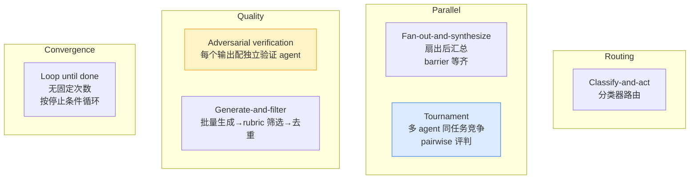

# 摘要

## 核心观点

> "Claude can now write its own **harness on the fly**, custom-built for the task at hand."

Anthropic 官方（Thariq Shihipar / Sid Bidasaria, Claude Code 技术团队）2026-06-02 博客的中心论断：**动态工作流 = 为每个任务即时生成的定制 harness**。这把 [[Thin Harness, Fat Skills]] 的"harness 极薄"原则推到了极致——薄到可以按任务即时生成。

与功能文档 [[Claude Code 动态工作流（Dynamic Workflows）]]（中文产品说明）互补：那篇讲**"怎么用"**，这篇讲**"为什么"+"用哪些模式"**。

## 三种失效模式（why workflows）

默认 Claude Code harness 把"规划"和"执行"放在同一 context window 里。任务越长、越复杂、越对抗，越容易触发这三种结构性失效：

| 失效模式 | 表现 | Workflow 如何防止 |
| :--- | :--- | :--- |
| **Agentic laziness** | 50 项安全审查只做完 35 项就宣布完成 | 把每项拆给独立 subagent，结构上无法跳过 |
| **Self-preferential bias** | 让 Claude 用 rubric 评判自己结果时偏向自己 | adversarial verification —— 让另一个 agent 独立验证 |
| **Goal drift** | 多轮 compaction 后丢失"don't do X"约束 | 每个 subagent 有独立、聚焦的目标，不受主对话漂移影响 |

这三种失效模式**首次在 wiki 中被记录**，与 [[Worker Verifier 对抗循环]]在动机层面同源——都是为了破除"单 agent 自我验证"的认识论困境。

## Dynamic vs Static workflows

| 维度 | Static workflow (Agent SDK / `claude -p`) | Dynamic workflow |
| :--- | :--- | :--- |
| 编写者 | 人类预先写死 | **Claude 即时生成** |
| 覆盖范围 | 必须考虑所有 edge case → 通用但臃肿 | 任务定制 → 精准但单次性 |
| 适用前提 | 模型能力固定 | **Claude Opus 4.8 智能足以为每个任务写定制 harness** |

**关键拐点**：dynamic workflow 之所以现在才出现，是因为模型终于聪明到可以**自己写 orchestrator**——这是 Anthropic 把 [[Agent Runtime]] 的"75% 失败可在 runtime 修复"再推一步：让 Claude 自己设计单次 runtime 的协调层。

## 六种核心编排模式

注意 **Fan-out-and-synthesize** 的 synthesize 步骤是 **barrier**——必须等齐所有 fan-out agent 才能合并结构化输出。这是单一会话窗口无法做到的：barrier 同步需要外部协调器。

## 十个用例（含 Bun 重写实战）

| 用例 | 关键模式 | 备注 |
| :--- | :--- | :--- |
| **迁移/重构** | Fan-out per callsite + worktree 隔离 + 对抗 review + merge | **Bun 用 workflow 从 Zig 重写到 Rust**（Jarred 的 X thread） |
| **深度研究** | `/deep-research` 内置 | Fan-out web search + 对抗验证 + 引用合成 |
| **深度验证** | 提取声明 → 每条 spin off 验证 agent → 高质量来源审查 | 报告 fact-check |
| **排序** | Tournament / pairwise pipeline / bucket-rank merge | 1000+ 行无法 single prompt 排序，**pairwise 比 absolute scoring 更可靠** |
| **记忆/规则遵守** | 每条规则配 verifier agent + skeptic 反向审查 | 反向：挖会话历史 → cluster → 对抗验证 → 蒸馏到 CLAUDE.md |
| **根因调查** | 多 agent 从 disjoint evidence 独立生成假设 → verifier/refuter panel | 防 self-preferential bias；非代码场景也适用（销售/数据/post-mortem） |
| **规模化分诊** | 分类 + 去重 + 行动 + **quarantine 模式** | quarantine：读不可信内容的 agent 禁止高权限操作，由动作 agent 隔离执行 |
| **探索/品味** | Generate + rubric review，task 完成由 review agent 判定 | 设计/命名等 taste-based 任务 |
| **轻量 Evals** | Worktree 隔离 + 对比 agent 按 rubric 打分 | 评估并优化 skill |
| **模型/智能路由** | Classifier 先调研再决定用 Sonnet 还是 Opus | 任务复杂度依赖 codebase shape，无法预先静态判断 |

## 安全模式：Quarantine（值得单列）

> "Bar the agents that read untrusted public content from taking high-privilege actions, which are instead done by the agents in charge of acting on the information."

**读未受信内容的 agent ↮ 执行高权限动作的 agent**，结构性隔离。这是 [[Agent Secure Runtime]] 三层安全检查在 multi-agent 场景下的自然延伸——把权限边界从单 agent 内部前移到 agent 之间。

## 操作技巧

- **何时不用**：常规编码任务不需要 5 人审查 panel。问自己 "does it really need more compute?"
- **Quick workflow**：workflow 不止用于大任务，对一个假设跑快速对抗 review 也值得
- **配合 `/goal` + `/loop`**：可重复 workflow（triage/research/verification）+ 定期循环 + 硬完成条件
- **Token 预算**：prompt 里直接说 "use 10k tokens" 就能设上限
- **分发方式**：按 `s` 保存到 `~/.claude/workflows`；通过 skill 分发时，**把 workflow 当模板而非死脚本**，留出灵活性

## 与现有 wiki 概念的同构与差异

| 本文新概念 | wiki 已有概念 | 关系 |
| :--- | :--- | :--- |
| Agentic laziness / Self-preferential bias / Goal drift | （新增） | **三种失效模式应该提升为独立 concept 页** |
| "harness on the fly" | [[Thin Harness, Fat Skills]] | 极致推论：harness 不仅薄，且可按任务即时生成 |
| Adversarial verification 模式 | [[Worker Verifier 对抗循环]] | 同构 —— workflow 是其工程化实现 |
| Quarantine 模式 | [[Agent Secure Runtime]] | multi-agent 场景下的权限隔离延伸 |
| Fan-out-and-synthesize | [[Multi-Agent 协作模式]] | Orchestrator-Worker 模式的脚本化版本 |
| Tournament | （新增） | wiki 此前未记录 pairwise-vs-absolute 的判断学说 |

## 关键洞察

1. **"A harness for every task"是范式转移宣言** — harness 从"一次设计、长期使用"变成"按任务即时生成、用完即弃"。这要求模型本身具备 meta-harness 设计能力（Opus 4.8 拐点）。
2. **三种失效模式是 multi-agent 架构的存在理由** — 不是"多 agent 更快"，而是"单 agent 在长任务上结构性失败"。这把 multi-agent 从效率论证升级为认识论必要性。
3. **Pairwise > absolute scoring** — Tournament 用 pairwise 比较取代单点打分，是排序任务的关键 insight；评判稳定性来自相对判断而非绝对量纲。
4. **Quarantine 把 prompt injection 防御从单 agent 转到 agent 间** — 这是 multi-agent 安全设计的一个范式新点。
5. **Workflow + `/loop` + `/goal` 的组合** — 让原本一次性的 orchestration 具备持续性、有终止条件的特性，向 [[Agent Harness 治理协议]] 的"长期一致性"靠拢。

## 待研究问题（应加入 CLAUDE.md Open Research Questions）

- Agentic laziness / Self-preferential bias / Goal drift 三种失效模式在不同模型规模上的发生率如何量化？
- Tournament 中 pairwise 比较的 transitivity 假设何时崩溃？(A>B, B>C 但 C>A 的循环判断怎么破？)
- Quarantine 模式在 prompt injection 实际防御中的效果？读 agent 能否被诱导把信息以"看似无害"的方式传给写 agent？
- "Bun 用 workflow 从 Zig 重写到 Rust"的细节（每个 subagent 的 prompt、对抗 review 的 rubric、merge 策略）值得单独 ingest

## 相关资源

- 原始来源：`raw/articles/2026-06-02-harness-for-every-task-dynamic-workflows.md`
- 互补 summary：[[Claude Code 动态工作流（Dynamic Workflows）]] —— 产品功能文档
- 上位概念：[[Thin Harness, Fat Skills]]、[[Multi-Agent 协作模式]]、[[Agent Runtime]]
- 同构概念：[[Worker Verifier 对抗循环]]、[[Agent Secure Runtime]]、[[Agent Harness 治理协议]]
- 子代理基础：[[Claude Code Subagent]]
