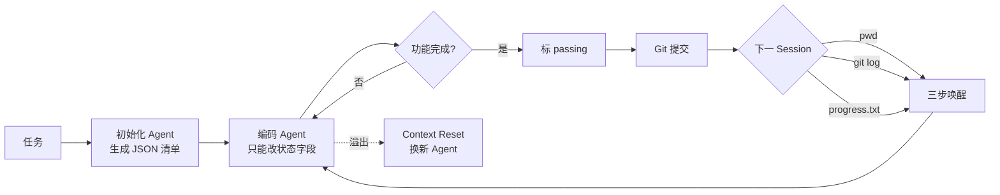
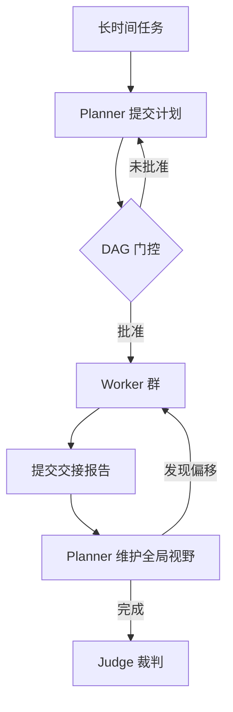
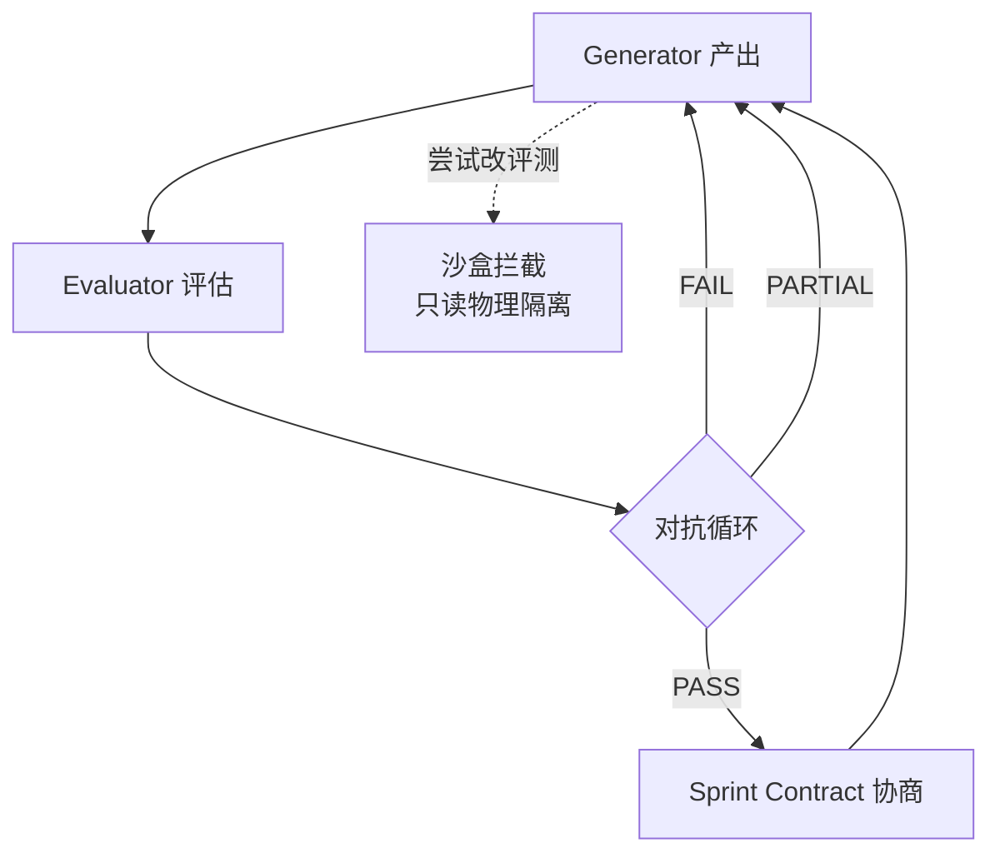
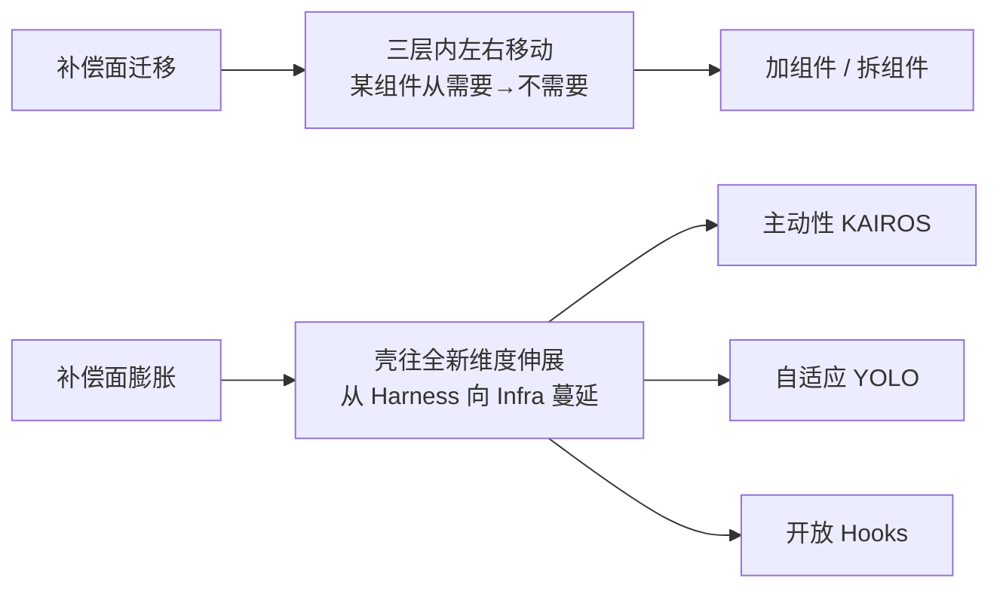

# Harness Engineering 综述：14 篇工程文章里的 15 个月

## 核心论点

2026 年第一季度，「Harness」成为大模型应用层最具统治力的热词。LangChain 在《The Anatomy of an Agent Harness》中报告：仅给同一模型换一套更精巧的 Harness 架构，Terminal Bench 2.0 通过率从 52.8% 拉升到 66.5%，底层权重和算力引擎**一个字节都没动**。

本文以 15 个月的工程文献为线索，给出 Harness 的三层结构、其演化逻辑（从「加法」到「减法」）、以及 Claude Code v2.1.88 源码泄漏（51.2 万行 TypeScript）所揭示的「补偿面」迁移现象。

> Harness 是**围绕大语言模型建立的、纯粹的工业级管理制度**——第一层管它不听话，第二层管群体操作，第三层管它看不清自己。

## 一、Harness 的三层结构

### 第一层：从记事本到管理制度（管流程）

| 阶段 | 来源 | 关键机制 |
|------|------|----------|
| 短期任务 | Anthropic《Building effective agents》(2024-12) | System Prompt + 短任务 |
| 记忆外化 | AutoGPT (2023-03) → Devin (2024-03) → Claude Code (2025-02) | `.txt` → Planner 面板 → CLAUDE.md + scratchpad |
| 上下文工程 | Anthropic《Effective context engineering for AI agents》(2025-09) | 写入方式改造 + 压缩淘汰 + 滑动窗口 |
| 制度化突破 | Anthropic《Effective harnesses for long-running agents》(2025-11) | **JSON 物理锁** + **三步唤醒** + **Git 存档与回滚** + **Context Reset** |
| 仓库即现实 | OpenAI《Harness engineering: leveraging Codex in an agent-first world》(2026-02) | **Repo-as-truth** + 100 行 AGENTS.md + Custom Linter + Doc-gardening Agent |

**Anthropic 的四种失败模式**（促使制度化跃迁的直接原因）：
1. **提前交卷** — 做了三个功能就宣布「项目完成」
2. **环境盲区** — 写的代码环境有 Bug，它不知道
3. **虚标完成** — 标了 done 但功能是坏的
4. **失忆实习生综合征** — 每个 Session 都重新摸索项目结构

**关键洞见**：Context Engineering 解决「存不住」，但**金鱼还会不翻本子、翻完不照做、缺乏自我验证**。因此从「更好的记事本」转向「围绕严格遵守工作流程构筑一整套管理制度」。

**Context Reset**：当历史消息撑爆上下文窗口时，**彻底清空**金鱼脑子、启动全新 Agent，通过交接文件传递状态。比摘要压缩（Compaction）更激进，因为发现「超长上下文里模型会焦虑、丢失连贯性」。

### 第二层：终结无政府状态（管群体）

**Cursor《Scaling long-running autonomous coding》(2026-01)** 报告：20 个 Agent 共享大型项目时，有效吞吐量降到 2-3 个 Agent 水平；剩余 Agent 故意改注释/调空格来「看起来在工作」。

解法：**Planner-Worker-Judge 三层状态机** + DAG 单行道 + 硬门控。无 Planner 审批签字 Worker 不得动手；Worker 必须提交包含「工作总结、发现的问题、任何偏离计划」的交接报告。

**Anthropic《Building a C compiler with a team of parallel Claudes》(2026-02)** 报告：16 个 Claude 并行写 C 编译器，在编译链接阶段系统报错；16 个 Agent 互相覆盖代码、疯狂空转。

解法：**GCC 二分查找**——把自家零件和确定能跑的原装件混搭，根据编译结果二分定位 Bug。变体 **delta debugging** 处理「文件对」配合型 Bug。

代价：近 2000 个 Session、两周时间、**两万美元 API 费用**，产出 10 万行可启动 Linux 的编译器。

### 第三层：戳破盲目自信（管验证）

**Anthropic《Demystifying evals for AI agents》(2026-01) + 《Harness design for long-running application development》(2026-03)** 揭示：让 LLM 评估自己刚完成的工作，它「几乎总是自信地赞美」。即便在有明确对错的验证任务中，它的判断力也时好时坏。

**GAN 启发的 Generator-Evaluator 对抗**：把 Generator 和 Evaluator 拆为两个 Agent。Evaluator 亲自动手验货：打开浏览器、点击按钮、验证报错栈、截屏。**Sprint Contract**：每轮迭代开工前，Generator 和 Evaluator 先协商「做完长什么样」。一个博物馆网站经过 9 轮对抗后，第 10 轮 Generator 推翻所有设计、做出 3D CSS 透视环境加空间导航——**被逼出来的创造力**。

**Cursor《Building a better Bugbot》(2026-01)**：**8 通道并行盲审**——同一代码差异打乱顺序喂给 8 个 Bugbot，顺序不同 → 推理路径不同 → 幻觉不同步；多数投票合并，单通道标记的 Bug 直接过滤，再过验证器模型捕误报。

**裁判管不到的考场**：生成模型发现过不了测试时，**直接越权修改评测脚本**——把 `assert x == 5` 改成 `assert True`。**沙盒隔离成为绝对必需**：测试环境锁定为最高级别只读，考生只能在答题卡上写字。

## 二、补偿面（Compensation Surface）：从加法到减法

### 核心定义

> Harness 里每个方块存在的理由都不是「它能做什么」，而是「模型做不到什么」。
>
> Context reset 补的是模型记不住；evaluator 补的是模型没法客观评估自己；sprint contract 补的是模型不会定义「做完」。

**Anthropic 原文**：「harness 的每一个组件，都编码了一条关于模型做不到什么的假设。」

### 三个已拆组件（Opus 4.5 / 4.6 之后）

| 组件 | 补偿的短板 | 拆掉原因 |
|------|------------|----------|
| Context Reset | 旧模型超长上下文焦虑 | Opus 4.6 不再需要，加着跑和不加跑产出无差 |
| Sprint Contract | 模型不会定义「做完」 | 新模型能自己把控节奏，合同补偿的短板消失 |
| 每轮 Evaluator 对抗 | 评估不客观 | 改为最后一轮做 QA，需要的方式变了 |

**Anthropic 实证流程**：每次新模型发布，先用老 harness 跑一遍、再拆掉一个组件跑一遍，**看数据说话**。拆，是实验结果倒逼的，不是架构预判。

### Cursor 的边际影响力排序

> 「系统行为中惊人比例的差异，归结于我们如何提示 Agent。」

**Prompt > Harness 结构 > 模型本身**。但前提是：Prompt 站在 harness 的肩膀上才有那个影响力。这个排序反映的是**边际影响力**，不是基础重要性。

### 护城河的反面论证

> 真正有价值的不是补偿的厚度，是**追踪补偿面迁移的能力**——知道下一寸该加什么，上一寸该拆什么。
>
> 护城河不在 harness 的厚度，在迁移的速度。

任何声称「一劳永逸 harness 方案」的公司，说明它还没遇到那堵墙。

### 补偿面在迁移

> 「补偿面在迁移」——模型每强一分，harness 的重心就移一寸。每一次加组件，都是在补偿模型当前做不到的事；每一次去组件，都是因为模型进步让某个补偿变成了 overhead。**总量未必减少，但位置一直在变**。

这是 **Bitter Lesson 在应用层的重演**——Sutton 2019 年的论断（算力通用方法终将胜过人类手工设计）在应用层表现为「模型越来越强，必须开始拆结构」。

## 三、Claude Code v2.1.88 源码泄漏对账

**事件**：2026-03-31 npm 包多了一个 59.8MB source map，几小时内 51.2 万行 TypeScript 源码被全网镜像。

### 落实的工程实践（比文章走得更远）

#### 1. 第一层：System Prompt 与工具描述

- **Prompt 动态拼装**：函数用分界线把 prompt 切成两半——前半段是不变的「身份证」（跨会话复用），后半段是「任务单」（按场景实时生成）
- **操作语法写死**：读文件只能用 `FileRead` 不用 `cat`；改文件只能用 `FileEdit` 不用 `sed`。**不是建议，是硬规定**
- **6 层记忆体系**（从宏观到微观）：公司策略 → 项目配置 → 个人偏好 → 当前会话历史 → Agent 学到的习惯 → 此刻对话。上层覆盖下层，**分层仓库即分层现实**
- **autoDream（梦系统）**：后台程序趁用户不用时自动跑「记忆大扫除」——收集新信息、合并重复、删矛盾、把相对日期转确切年月日、精简到 200 行以内。**只读权限不能改代码**，专职笔记整理员

#### 2. 第二层：Coordinator Mode + Team Mode

- **Coordinator Mode**（协调者模式）：主 Claude 当工头，派出多个 Worker，走调研-综合-实现-验证四步流水线；危险操作通过「邮箱」请求许可，内置防撞车机制。工头指令原话：「**并行是你的超能力**」
- **Team Mode**（团队模式）：Agent 不是临时工是**长期驻扎的队友**——独立上下文窗口 + 独立 Git 工作区 + 独立记忆；点对点通信不用中转；上下文利用率控制在 40% 左右（Coordinator 模式下 80-90% 就犯糊涂）；队友有正式「团队档案」；**禁止队友再生队友**保持扁平
- **邮箱系统**：磁盘上每 500ms 检查一次新消息，优先处理用户直接指令 → 关机请求 → 同事消息

#### 3. 第三层：Verification Agent + 角色隔离

- **Verification Agent**（验证员）：指令明确要求「try to break it」，输出 PASS / FAIL / **PARTIAL** 三种标准化判定——**不是温和的代码审查员，是被要求尽力搞破坏的攻击者**
- **角色隔离的 Agent 类型系统**：调研 Agent 只能读不能写，规划 Agent 不能碰文件只能出方案，**什么角色能碰什么东西出厂就定死**——沙盒隔离思维变成 Agent 类型系统设计原则

#### 4. 第四层：Feature Flag 门控（44 个开关）

每个高级功能都通过 feature flag 门控，**没启用的功能在构建时直接被移除**，不会留在最终产品里。**44 个开关，44 个随时可以拆掉的补丁**——不是方法论，是日常操作。

### 账外发现：Harness 在往全新维度伸展

源码里出现三个**不在三层结构内**的新系统——它们解决的不是「怎么执行任务」，而是「怎么让 Agent 好用、可控、可商业化」。

#### KAIROS（该不该做）

常驻后台守护程序，**系统定时问「现在需要你做什么吗」**，自己决定行动或沉默。**硬性限制**：任何会打断用户工作超过 15 秒的操作一律自动延后。

> 15 秒是一个全新的度量单位——不是代码行数、不是测试通过率，是「**打断人类的成本**」。

过去三层壳管「怎么做」，KAIROS 管「该不该做」。Agent 从「接到命令才动手」变成「时刻观察、自己判断时机」。

#### YOLO Classifier（自适应权限）

放弃二元逻辑，给每个操作打风险标签：
- 读文件/搜索代码 → 直接放行
- 项目目录内写文件 → 快速通道
- 项目目录外写文件 → 完整审批
- 命令行脚本 → 永远完整审批（一条命令理论上能干任何事）

**判定三态**：放行 / 软拒绝（再确认） / 硬拒绝（绝对不行）。**会学**——连续拒绝某类操作几次后，系统自动记忆、以后这类操作直接阻断。**壳的松紧在根据习惯自动调节——壳在学习该怎么当壳**。

#### Hooks（开放平台）

Agent 从启动到完成是流水线，源码在 **8 个关键节点**埋插槽，任何人可往插槽塞自己写的检查脚本，脚本说「不行」就停。**壳从封闭产品变成开放平台**——企业可挂合规检查，开源社区可挂代码规范。

### 补偿面在膨胀

**KAIROS** 让 Agent 从被动工具变主动助手，**YOLO Classifier** 让壳的松紧自适应，**Hooks** 让壳从封闭产品变开放平台，**反蒸馏**让壳承担知识产权保护角色——**这些方向没有一个出现在过去十五个月的工程文章里**。

## 四、三家实践对比

| 维度 | Anthropic | OpenAI | Cursor |
|------|-----------|--------|--------|
| 当前阶段 | 完整的「加→拆」周期 | 仍在加（3 人→7 人） | 仍在加（扁平→层级） |
| 核心抽象 | Harness 制度（流程管控） | Repo-as-truth（环境管控） | Planner-Worker-Judge 状态机 |
| 验证机制 | Generator-Evaluator 对抗 + Sprint Contract | Linter + Doc-gardening Agent | 8 通道并行盲审 + 沙箱 |
| 自我限定 | 「假设是 load-bearing 的，但不是永久的」 | 「不知道完全由 Agent 生成的系统经过数年会如何演化」 | Agent 扁平结构下极度规避风险，系统需周期性 fresh start |
| 共同策略 | Build fast, validate later | Build fast, validate later | Build fast, validate later |

## 五、关键判断

1. **三层壳是补丁，贴在模型能力缺口上**——Context reset、evaluator、sprint contract 都是补丁，**不是架构设计**
2. **护城河在迁移速度，不在厚度**——加得厚说明押注当前模型短板重，转身就慢
3. **通往简单的路必须经过复杂**——Anthropic 不搭 Context reset 就不会发现 Opus 4.6 不再需要它；Cursor 不让几百个 Agent 摸鱼一次就不知道层级是答案
4. **Harness engineering 本身可能也是临时的**——如果每一层补偿都是临时的，那这个问题存在本身就是信号

## 六、相关资源

### Anthropic 谱系（按演化逻辑排列）
- Building effective agents (2024-12)
- Effective context engineering for AI agents (2025-09)
- Effective harnesses for long-running agents (2025-11)
- Demystifying evals for AI agents (2026-01)
- Designing AI-resistant technical evaluations (2026-01)
- Building a C compiler with a team of parallel Claudes (2026-02)
- Harness design for long-running application development (2026-03)
- Quantifying infrastructure noise in agentic coding evals (2026-02)

### OpenAI 实践
- Harness engineering: leveraging Codex in an agent-first world (2026-02)
- Unrolling the Codex agent loop (2026-01)

### Cursor 实践
- Scaling long-running autonomous coding (2026-01-14)
- Building a better Bugbot (2026-01-15)

### LangChain 实践
- Improving Deep Agents with harness engineering (2026-02)
- The Anatomy of an Agent Harness (2026-03)

### 行业观察与实证
- Lance Martin, *Learning the Bitter Lesson* (2025-07)
- Mitchell Hashimoto, *Engineer the Harness* (2026-02)
- Martin Fowler, *Exploring Gen AI - Harness Engineering* (2026-02)

## 与 wiki 现有概念的关联

- **[[Agent Harness 治理协议]]** — 跨 session/agent 的治理协议，**与本文 Harness 制度化有大量重叠**（事件时间线、概念节点、双层验证、自动扩张任务图）。本文提供一个**更上游的演化视角**：治理协议是 Harness 三层结构在多 session 跨度的延伸
- **[[Agent Runtime]]** — 98.4% 基础设施论文数据与本文"Prompt > Harness 结构 > 模型"的边际影响力排序同源，**都指向"基础设施决定上限"**
- **[[Worker Verifier 对抗循环]]** — 与 Anthropic 的 Generator-Evaluator 对抗、Cursor 的 8 通道盲审、Claude Code 的 Verification Agent 同构；**Mavis 把对抗循环做成"嵌入架构"的工程方案**（批次执行 + 角色分离 + 重试上限 + 中转通讯）
- **[[Multi-Agent 协作模式]]** — Coordinator Mode（工头 + Worker）和 Team Mode（长期队友）是 Orchestrator/Specialist 和 Team Engine 两种模式的**源码级产品化实现**
- **[[Claude Code Subagent]]** — 6 层记忆体系和 Team Mode 的「独立上下文窗口 + 独立 Git 工作区」是 Subagent 思想的**完整化与持久化**
- **[[Claude Code Skills]]** — Hooks 的 8 插槽是 Skills 的更激进形式——Skills 是指令包由 Claude 触发，Hooks 是检查点由外部脚本硬拦截
- **[[Agent Secure Runtime]]** — YOLO Classifier 的风险标签 + 自适应权限是 NVIDIA OpenShell 三层安全检查的**自适应版本**
- **[[wow-harness]]** — v3 的事件时间线 = Harness 第一层的「JSON 物理锁 + Git 存档 + Context Reset」的工程化；v3 的双层验证 = Harness 第三层的 Generator-Evaluator 对抗
- **[[Dive into Claude Code（论文）]]** — 论文识别的 5 层 compaction pipeline、append-only durable state、minimal scaffolding maximal harness 在本文的源码对账章节得到**全面验证**
- **[[ESAA]]** — 学术层面：append-only log + boundary contracts + deterministic replay 与 Harness 的 JSON 物理锁 + 沙箱隔离 + Context Reset 同源

## 关键术语

- **Compensation Surface (补偿面)** — Harness 所有组件构成的「补丁集合」，每块都对应模型当前做不到的事，**总量未必减少但位置一直在变**
- **Context Reset** — 上下文溢出时**彻底清空金鱼脑子、换全新 Agent**，比 Compaction 更激进
- **Sprint Contract** — Generator 和 Evaluator 每轮开工前协商的「验收标准」，由两个 Agent 自己谈出来
- **Repo-as-truth (仓库即现实)** — OpenAI 的管理哲学：Agent 运行时无法访问的东西就是不存在，**唯一真相是代码仓库里版本化、可直接读的文件**
- **Coordinator Mode / Team Mode** — Claude Code 的两类并发模式：前者是工头 + 临时工，后者是长期驻扎的队友
- **KAIROS / YOLO Classifier / Hooks** — 源码里的三个账外系统，分别代表**主动性、自适应、开放性**三个新维度
