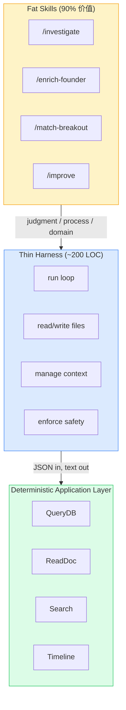

# 摘要

## 核心论点

AI 编码 agent 的 10x–1000x 生产力差距**不来自模型智能**（2x 的人和 100x 的人用同样的模型），而来自**套具（harness）架构**。正确的架构形状可凝练为一句话：**Thin Harness, Fat Skills**——把智能向上推到 markdown 流程文件（skill），把执行向下推给确定性工具，把中间层（harness）保持极薄。

> 套具就是产品。模型永远不是瓶颈，瓶颈是模型看到的**上下文质量**——你的 schema、你的约定、你的问题形状。Five definitions 修这个；Three-layer architecture 把它落成代码；A system that learns 让它自己进化。

## 五个核心定义

### 1. Skill 文件

**Skill** 是一份可复用的 markdown 文档，教模型**怎么做**某件事（不教做什么——做什么由用户传入）。

最反直觉的一点：**Skill 是一种方法调用（method call）**。同一份过程文件，传入不同参数，产生截然不同的能力。

> 例：`/investigate` skill 有七步：scoping / timeline / diarization / synthesis / argue both sides / cite sources。接收三个参数：`TARGET`、`QUESTION`、`DATASET`。
>
> - 传入 TARGET=安全科学家，DATASET=210 万封内部邮件 → 产出判定吹哨人是否被压制的医学研究分析师
> - 传入 TARGET=空壳公司，DATASET=FEC 申报 → 产出追踪协调性政治捐款的取证调查员
>
> **同一份 skill，同七步，同一个 markdown 文件。Skill 描述判断过程，调用提供世界。**

这不是 prompt engineering。这是**以 markdown 为编程语言、以人类判断为运行时的软件设计**。markdown 比刚性源码更完美地封装能力，因为它用模型已经在思考的语言描述过程、判断与上下文。

参见 [[concepts/Claude-Code-Skills/index|Claude Code Skills]]。

### 2. Harness

**Harness** 是运行 LLM 的程序，做四件事：
1. 把模型跑在循环里
2. 读写文件
3. 管理上下文
4. 强制安全

仅此而已。这就是 "thin"。

**反模式是 fat harness + thin skills**：40+ 工具定义吃掉半个上下文窗口、每次 2–5 秒的 MCP 往返、把每个 REST 端点都封装成独立工具 → 三倍 token、三倍延迟、三倍失败率。

> 正解是**目的性强、又快又窄**的工具。一个 100ms 完成单次浏览器操作的 Playwright CLI，比 15 秒的 "screenshot→find→click→wait→read" Chrome MCP 快 75x。**软件不再需要"端庄"。只构建你真正需要的东西，别的都不要。**

参见 [[concepts/Agent-Runtime|Agent Runtime]]。

### 3. Resolver

**Resolver** 是上下文的路由表：**任务类型 X 出现时，先加载文档 Y**。

- Skill 告诉模型"怎么做"
- Resolver 告诉模型"加载什么、何时加载"

> 例子：开发者改了一个 prompt。没 resolver，他直接 ship；有 resolver，模型先读 `docs/EVALS.md`——里面写着："跑 eval 套件、对比分数，如果 accuracy 跌超过 2% 就 revert 并调查"。开发者根本不知道 eval 套件存在。**Resolver 在对的时刻加载了对的上下文。**

Claude Code 内置了一个 resolver：每个 skill 都有 `description` 字段，模型自动把用户意图与 description 匹配。**你不必记得 `/ship` 存在，description 就是 resolver。**

> 自白：作者本人的 `CLAUDE.md` 曾经是 20,000 行——包含所有怪癖、模式、教训。结果模型注意力退化，Claude Code 主动告诉他"砍掉"。最终方案是 ~200 行——**纯指针**，resolver 在关键时刻加载那一份。2 万行知识按需可达，不污染主上下文。

### 4. Latent vs. Deterministic

**系统里每一步都是其中一种，把两者搞混是 agent 设计最常见的错误。**

- **Latent space** — 智能之家。模型读、解读、做决定。判断、综合、模式识别。
- **Deterministic** — 信任之家。同输入同输出，**每一次**。SQL 查询、编译代码、算术。

> 反例：LLM 能给 8 人晚宴排座（结合性格、社交动态）；让它排 800 人，它会幻觉出一份看起来合理但**完全错**的座位图——因为这是**组合优化**（确定性），被强行塞进 latent space。

最差的系统把错的工作放到错的一侧；最好的系统对此**无情**。

### 5. Diarization

**Diarization** 是让 AI 对真实知识工作有用的那一步。模型读尽关于一个主题的所有资料，输出一份**结构化档案**——从几十或几百份文档中蒸馏出**一页判断**。

- SQL 查询做不到
- RAG pipeline 做不到
- 模型必须真正**读完、同时持有矛盾、注意到何时何物变化、综合出结构化智能**

这是**数据库查询 vs. 分析师简报**的差别。

## 三层架构



**原则是单向的**：

$$\text{intelligence} \uparrow \quad\quad \text{execution} \downarrow$$

- 智能向上推到 skills
- 执行向下推到确定性工具
- harness 保持薄

这样做的好处：模型的每次升级，**自动**惠及所有 skill；确定性层保持完美可靠。

## 一个学习的系统：YC Startup School 案例

五定义协同工作不是理论，下面是 YC 在 2026 年 7 月 Chase Center 6,000 founder 场景中的实际系统。

### Enrichment

`/enrich-founder` skill 拉取所有来源（申请表、问卷、1:1 顾问对话、X 帖、GitHub commits、Claude Code transcripts），跑 enrichments、做 diarization，标出 founder **嘴上说的**和**实际在做的**之间的 gap。

确定性层负责 SQL 查询、GitHub stats、demo URL 浏览器测试、social signal pulls、CrustData queries。Cron 每晚跑，6,000 份 profile 永远新鲜。

> 例子：
> - FOUNDER: Maria Santos
> - COMPANY: Contrail
> - SAYS: "Datadog for AI agents"
> - ACTUALLY BUILDING: 80% commits 在 billing 模块 → 她在做一个伪装成 observability 的 FinOps 工具
>
> 这个 gap 需要**同时**读 GitHub commit 历史、申请表、顾问对话，三者同持在心智中。**没有任何 embedding 相似度搜索找得到，没有任何关键词过滤器找得到。模型必须读完整 profile 然后做判断**。这（！）就是放进 latent space 的完美决策。

### Matching：skill-as-method-call 闪光

同一份 matching skill，三次调用，三套完全不同的策略：

| 调用 | 输入 | 策略 | 关键技术 |
|------|------|------|---------|
| `/match-breakout` | 1,200 founder | 按 sector 聚类，30 人/间 | embedding + 确定性分配 |
| `/match-lunch` | 600 founder | 跨 sector 随机，8 人/桌，无重复 | LLM 发明主题 → 确定性算法分配 |
| `/match-live` | 现场任意 200 人 | 最近邻 embedding，1:1 配对，200ms | 排除已见过的人 |

模型还做聚类算法做不到的判断：

> "Santos 和 Oram 都是 AI infra，但他们不是竞品——Santos 做成本归因，Oram 做编排。放进同一组。"
>
> "Kim 申请时写 'developer tools'，但 1:1 对话显示他在做 SOC2 合规自动化。移到 FinTech/RegTech。"

**没有任何 embedding 能捕捉 Kim 的重分类。模型必须读完整 profile。**

### Learning loop

活动结束后，`/improve` skill 读 NPS 调查，对"OK"评级（不是差的，是"还行但没起作用"）做 diarization，提取模式，然后**把新规则写回 matching skill 文件**：

```
When attendee says "AI infrastructure"
    but startup is 80%+ billing code:
    → Classify as FinTech, not AI Infra.

When two attendees in same group
    already know each other:
    → Penalize proximity.
       Prioritize novel introductions.
```

下次运行自动使用新规则。**Skill 改写自己。**

| 指标 | 数值 |
|------|------|
| 7 月活动"OK"评级 | 12% |
| 下次活动"OK"评级 | 4% |
| 提升幅度 | 8pp |
| 需要写代码吗 | 不需要 |

> **这个模式普适**：retrieve → read → diarize → count → synthesize → survey → investigate → diarize → rewrite the skill。
>
> 2026 年最有价值的循环就是这些。**我们可以把它套用到知识工作的每一个学科、每一种生活。**

## Skills 是永久升级

作者给 OpenClaw 下的一条指令被广泛传播：

> 你不被允许做一次性工作。如果我让你做某件事，而它属于"还会再做一次"的类型，你必须：
> 1. 先手动在 3 到 10 个样本上做一遍
> 2. 给我看输出
> 3. 我批准后，**编纂成 skill 文件**
> 4. 如果应该自动跑，挂到 cron 上
>
> **测试：如果我必须第二次向你请求，你失败了。**

被点赞 1000+，被收藏 2500+。人们以为是 prompt engineering 技巧。**不是**。它就是上述架构的应用：**你写的每一个 skill 都是系统的永久升级**——永不退化、永不遗忘、凌晨 3 点也在跑；下一版模型发布，**所有 skill 瞬间变好**——latent 步骤的判断力提升，确定性步骤保持完美可靠。

**这就是 Yegge 说的 100x 怎么来的。不是更聪明的模型。是 fat skills、thin harness、和把一切编纂成代码的纪律。**

> 系统复利。建一次，永远运行。

## 关键判断

1. **套具即产品** — 98.4% 的 Claude Code 代码是基础设施、1.6% 是 AI 决策逻辑（参 [[entities/Dive-into-Claude-Code]]）；模型之外的所有工程都在为"对的上下文在对的时刻送达"服务
2. **Skill 是一种方法调用** — 同过程 + 不同参数 = 全新能力；这是 markdown 作为编程语言的表达力
3. **Latent vs. Deterministic 边界** — 把错的工作放到错的一侧是 agent 设计最常见错误；判断/综合放 latent，组合优化/SQL/算术放 deterministic
4. **Diarization 不可替代** — 没有 SQL、没有 RAG 能产出"一页判断"；只有模型能读尽、持矛盾、注意到变化
5. **Self-rewriting skill** — `/improve` skill 把"OK"评级中的模式写回自身；7 月 12% → 下次 4% 没人改代码
6. **Zero 一次性的纪律** — "如果我必须问第二次，你失败了"；这是把人类判断沉淀为系统能力的不二法门

## 与现有 wiki 概念的关联

- [[concepts/Claude-Code-Skills/index|Claude Code Skills]] — 本文是 skill-as-method-call 与 fat skills 哲学的源头
- [[concepts/Agent-Runtime|Agent Runtime]] — harness = runtime；本文定义了"瘦"runtime 的四个职责
- [[concepts/Agent-Harness-治理协议|Agent Harness 治理协议]] — thin harness 哲学与治理协议（事件时间线、概念演化）互补：前者管"一次 session 的形状"，后者管"跨 session 的一致性"
- [[entities/Dive-into-Claude-Code|Dive into Claude Code]] — 98.4% 基础设施数据印证"套具比模型重要"
- [[entities/wow-harness|wow-harness]] — 自动扩张任务图 + 事件驱动 agent spawn 是 harness 内的"扩张"机制，与本文"瘦 harness"在"如何不膨胀"上互补
- [[summaries/10-claude-code-dynamic-workflows|10-claude-code-dynamic-workflows]] — dynamic workflow 是 fat skills 的一种运行时形态

## 待解决问题

- "Markdown as a programming language"的边界在哪？何时 skill 该被编译成 TypeScript / 何时 markdown 仍然是更好的载体？
- Latent vs. Deterministic 的判定在多步 agent 中如何传播？某步选错会污染下游多少步？
- Resolver 的 description 匹配在小规模有效，skill 库增长到 200+ 后如何避免"长尾 description 失配"？
- Self-rewriting skill 的版本控制和回滚机制是什么？规则被错误改写后如何回退？
- "Diarization 的判断质量"如何量化？一页判断与多页判断的边界？
