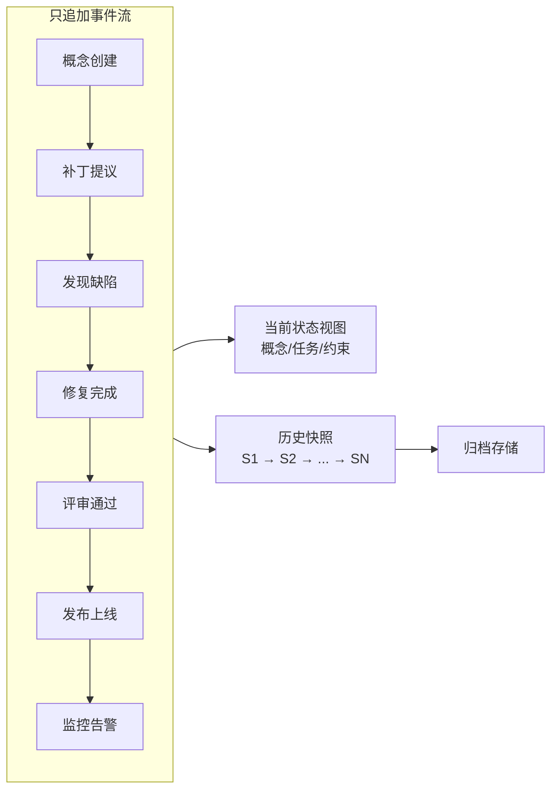
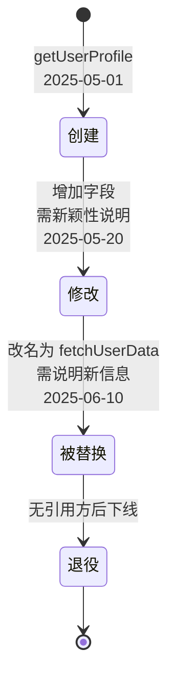
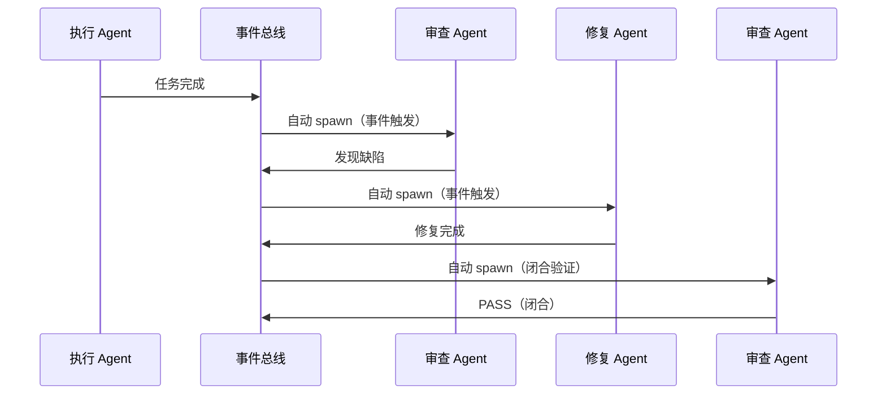
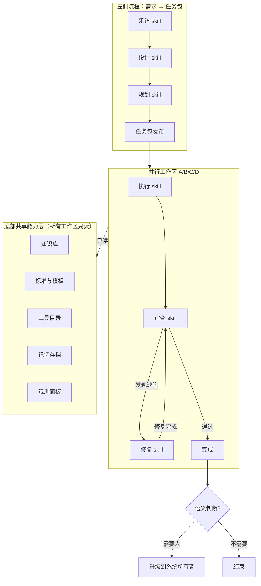

# Hermes Agent 之后：AI 开发需要一层治理协议

> 原始作者：张晨曦（Nature），通向惊喜科技创始人，大四在读  
> 原始来源：微信公众号 (2026-05-20)  
> 本 wiki 摄取日期：2026-06-04

## 摘要

这是 wow-harness v3 的设计者本人撰写的一手分享。核心判断：

> **协议比能力重要，治理比智能重要，长期连贯性比单次质量重要。**

文章指出当前 AI 开发工具（Claude Code、Superpowers、Hermes Agent、OpenHands）都只优化"一个人 + 一个 agent"的单次体验，**没有任何一套工具在管"一百次 session 之间不漂移"**。v3 是面向"跨 session、跨 agent 长期一致性治理"这个空白地带的设计。

详见 [[entities/wow-harness]] 与 [[concepts/Agent-Harness-治理协议]]。

## 关键论点

### 一、为什么现有工具都没碰这件事

四个工具的共同盲点：

| 工具 | 优化对象 | 盲点 |
|------|---------|------|
| Claude Code | 单次 session 执行效率 | 不管跨 session 一致性 |
| Superpowers | agent 行为约束（14 个 skill 文件） | prompt 层约束，session 结束就丢 |
| Hermes Agent | 个人记忆 + 技能自演化 | 围绕单用户单 agent，不假设多 agent 组织 |
| OpenHands | 临时事件总线 | EventStream 是 session 内消息总线，session 结束就消失 |

Anthropic 自己的判断：

> "真正决定效果的，是围绕模型搭起来的那套'套具'（harness），对最终效果的影响远超模型本身。"

目前的"套具"都在管"一次做好"，**管"一百次之间不漂移"的套具还没有人做**。

### 二、四个工具的二维定位

| | 单次会话 | 跨会话长期演化 |
|---|---|---|
| **单个 Agent** | — | Hermes Agent（个人记忆 + 技能自演化） |
| **多 Agent 组织** | Superpowers（行为约束清单）、OpenHands（临时事件总线） | **wow-harness v3** |
| **地基** | Claude Code（v3 运行其上） | — |

*（工具对比四象限图：横轴=单次会话 vs 跨会话长期演化，纵轴=单个 Agent vs 多 Agent 组织，详见原始文章 fig1）*

### 三、v3 五个核心问题及方案

#### 问题 1：AI 做过的事怎么不丢？

**方案**：事件时间线 + 增量状态推导 + 快照压缩

- 所有 agent 产出（代码改动、判断、概念调整）作为**事件写入只追加、不可篡改的时间线**
- 时间线是整个系统的**唯一真相来源**
- 配套机制：
  - **增量推导当前状态**（不需要每次从头扫描）
  - **定期归并压缩成关键快照**（保留可追溯性但减少存储）

事件流：概念创建 → 补丁提议 → 发现缺陷 → 修复完成 → 评审通过 → 发布上线 → 监控告警  
当前状态视图：概念状态 / 任务状态 / 约束状态  
历史快照：S1 → S2 → ... → SN → 归档存储

#### 问题 2：工程概念跨 session 怎么不漂移？

**方案**：概念节点生命周期 + 新颖性检查

- 每个工程概念是独立节点，有自己的生命周期：**创建 → 修改 → 被替换 → 退役**
- 概念被替换时，系统自动扫描"谁还在用旧版本"并通知
- **关键约束**：替换必须说明"引入了什么之前没有的新信息"。如果只是"我觉得新名字更好"，系统不允许替换——这消除了长期项目的振荡问题

每个版本都关联引用方（前端调用、测试用例、文档说明、下游模块），变更自动触发影响扫描和一致性保障。

#### 问题 3：怎么确保 AI 的产出真的做完了？

**方案**：双层验证（自检 + 交叉验证）

**第一层：自检（物理拦截）**
- agent 提交前必须跑一组自检项
- 每项要有具体验证证据（命令输出、测试报告、grep 结果）
- 通过**物理层面**的统一提交检查点拦截不合格产出
- 与 Superpowers 的"提示词约束"有本质区别：**自检不过就提交不了**

**第二层：交叉验证（schema 级权限隔离）**
- 另一个独立 agent 做交叉验证
- 验证 agent **没有写权限**（schema 级限制）
- 做判断的人不能同时是做事的人

#### 问题 4：怎么让 AI 不是"一个工具"而是"一个自己运转的组织"？

这是 v3 跟所有现有工具最根本的差异。

**假设反转**：
- Superpowers 假设：agent 是需要被管教的执行者
- v3 假设：**agent 是组织成员**——采访员、架构师、执行者、审查员、修复师协作不靠人调度，靠协议自动驱动

**核心结构：自动扩张的图**
- 每个节点是一个 agent skill（采访、设计、规划、执行、审查、修复）
- 边是事件触发关系
- 一个节点完成产出事件，系统自动检查"该触发哪个下游节点"，然后自动 spawn 新 agent session

**示例闭环**：

整条链路**没有任何人参与调度**——图自己在扩张、收缩、运转。

**关键设计：上下文胶囊**
- 每个新 spawn 的 agent session 都是**无状态**的，不继承上一个 session 的偏见和惯性
- 它拿到系统专门组装的**上下文胶囊**（包含需要知道的概念、约束、引用关系）
- 从 artifact 出发做独立判断——像新员工入职，看交接文档就能开始工作

**与线性流程的根本区别**：

| 维度 | 线性流程（Superpowers） | 自动扩张图（v3） |
|------|------------------------|-----------------|
| 并行 | 不支持 | 支持（5 个 agent 同时做 5 个任务） |
| 回路 | 不支持（审查发现问题需人重新触发） | 支持（审查 → 修复 → 闭合验证自动串联） |
| 跨任务概念冲突检测 | 不支持 | 支持 |

#### 问题 5：项目负责人怎么不退化判断权？

**方案**：人机决策分层

| 类型 | 决策内容 | 处理方式 |
|------|---------|---------|
| 工程实施类 | 怎么写、怎么测、怎么部署 | AI 自己做，不问人 |
| 语义判断类 | 产品方向、不可逆操作、价值取向 | 走"升级"路径送到系统所有者面前 |

升级时用**产品语言**描述情况、列出选项和各自代价，让系统所有者直接判断"要 A 还是 B"。系统所有者的每次判断本身也是一个事件，写入时间线、永久留痕。

### 四、学术验证

2026 年 2 月，arxiv 出现 ESAA（[[entities/ESAA]]，arxiv 2602.23193）论文，核心命题与 v3 高度重合：

| ESAA 命题 | v3 对应机制 |
|----------|------------|
| 意图与执行分离：agent 发结构化意图声明，验证器检查后写入不可篡改日志 | "事件意图 → 提交检查点验证 → 事件记录" |
| 长期一致性：AI 开发从对话式转向长期连贯工作流 | 概念图 + 演化链 + 新颖性检查 |
| 状态漂移：agent 相信自己修复了问题但系统实际没变 | 双层验证 + 物理拦截 |

ESAA 目前仍是论文阶段。v3 在多个维度超出论文范围：
- 概念节点生命周期状态机
- 约束规则独立生命周期
- 上下文胶囊机制
- 三正交审查方法论
- 闭合合约驱动修复协议

## 核心判断

> **协议比能力重要，治理比智能重要，长期连贯性比单次质量重要。**

> 项目负责人说完需求就可以退场。后面的一切（设计、规划、执行、审查、修复、集成）是 AI 组织自己完成的。

## 作者与体系背景

- **张晨曦（Nature）**：通向惊喜科技创始人，大四在读
- **通爻协议（ToWow Protocol）**：面向跨组织 Agent 协作的 A2A 协议，已被多个独立研究团队走同方向并验证，现已商业化
- **wow-harness**：通爻协议体系中面向**单组织内部 AI 协作治理**的一层（端点 Runtime 位置）
- v3 规模：21 个模块，设计文档约 50,000 行，经历六轮版本迭代
- 本文覆盖 v3 骨架：事件溯源、概念演化、双层验证、自动扩张任务图

同一协议体系还包含：基于证伪主义的三正交审查方法论、闭合合约驱动的缺陷修复协议、约束规则独立生命周期管理、上下文胶囊机制等。

## 引用图片

- [封面](D:/03resource/_Projects/work/harness-lab/context/references/hermes-agent-harness/cover.jpg)
- [图1：工具对比四象限](D:/03resource/_Projects/work/harness-lab/context/references/hermes-agent-harness/fig1-tool-comparison.jpg)
- [图2：事件时间线](D:/03resource/_Projects/work/harness-lab/context/references/hermes-agent-harness/fig2-event-sourcing.jpg)
- [图3：概念演化链](D:/03resource/_Projects/work/harness-lab/context/references/hermes-agent-harness/fig3-concept-evolution.jpg)
- [图4：自动扩张的任务图](D:/03resource/_Projects/work/harness-lab/context/references/hermes-agent-harness/fig4-auto-expanding-graph.jpg)

## 相关概念

- 关联概念：[[concepts/Agent-Harness-治理协议|Agent Harness 治理协议]]、[[entities/wow-harness|wow-harness v3]]
