# 摘要

## 核心论点

Agent 不是"人/工具/界面"中的任何一种，它是一次**显形**：输入进来、窗口被切出、行动单元工作、输出留痕、然后消散。Harness 解决的不是"管好 Agent"，而是**管好四种显形条件**——

1. **附着点** (Attachment Point)：Agent 这次附着在哪个上下文上
2. **可见世界** (Visible Window)：它能看见的窗口由什么决定
3. **公共痕迹** (Public Trace)：它做完以后什么能被追溯和召回
4. **接续机制** (Continuation)：下一次显形如何继承上一次的结果

> 分布式不是一开始的定义，而是从这些局部生命的协作问题里**自然长出来**的。

## 一、对 Agent 的三种误解

| 比喻 | 期待 | 设计后果 |
|------|------|----------|
| 像人 | 常识、记忆、责任感 | 反复追求"说清楚需求"，但它没有稳定常识 |
| 像工具 | 按钮式稳定执行 | 看不见复杂任务里的可塑性 |
| 像界面 | 窗口、角色、语气 | 把 Agent 绑死在窗口上，看不见后台协作 |

比喻可作为入口，但**不能作为本体**。把 Agent 当成"会话助手"会引导出窗口化设计；把 Agent 当成"短命工人"才能引导出分布式组织设计。

## 二、上下文是生成条件，不是材料包

"给 AI 上下文" 不是上传附件。**真正的上下文是它这一次能看见的一切**：

- **材料**：文件、原话、历史、规则（只是其中一部分）
- **工具**：它能调用什么，决定它能行动到哪里
- **边界**：什么能改、什么能提交、什么算事实

> Agent 看见的不是一个完整世界，而是一个**被切出来的窗口**。能力首先是视野的产物——看见什么决定能理解什么；看不见什么决定会在哪里误判。

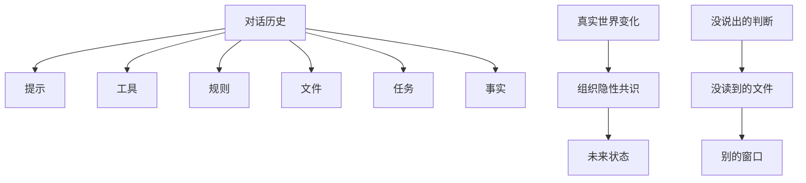

差异（Deleuze 意义上的）不在两个固定实体之间，而在**关系、条件、生成过程**中。Agent 的差异是在上下文里生成的。

## 三、同一团能力，附着点不同，显形不同

就像毒液——附着在**代码库、访谈、审查、玄学**语境上时，能力表现出的形态完全不同。差异不是身份标签（"写代码 Agent"或"营销 Agent"），而是**附着点**。

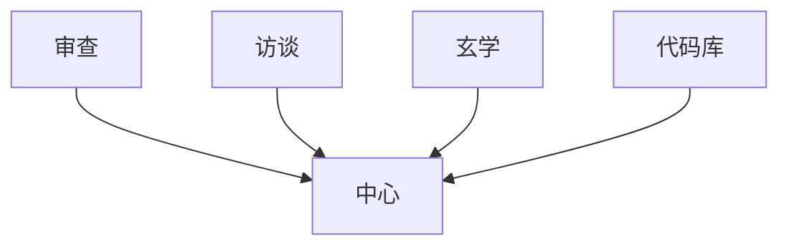

**Harness 进入这里的方式**：不是给 Agent 增加角色，而是**安排生成条件**。

## 四、显形 = 一次生命

Agent 不是一直在那里，而是**一次显形**：

- **输入**：任务、文件、提示、已有事实
- **窗口**：被切出的可见范围
- **行动单元**：在窗口内工作的单位
- **输出**：结果、判断、事件、可召回痕迹

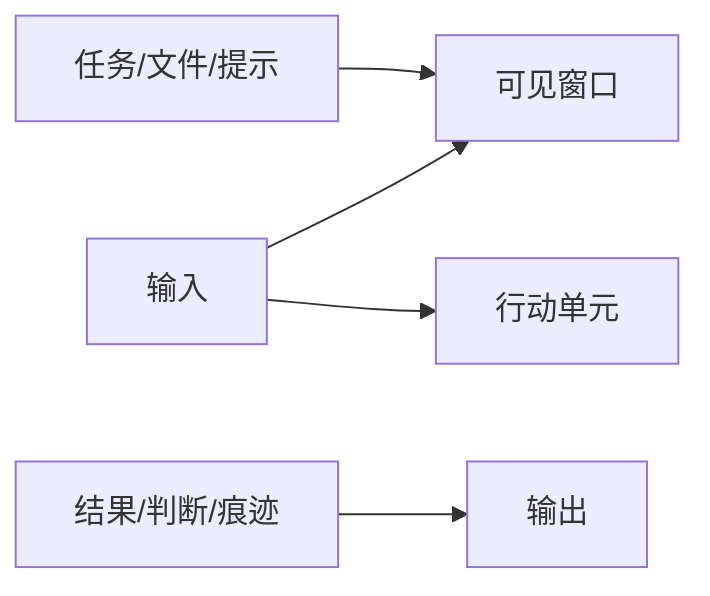

## 五、协作与记忆

### 横向并行 ≠ 共享大脑

多个单元并排工作，每个都有自己的输入、窗口和输出。**协作的关键不是"大家一起想"，而是局部结果如何互相可用**：

- 单元 A 看见局部、输出痕迹
- 单元 B 看见局部、输出痕迹
- 单元 C 看见局部、输出痕迹
- 单元 D 看见局部、输出痕迹

接口 = 输出物 + 事件 + 概念 + 结果。

### 垂直串行 = 断点接续

单对话看起来连续，其实是**断点式接续**。记忆不是 Agent 一直活着，而是**上一次留下来的东西被下一次重新读到**。

```mermaid
graph TD
    A[单元 1] -->|输入| B[单元 2]
    A -->|输出| C[单元 3]
    D[单元 2] -->|输入| E[单元 3]
    D[|输出| F[单元 3]
    style A fill:#f9f,stroke:#333
    style B fill:#f9f,stroke:#333
    style C fill:#f9f,stroke:#333
    style D fill:#f9f,stroke:#333
    style E fill:#f9f,stroke:#333
    style F fill:#f9f,stroke:#333
```

## 六、高维 / 低维：信息不是数量问题

> **高维不是更多信息，低维不是更少信息**——区别在于能否被低维透镜完整看见。

- **高维**：感受、判断、意图、世界，更接近真实但**不能被一次穷举**
- **低维**：能传播、能执行、能存储的**切片**，但一定有损失

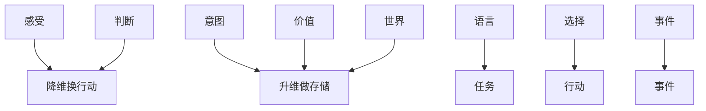

### 降维换行动

说出来的，已经不是感受到的；但如果不说、不写、不切成任务，它就没有操作性。**降维不是错误，是行动的入口**——损失和歧义是行动能力的代价。

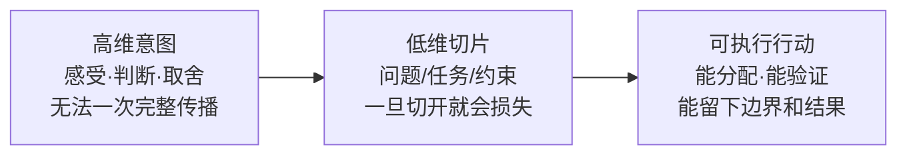

### 低维转高维

低维切片足够多，才能拼出高维侧写。**存储不是堆碎片，而是让碎片重新长出语义**——命名、归纳、归档，再交还给人判断。

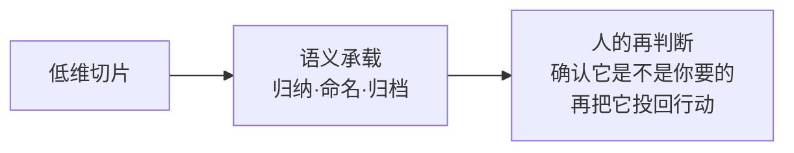

## 七、一次生命如何被下一次继承？

Agent 会结束。**继承靠三种证据 + 两种承载**：

| 类型 | 内容 |
|------|------|
| 证据 1：原话 | 语气与歧义 |
| 证据 2：判断 | 价值与边界 |
| 证据 3：事件 | 行动与结果 |
| 承载 1：状态 | 下一次直接继承 |
| 承载 2：快照 | 必要时回看追溯 |

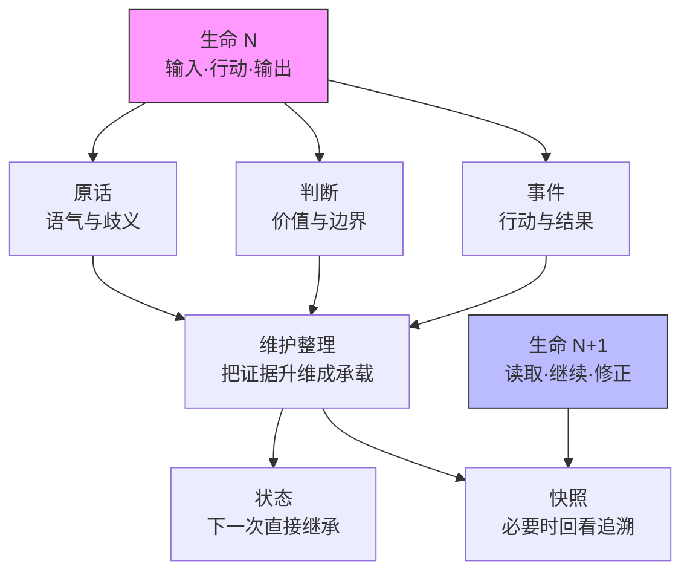

## 八、四层维度循环

降维、行动、升维**不只发生在 Agent 内部**——同一个循环在四个层级反复发生：

1. **人内部循环**：感受 → 语言/行动 → 再理解自己
2. **人机循环**：人的意图 → 低维输入/输出 → 人的判断接回
3. **Agent 内部循环**：任务语义 → 执行铺开 → 结果与痕迹
4. **Agent 间循环**：语义承载 → 局部工作 → 下一次继承

## 九、两种维度幻觉

> 维度看错以后，协作就会错。两种幻觉都会把人从循环里拿掉。

### 幻觉一：把二维输出当成三维真实

- **症状**：看起来很顺，但落地时缺一块
- **原因**：输出完整，不等于世界完整
- **修正**：把人的判断重新接回循环

### 幻觉二：把三维感受当成二维文本

- **症状**：反复觉得"它怎么还是不懂"
- **原因**：人的真实意图没有被充分萃取
- **修正**：用追问、选择、判断持续降维

## 十、人不是审查按钮——人是维度循环的上升端

> Human in the loop **不是审批按钮**，而是维度循环里的上升端。

人的工作：

- **输入端**：把高维意图降成可行动的上下文（追问、决策、信息价值判断）
- **判断端**：把低维输出升回人的现实感和取舍

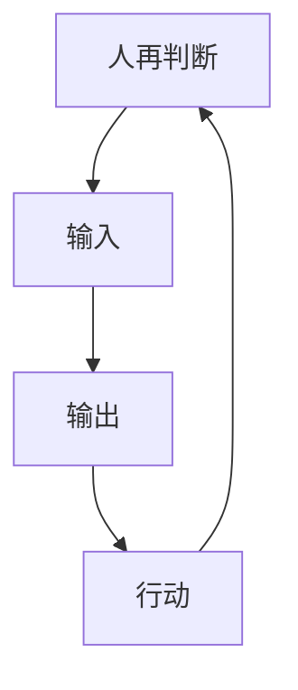

人负责把**不可穷举的东西，一次次重新接回现实**。

## 十一、Context Generation Protocol / Intent Extraction Layer

**采访不是聊天，是上下文生成**——追问、现实锚定、场景构造、信息价值判断，都是为了把人的高维意图**萃取成可行动、可传递、可维护的上下文**。

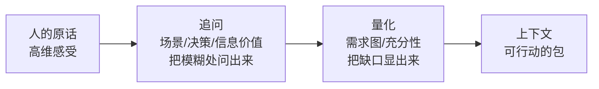

### 工具组墙（9 件）

| 工具 | 英文 | 作用 |
|------|------|------|
| 现实锚定研究 | Grounding Research | 把系统放进真实使用场景 |
| 场景构造 | ConOps | 从未来行动反推现在必须知道什么 |
| 决策透镜 | Decision Lenses | 不同透镜照亮同一模糊意图 |
| 结构化决策反推 | SDM | 从决策反推选项、指标、约束 |
| 关键决策追问 | CDM | 找到真正影响结果的判断点 |
| 决策影响图 | Influence Diagram | 看见变量之间怎样互相影响 |
| 信息价值判断 | Vol Gate | 判断这条信息值不值得继续问 |
| 信息充分性 | Info Power | 判断现在是否足够进入下游 |
| 人类判断捕获 | Human Judgment | 把判断转成可执行边界 |

### 信息需求图（Info Need Graph）

下游要做什么，决定上游必须问清什么。

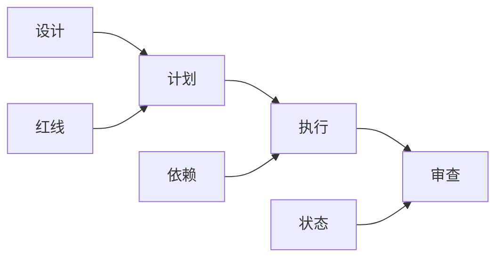

每个 InfoNeed 节点承载：来源、缺口、红线、依赖、下游用途、当前状态。

### 信息充分性（Info Power）

不是"资料够不够多"，而是"**下游能不能开始**"：

- **硬门槛**：红线清空、方向稳定、设计可推、独特判断覆盖
- **质量维度**：广度、特异性、可对话性、质量
- **判定**：够了 / 不够 / 有条件地够了

## 十二、实体注册、关系切面、Fork 与胶囊

### 实体注册

切片被命名以后，才会变成系统可以维护的对象。

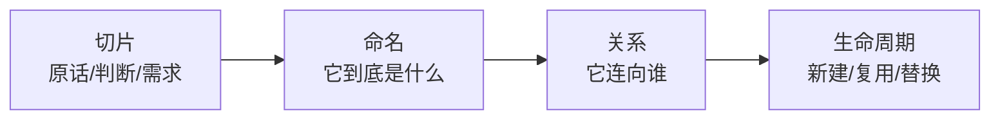

### 关系切面

不把全局塞进窗口，只让概念知道自己的邻居。

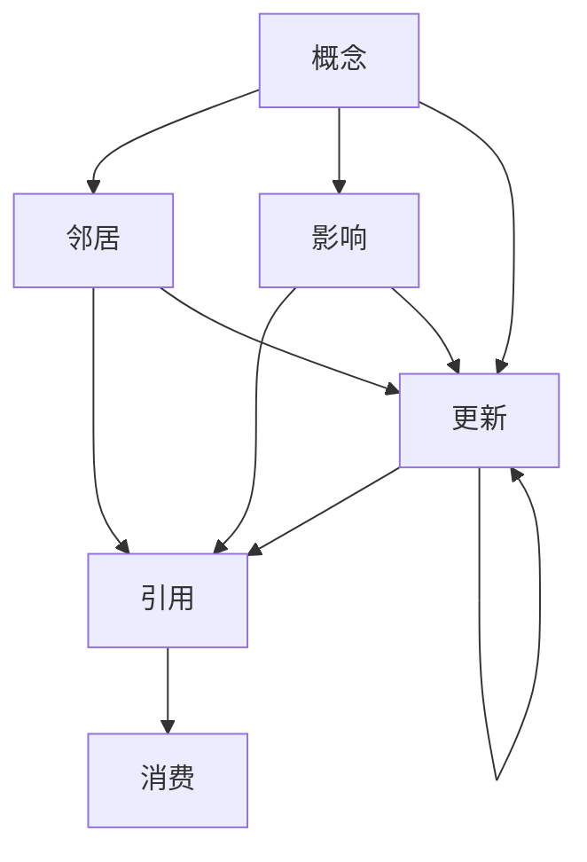

### Fork 与胶囊

用一个小窗口去摸清一个局部，再把结果带回来。

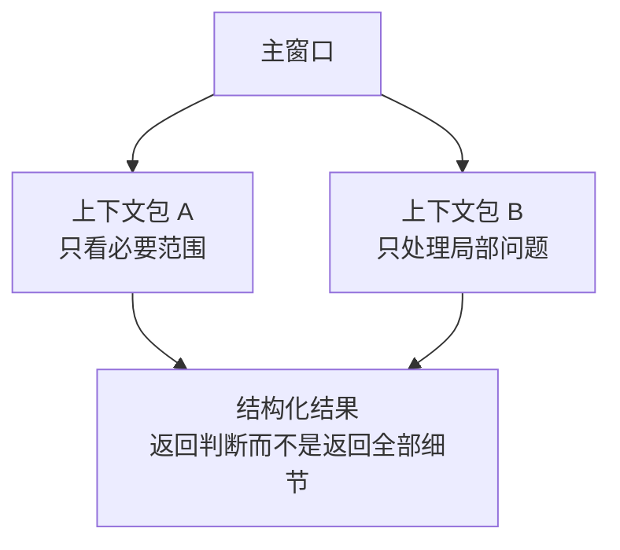

## 十三、维护与升维存储（四层结构）

后台维护像做梦——扫过低维切片，把它们整理成下一次可继承的语义。

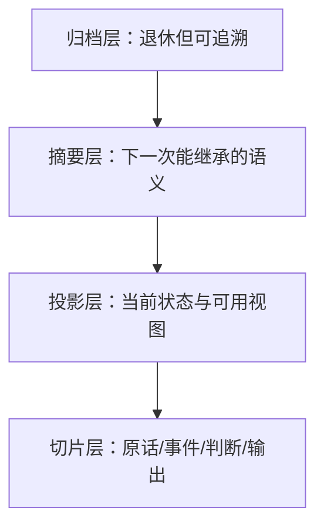

## 十四、分布式 Harness：智流网络

> 智慧应该流动，而不是停在一个窗口里。

一个会话里有多个队友；每个队友可以派出多个子会话；**窗口、终端、机器、组织、框架**，都可以成为流动的边。分布式 Harness 打开的是**跨窗口、跨机器、跨框架**的想象力。

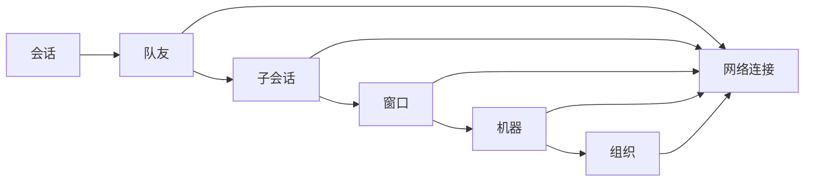

智流不是一条主河，是**很多支流被织起来**。

---

# 与现有 wiki 概念的关联

## 与 [[concepts/Agent-Harness-治理协议|Agent Harness 治理协议]] 的关系

两篇文章共同构成 "Harness" 的两个层面：

| 维度 | 治理协议 (工程层) | 分布式 Harness (哲学层) |
|------|-------------------|-------------------------|
| 关心问题 | 跨 session 一致性 | 显形条件、维度转换 |
| 主要机制 | 事件时间线、概念节点、双层验证 | 附着点、可见窗口、痕迹、接续 |
| 视角 | 系统怎么管 | 一次生命怎么活、怎么被继承 |
| 状态 vs 快照 | 增量推导 + 定期压缩 | 显形留下的两种承载 |

两文互补：治理协议提供工程骨架；分布式 Harness 提供存在论基础——为什么需要这些机制。

## 与 [[entities/wow-harness|wow-harness v3]] 的关系

wow-harness v3 的**事件时间线**对应本文的"公共痕迹"；**概念节点生命周期**对应本文的"实体注册 + 关系切面"；**自动扩张任务图**对应本文的"横向并行 + 垂直串行"；**上下文胶囊**对应本文的"Fork 与胶囊"。

## 与 [[concepts/Multi-Agent-协作模式|Multi-Agent 协作模式]] 的关系

四种核心模式在本文中均有哲学对应：

- **Orchestrator/Specialist** ↔ 横向并行的"接口 = 输出物 + 事件 + 概念"
- **Worker/Verifier** ↔ 垂直串行的"断点接续" + "返回判断而不是返回全部细节"
- **Team Engine** ↔ 会话 → 队友 → 子会话的层级
- **自动扩张任务图** ↔ 智流网络横向切面

## 与 [[concepts/Claude-Code-Subagent/index|Claude Code Subagent]] 的关系

Subagent 的"独立上下文窗口 + summary-only 返回"是 **Fork 与胶囊** 模式的工程实现；持久内存、Hooks 是**接续机制**的 Claude Code 表述。

## 与 [[concepts/Agent-Runtime|Agent Runtime]] 的关系

Agent Runtime 关注单 Agent 执行环境的工程细节（Prompt/工具/上下文/错误处理）。本文的"可见窗口"概念为其提供了**维度论**解释：单 Agent 看见的窗口由 Prompt/工具/规则/文件/任务/事实共同切出。

## 与 [[entities/ESAA|ESAA 论文]] 的关系

ESAA 的 **append-only immutable log** 对应本文的"公共痕迹"+"维护与升维存储"；**deterministic replay** 对应"状态"+"快照"的双承载继承；**boundary contracts** 对应"上下文包 / 胶囊"。

## 重要术语

- **附着点 (Attachment Point)**：Agent 这次显形所附着的基础语境（代码库/访谈/审查/玄学）
- **显形条件 (Manifestation Conditions)**：附着点 + 可见世界 + 公共痕迹 + 接续机制
- **降维换行动 (Dimension Reduction for Action)**：把高维意图切成低维任务
- **低维转高维 (Low-Dim to High-Dim)**：把可存储切片组织成语义承载
- **Fork 与胶囊 (Fork & Capsule)**：用小窗口摸清局部，返回结构化判断
- **智流 (Wisdom Flow)**：智慧在分布式网络中流动，不停在单窗口
- **Human in the Loop**：人作为维度循环的上升端，不是审批按钮
- **Context Generation Protocol (CGP)**：把人的高维意图萃取成可行动上下文的协议
- **Intent Extraction Layer (IEL)**：CGP 中的意图萃取层
- **Info Need Graph**：从下游行动反推上游必须问清什么的图
- **Vol Gate**：信息价值判断闸门

---

# 关键洞察

1. **"管 Agent"是个伪命题**——Harness 管的是显形条件，不是 Agent 本身
2. **分布式是协作的副产物**——不是一开始就定义分布式，而是从局部生命的协作问题里长出来
3. **继承靠两种承载**——状态（直接继承）和快照（追溯回看），与 ESAA 的 deterministic replay 异曲同工
4. **维度循环是协作的元结构**——四层循环（人内/人机/Agent内/Agent间）反复做同一件事
5. **人不是审批员**——人是维度循环的上升端，负责把不可穷举的高维一次次接回现实
6. **CGP 是分布式 Harness 的入口**——不解决意图萃取，分布式只放大混乱
