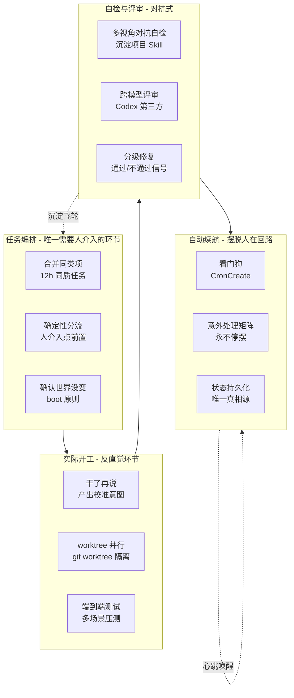

# 如何实现一个好的 AI 自主干活系统

> 原始作者：阳志平  
> 原始来源：微信公众号（2026-06-02）  
> 本 wiki 摄取日期：2026-06-04

## 摘要

业界习惯用「harness」一词，本文作者更愿意称之为 **AI 自主系统（Autonomous AI System）**。作者在访谈中给出一个判断标准：

> 「衡量当前 AI 发展到了什么水准，就看一件事：在没有任何人类介入的前提下，它能独立工作多久、能不能交付高质量的成果。」

从 30 分钟、3 小时、9 小时到 36 小时+，作者把「让 AI 在你跑步、睡觉时持续干活」的全套技巧拆为四组共 12 个：

1. **任务编排** — 合并同类项、确定性分流、开工前确认世界没变
2. **实际开工** — 干了再说、worktree 并行分身、补齐端到端测试
3. **自检与评审** — 对抗性自检、跨模型评审、分级修复与通过信号
4. **自动续航** — 看门狗、意外处理矩阵、状态持久化

详见 [[Autonomous-AI-System]] 与 [[concepts/Agent-Runtime|Agent Runtime]]。

## 关键论点

### 一、为什么需要"人介入的点"前置

> **把人介入的点，前置到「开工前」，而不是「返工时」。**

传统 AI 协作的痛苦是：AI 闷头干半天方向错了，事后盯更紧没用。**AI 自主干活系统的核心设计是让 AI 在开工前先自我分流**——高确定性的活一句话确认就放手；高不确定性的活先停下来，把关键决策点摆到人面前。

### 二、四组 12 个技巧总览

| 组别 | 技巧 | 核心动作 |
|------|------|---------|
| 一·任务编排 | 1. 合并同类项 | 减少上下文切换，按复杂度从低到高排序，控制在 12h 内可完成 |
| 一·任务编排 | 2. 确定性分流 | 开工前自检：是否拥有足够上下文？是否需要重新定义问题？ |
| 一·任务编排 | 3. 开工前确认世界没变 | 读最新真实状态，别拿上次缓存的旧状态当真相 |
| 二·实际开工 | 4. 干了再说 | 计划是一次性脚手架；让最小可用版本先跑起来再对齐意图 |
| 二·实际开工 | 5. worktree 并行分身 | 用 `git worktree` 创建隔离工作副本，多分身同时干同一大活 |
| 二·实际开工 | 6. 补齐测试 | 端到端、多样本、真环境；别让 AI "看起来跑通" |
| 三·自检评审 | 7. 对抗性自检 | 多视角互相对抗而非再读一遍；沉淀项目专用自检 Skill |
| 三·自检评审 | 8. 换不同谱系模型评审 | 上下文已被任务污染的模型做不了干净评审，调用 Codex 之类做第三方 |
| 三·自检评审 | 9. 分级修复 + 通过信号 | P0/P1/P2；每轮给"通过/不通过"明确判据，不许说"差不多" |
| 四·自动续航 | 10. 看门狗 | CronCreate + 定时读状态文件 + "待办就执行，不问问题" |
| 四·自动续航 | 11. 意外处理矩阵 | 提前预设 if-then 绕行路径；单条卡住就跳下一条，**永不停摆** |
| 四·自动续航 | 12. 状态持久化 | 状态文件是看门狗醒来后唯一真相源；交班时产出"人话"汇报 |

### 三、四组架构关系

任务编排把人介入前置；实际开工让"产出"代替"计划"；自检评审用对抗和跨模型对抗单视角偏差；自动续航用看门狗 + 状态文件让 AI 在人离场后继续推进。**每轮的教训沉淀为 Skill 注入下一轮的任务编排，形成越用越聪明的飞轮**。

### 四、几个值得深挖的设计原则

#### 1. "AI 最怕任务杂"

> **AI 自主干活，最怕任务杂。** 让它一会儿修 bug、一会儿写文案、一会儿做表格，上下文反复横跳，交付质量必然差。

同类任务能让 AI 把上一个任务里建立的模式顺势复用到下一个。**成功带来成功**——这条对 AI 和人类一样成立。

#### 2. 反传统工程的"干了再说"

> 计划永远不是唯一的真相，实际产出（比如代码）才是。

复杂活也写计划，但计划只是一次性脚手架。**需求往往是「干」出来的，靠「想」想不全。** 这与 [[concepts/Agent-Harness-治理协议|Agent Harness 治理协议]] 的"事件意图 → 提交检查点验证 → 事件记录"思路同源——意图必须被实际产出验证，而不是被计划验证。

#### 3. worktree = "把并行约束在人类工作记忆以内"

worktree 早在 2015 年由 pclouds 主导开发，但一直不是 git 常用命令。如今得益于 AI 进步成为 AI 自主系统标配。**关键约束不是技术实现，而是工作记忆与认知负荷**——人类大脑极不擅长多线程切换。

#### 4. 跨模型评审 = "最被低估的一步"

> 让两个 AI 一起评审，最大的危险是**它们会互相说服**——干活的那个解读评审结论时，会下意识往「通过」的方向偏。

作者永远不让干活的模型自己解读评审结果，而是另起一个干净上下文、不同谱系、不同训练数据的旗舰模型。例：`codex exec -m gpt-5.5 -c model_reasoning_effort=medium`（在 Claude Code 中直接调用 Codex）。

#### 5. 意外处理矩阵 = "为 AI 预设执行意图"

> 就像人类设定执行意图能大幅提高行动力一样，提前预设「意外处理矩阵」，其实就是给 AI 预设执行意图。

真实示例（节选）：

| 如果 | 那么 |
|------|------|
| codex 评审超时（> 5 min） | kill 进程 + 记录 + PR 留着不合 + 跳下一个 |
| codex 持续 REQUEST_CHANGES（≥ 2 次） | PR 留着不合 + 评论附输出 + 跳下一个 |
| 测试 fail 修不动 | PR 不开 + 分支保留 + issue 标 BLOCKED + 跳下一个 |
| 调用 /simplify 后测试 fail | 撤改动重新做；仍 fail 标 BLOCKED |
| 任何 unrecoverable | 记 `.claude/notes/autonomous-state.md` + 跳下一个 |

**核心原则：永不停摆。** 一批任务里总有一两个会卡住。一卡就停，这系统也太弱。规则必须是**单条卡住就跳下一条，绝不阻塞整体推进**。

## 与现有 wiki 概念的关联

| 本文技巧 | 对应 wiki 概念 |
|---------|---------------|
| 合并同类项、约束任务清单 | [[concepts/Agent-Runtime|Agent Runtime]] 上下文管理（"约束实体 ≤ 4" 经验值同源） |
| 干了再说、产出校准意图 | [[concepts/Agent-Harness-治理协议|Agent Harness 治理协议]] "事件意图 → 提交检查点验证" |
| worktree 并行分身 | [[concepts/Multi-Agent-协作模式|Multi-Agent 协作模式]] 并行 Worker |
| 对抗性自检、多视角审查 | [[concepts/Worker-Verifier-对抗循环|Worker/Verifier 对抗循环]] 物理拦截 + 跨视角加权 |
| 跨模型评审 | 与 Agent Harness 治理协议的"双层验证"同构——验证者与执行者必须是不同上下文/不同模型 |
| 看门狗、定时执行 | [[concepts/Meta-Reflection-Techniques]] 技巧 7 看门狗；Agent Harness 治理协议自动扩张任务图的事件驱动 |
| 状态持久化、唯一真相源 | [[entities/ESAA]] Event Sourcing + 当前状态视图 |
| 意外处理矩阵、永不停摆 | [[entities/wow-harness]] "为失败预设绕行路径" 处处可见 |
| 沉淀自检 Skill / 评审教训制度化 | [[concepts/Thin-Harness-Fat-Skills|Thin Harness, Fat Skills]] 90% 价值在 markdown 流程文件 |

## 核心判断

> 真正的答案也许不在那些确定的、高效的、可被自动化的回答里，而在人类面对 AI 这类快速生长的技术巨物时的恐惧之中，在它所带来的颠覆面前的踌躇之间，在一时不知如何自处的茫然之际。**当 AI 把确定的事越做越快、把不确定留给人类，恰恰是这份恐惧、踌躇与茫然，见证着人类之所以为人类。**

「AI 自主干活系统」的提出，是对"人 vs AI 双节奏协同"这一本源问题的正面回应——哪些事要人亲自做？哪些事可以交给 AI 持续推进？**如何让越来越强的 AI 增强人类，而不是削弱人类的自主感与意义感**。

## 相关阅读

- 关联概念：[[concepts/Autonomous-AI-System|Autonomous-AI-System]]、[[concepts/Agent-Harness-治理协议|Agent Harness 治理协议]]
- [让 AI 变得更聪明的 12 个元反思技巧](https://mp.weixin.qq.com/s?__biz=MzA3MzM0MjUyMQ==&mid=2652154952&idx=1&sn=a1d6c7cc99eae8d5b18be4fcab5e100c&scene=21#wechat_redirect) — 与本文同源（技巧 7 看门狗、技巧 8 完整性、技巧 12 积累飞轮直接对应）
- [我是谁？关于人生叙事的十个要点](https://mp.weixin.qq.com/s?__biz=MzA3MzM0MjUyMQ==&mid=2652154906&idx=1&sn=210122a226118c0df9f9a265a00f9efe&scene=21#wechat_redirect)
- [读了这四本书，你更懂第三代认知科学](https://mp.weixin.qq.com/s?__biz=MzA3MzM0MjUyMQ==&mid=2652154796&idx=1&sn=847dfcbe1b63b55a08a883231d9d4d4a&scene=21#wechat_redirect)
