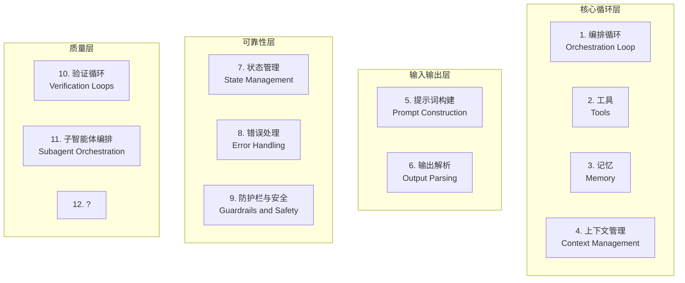
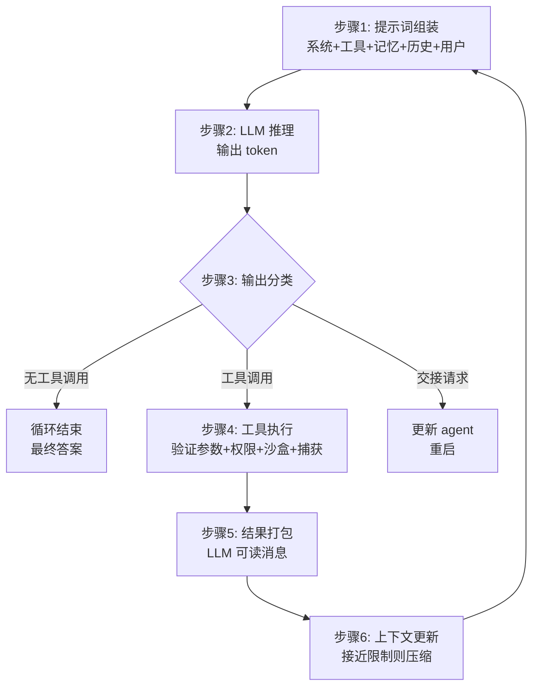
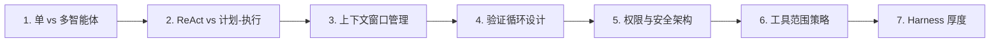

# 摘要

> **本文与 [[summaries/12-harness-engineering-survey]] 的主题重叠分工**：本文偏向**单 Agent 视角的 12 组件架构拆解 + 7 个关键设计决策**（TAO 循环、上下文腐烂、Anthropic/OpenAI/LangChain 框架对比、脚手架隐喻、Harness 厚度等具体工程实现），适合需要从零设计一个生产级 Agent Harness 的读者；12- 则偏向**跨厂商、跨时间的行业综述**（14 篇工程文章 + Claude Code v2.1.88 源码对账，揭示"补偿面在膨胀与迁移"的演化规律），适合需要把握 Harness Engineering 整体生态与趋势的读者。两文在"harness 不是商品层"这一核心判断上重合，但切入角度互补。

## 核心论点

> "如果你不是模型，你就是 harness。" — Vivek Trivedy, LangChain

**Agent Harness** 是包裹 LLM 的完整软件基础设施（编排循环、工具、记忆、上下文管理、状态持久化、错误处理、安全防护），2026 年初被正式确立。Anthropic 的 Claude Code 文档直接说明"SDK 就是驱动 Claude Code 的 Agent harness"；OpenAI Codex 团队用同一表述把"Agent"与"Harness"等同。

**关键实证**：LangChain 的一项实验只改变 LLM 基础设施（模型与权重完全不变），在 TerminalBench 2.0 上排名从 30 名开外跃升到第 5 名；另一项目让 LLM 自主优化基础设施，通过率达到 76.4%，超过人工设计的系统。**harness 不是商品层——它是产品差异化的核心战场。**

## Agent vs. Harness：术语区分

| 概念 | 定义 |
| :--- | :--- |
| **Agent** | 涌现出来的行为——有目标、会用工具、能自我纠错的实体 |
| **Harness** | 产生这种行为的"机械装置"——编排循环、上下文管理、状态持久化等非模型基础设施 |

> 当有人说"我做了个 Agent"，实际意思是他做了个 Harness，然后把它指向了一个模型。

Beren Millidge（2023，《Scaffolded LLMs as Natural Language Computers》）的冯·诺依曼类比：

- 原始 LLM = 没有内存/硬盘/I/O 的 CPU
- 上下文窗口 = RAM（快但有限）
- 外部数据库 = 硬盘（大但慢）
- 工具集成 = 设备驱动
- **Harness = 操作系统**

> "我们重新发明了冯·诺依曼架构"——任何计算系统的自然抽象。

## 三层工程同心圆

| 层级 | 范围 | 工程目标 |
| :--- | :--- | :--- |
| 提示词工程 | 精心制作模型接收的指令 | 优化单次指令的措辞 |
| 上下文工程 | 管理模型看到什么、何时看到 | 优化信息流入 |
| **Harness 工程** | 前两者 + 工具编排、状态持久化、错误恢复、验证循环、安全执行、生命周期管理 | 让自主智能体行为成为可能 |

> Harness 不是提示词的包装器——它是让自主智能体行为成为可能的完整系统。

## 生产级 Harness 的 12 个组件

综合 Anthropic、OpenAI、LangChain 与实践社区，一个生产级 agent harness 由 12 个独立组件构成：

### 1. 编排循环（Orchestration Loop）

心脏。实现 **TAO 循环**（Think-Act-Observe，又名 ReAct）：组装提示词 → 调用 LLM → 解析输出 → 执行工具调用 → 反馈结果 → 重复。

机械上通常是 `while` 循环。复杂性在于循环管理什么，循环本身很简单。Anthropic 把运行时描述为"**哑循环**"——所有智能都在模型里，harness 只管理回合。

### 2. 工具（Tools）

Agent 的手。定义为模式（名称、描述、参数类型），注入到 LLM 上下文中。工具层负责：注册、模式验证、参数提取、沙盒执行、结果捕获、格式化回 LLM 可读观察。

- **Claude Code**：六类工具——文件操作、搜索、执行、网络访问、代码智能、子智能体生成
- **OpenAI Agents SDK**：函数工具（`@function_tool`）、托管工具（WebSearch、CodeInterpreter、FileSearch）、MCP 服务器工具

### 3. 记忆（Memory）

| 类型 | 范围 | 实现 |
| :--- | :--- | :--- |
| 短期记忆 | 单会话内对话历史 | 对话状态 |
| 长期记忆 | 跨会话持久化 | 文件、KV、DB |

- **Anthropic**：`CLAUDE.md` 项目文件 + 自动生成的 `MEMORY.md`
- **LangGraph**：命名空间组织的 JSON 存储
- **OpenAI**：SQLite 或 Redis 支持的 Sessions

**Claude Code 的三层记忆**：

1. 轻量级索引（每条约 150 字符，始终加载）
2. 按需拉取的详细文件
3. 仅通过搜索访问的原始记录

**关键设计原则**：Agent 把自己的记忆当作"提示"，在行动前会对照实际状态验证——避免对记忆的盲目信任。

### 4. 上下文管理（Context Management）

这是许多 agent 失败的地方。核心问题是 **上下文腐烂**（context rot）——Chroma 研究与斯坦福"Lost in the Middle"一致发现：关键内容落在窗口中间位置时，模型性能下降 30% 以上。

> 即使是百万 token 窗口，随着上下文增长，指令遵循能力也会退化。

生产策略：

| 策略 | 说明 | 例子 |
| :--- | :--- | :--- |
| 压缩 | 接近限制时总结对话历史 | Claude Code 保留架构决策与未解决的 bug，丢弃冗余工具输出 |
| 观察遮蔽 | 隐藏旧工具输出，保留工具调用可见 | JetBrains Junie |
| 即时检索 | 维护轻量级标识符，动态加载数据 | Claude Code 用 `grep`/`glob`/`head`/`tail` 而非加载完整文件 |
| 子智能体委托 | 子智能体广泛探索，返回压缩摘要 | 1000–2000 token summary |

> **Anthropic 上下文工程指南的目标**：找到最小的高信号 token 集合，最大化期望结果的可能性。

### 5. 提示词构建（Prompt Construction）

分层组装模型每一步看到的内容：**系统提示词 → 工具定义 → 记忆文件 → 对话历史 → 当前用户消息**。

**OpenAI Codex 的严格优先级栈**：

1. 服务器控制的系统消息（最高优先级）
2. 工具定义
3. 开发者指令
4. 用户指令（级联 `AGENTS.md` 文件，32 KB 限制）
5. 对话历史

### 6. 输出解析（Output Parsing）

现代 harness 依赖原生工具调用，模型返回结构化 `tool_calls` 对象而非自由文本。Harness 检查：

- 有工具调用 → 执行并循环
- 无工具调用 → 最终答案
- 交接请求 → 更新当前 agent 并重启

结构化输出通过 Pydantic 模型做模式约束。`RetryWithErrorOutputParser`（将原始提示词 + 失败完成 + 解析错误反馈给模型）仍用于边缘情况。

### 7. 状态管理（State Management）

| 框架 | 状态模型 |
| :--- | :--- |
| **LangGraph** | 状态建模为流经图节点的类型化字典，reducer 合并更新；检查点发生在超级步骤边界，支持中断后恢复与时间旅行调试 |
| **OpenAI** | 四种互斥策略：应用程序内存、SDK 会话、服务器端 Conversations API、轻量级 `previous_response_id` 链接 |
| **Claude Code** | git 提交作为检查点，进度文件作为结构化草稿本 |

### 8. 错误处理（Error Handling）

**复合失败定律**：10 步流程、每步 99% 成功率，端到端只有约：

$$P_{\text{end}} = 0.99^{10} \approx 90.4\%$$

LangGraph 区分四种错误类型：

| 错误类型 | 处理方式 |
| :--- | :--- |
| 瞬态错误 | 带退避重试 |
| LLM 可恢复 | 将错误作为 `ToolMessage` 返回，让模型调整 |
| 用户可修复 | 中断等待人工输入 |
| 意外错误 | 冒泡用于调试 |

Anthropic 在工具处理程序内捕获失败，作为错误结果返回以保持循环运行。Stripe 的生产 harness 将重试上限设为两次。

### 9. 防护栏与安全（Guardrails and Safety）

**OpenAI SDK 的三个级别**：

1. 输入防护栏（第一个 agent 上运行）
2. 输出防护栏（最终输出上运行）
3. 工具防护栏（每次工具调用时运行）

"绊线"机制在触发时立即停止 agent。

**Anthropic 架构分离**：模型决定尝试什么（决策层），工具系统决定允许什么（执行层）。**权限执行与模型推理是架构上分离的。**

Claude Code 独立管理约 40 个离散工具能力，分三阶段：

1. 项目加载时建立信任
2. 每次工具调用前权限检查
3. 高风险操作的明确用户确认

### 10. 验证循环（Verification Loops）

区分玩具演示和生产 agent 的关键。Anthropic 推荐三种方法：

| 方法 | 用途 |
| :--- | :--- |
| 基于规则的反馈 | 测试、linter、类型检查器 |
| 视觉反馈 | Playwright 截图用于 UI 任务 |
| LLM 作为评判者 | 单独的子智能体评估输出 |

> **Claude Code 创建者 Boris Cherny**：给模型一种验证其工作的方法，**质量提高 2 到 3 倍**。

### 11. 子智能体编排（Subagent Orchestration）

**Claude Code 的三种执行模型**：

- **Fork** — 父上下文的字节相同副本
- **Teammate** — 带基于文件的邮箱通信的单独终端窗格
- **Worktree** — 自己的 git 工作树，每个 agent 一个独立分支

**OpenAI SDK** 支持智能体作为工具（专家处理有界子任务）和交接（专家获得完全控制）。**LangGraph** 将子智能体实现为嵌套状态图。

## 循环运作：逐步演练

**终止条件（分层）**：

- 模型产生无工具调用的响应
- 超过最大回合限制
- token 预算耗尽
- 防护栏绊线触发
- 用户中断
- 返回安全拒绝

一个简单问题需要 1–2 回合；复杂重构可链式调用数十次工具。

### 跨窗口连续性：Ralph Loop

对于跨越多个上下文窗口的长期任务，Anthropic 开发的**两阶段 Ralph Loop 模式**：

1. **初始化 Agent** — 设置环境（初始化脚本、进度文件、功能列表、初始 git 提交）
2. **编码 Agent** — 每个后续会话读取 git 日志与进度文件定位自己 → 选择最高优先级的未完成功能 → 处理 → 提交并写摘要

> **文件系统在上下文窗口之间提供连续性**。

## 真实框架如何实现该模式

| 框架 | Harness 模型 | 关键设计 |
| :--- | :--- | :--- |
| **Anthropic Claude Agent SDK** | 单个 `query()` 函数暴露 harness，运行时是"哑循环" | 收集-行动-验证循环：搜索文件/读代码 → 编辑/运行 → 测试/检查输出 |
| **OpenAI Agents SDK** | `Runner` 类（异步/同步/流式） | "代码优先"：工作流逻辑用原生 Python 表达，而非图 DSL |
| **OpenAI Codex** | 三层架构 | Codex Core（agent 代码 + 运行时）+ App Server（双向 JSON-RPC API）+ 客户端界面（CLI、VS Code、web） |
| **LangGraph** | 显式状态图 | 两个节点（`llm_call` 和 `tool_node`）+ 条件边：工具调用→`tool_node`，否则→`END` |
| **LangChain Deep Agents** | 明确使用"agent harness"术语 | 内置工具 + 规划（`write_todos`）+ 文件系统 + 子智能体生成 + 持久记忆 |
| **CrewAI** | 基于角色的多智能体 | Agent（角色+目标+背景故事+工具）+ Task + Crew + Flows 层（确定性骨干） |
| **AutoGen / Microsoft Agent Framework** | 对话驱动编排 | 三层架构：Core + AgentChat + Extensions；五种编排模式：顺序/并发/群聊/交接/magentic |

> 所有 Codex 界面共享同一个 harness——这就是为什么"Codex 模型在 Codex 界面上比在通用聊天窗口中感觉更好"。

## 脚手架隐喻与协同进化

建筑脚手架是临时基础设施——使工人能建造他们无法触及的结构。它不做建造，但没有它工人无法到达上层。**关键洞察**：建筑完成后脚手架会被拆除。

> 随着模型改进，harness 复杂性应该降低。

**实证**：Manus 在六个月内重建了五次，每次重写都删除了复杂性——复杂的工具定义变成通用 shell 执行，"管理 agent"变成简单结构化交接。

**协同进化原则**：模型现在在循环中使用特定 harness 进行后训练。Claude Code 的模型学会了使用它训练时使用的特定 harness。**改变工具实现可能降低性能**。

> **未来验证测试**：如果性能随更强模型扩展而**不增加** harness 复杂性，设计就是合理的。

## 定义每个 Harness 的 7 个决策

### 1. 单智能体 vs. 多智能体

**Anthropic 和 OpenAI 都建议：先最大化单个 agent。** 多智能体系统增加开销（路由的额外 LLM 调用、交接期间的上下文丢失）。

仅当满足以下条件时拆分：

- 工具过载（超过约 10 个重叠工具）
- 存在明显独立的任务域

### 2. ReAct vs. 计划-执行

| 模式 | 特点 |
| :--- | :--- |
| **ReAct** | 每步交织推理和行动——灵活但每步成本更高 |
| **计划-执行** | 规划与执行分离。**LLMCompiler 报告比顺序 ReAct 快 3.6 倍** |

### 3. 上下文窗口管理策略

五种生产方法：基于时间的清除、对话总结、观察遮蔽、结构化笔记、子智能体委托。

> **ACON 研究**：通过优先考虑推理轨迹而非原始工具输出，token 减少 26%–54%，同时保持 95%+ 准确率。

### 4. 验证循环设计

| 类型 | 优势 | 代价 |
| :--- | :--- | :--- |
| 计算验证（测试、linter） | 确定性真相 | 仅语法/类型层 |
| 推理验证（LLM 作为评判者） | 捕获语义问题 | 增加延迟 |

Martin Fowler / Thoughtworks 框架化为**指南**（前馈，行动前引导）与**传感器**（反馈，行动后观察）。

### 5. 权限与安全架构

- **宽松** — 快但有风险，自动批准大多数操作
- **限制性** — 安全但慢，每个操作都需要批准

选择取决于部署环境。

### 6. 工具范围策略

更多工具通常意味着更差的性能。**Vercel 从 v0 中删除 80% 工具，获得更好的结果。** Claude Code 通过延迟加载实现 95% 上下文减少。

> **原则**：暴露当前步骤所需的最小工具集。

### 7. Harness 厚度

harness 与模型中各有多少逻辑。**Anthropic 押注于薄 harness 和模型改进**；基于图的框架押注于显式控制。Anthropic 定期从 Claude Code 的 harness 中删除规划步骤——新模型版本内化了该能力。

## Harness 就是产品

> 使用相同模型的两个产品，仅基于 harness 设计就可以有截然不同的性能。

**TerminalBench 证据**：仅改变 harness 就使 agent 移动了 20 多个排名位置。

Harness 不是已解决的问题或商品层。**这是艰苦工程的所在**：

- 将上下文作为稀缺资源管理
- 设计在失败复合之前捕获失败的验证循环
- 构建提供连续性而不产生幻觉的记忆系统
- 在构建多少脚手架与留给模型多少之间做出架构押注

该领域正朝着更薄的 harness 发展，因为模型在改进。**但 harness 本身不会消失**——即使是最有能力的模型也需要东西来管理其上下文窗口、执行工具调用、持久化状态、验证其工作。

> 下次你的 agent 失败时，别怪模型，看看 harness。

## 关键观察

1. **TAO 循环是中心节点**——其余 11 个组件都是它要协调的对象。Anthropic "哑循环"哲学意味着循环本身简单、智能在模型，但管理循环中流动的 11 个子系统才是工程难点。
2. **"如果性能随模型升级不增加 harness 复杂性"是反直觉的**——直觉是"模型变强了，harness 复杂点也没关系"，但 Manus 6 个月重写 5 次的事实是反例。
3. **Vercel 删除 80% 工具、Claude Code 延迟加载 95% 上下文**——这两个独立案例强证据：工具作用域是过拟合的优化目标。
4. **ACON 的"推理轨迹优先于工具输出"**（token -26%–54%、准确率 ≥95%）与 Agent Harness 治理协议的"事件时间线"思想同源——都是"原始数据少保留、语义密度高的产物多保留"。

## 与现有 wiki 概念的关联

- **编排循环 = TAO 循环** — 与 [[concepts/Agent-Runtime|Agent Runtime]]的"四个组件"（Prompt/工具/上下文/错误）框架同构，但 12 组件是更细的实现分解
- **事件时间线 / 状态管理 / 错误处理** — 与 [[concepts/Agent-Harness-治理协议|Agent Harness 治理协议]]的"事件时间线"在状态管理层面同构；本文是单次 session 内、治理协议是跨 session 长期
- **子智能体编排** — 与 [[concepts/Claude-Code-Subagent/index|Claude Code Subagent]] 的 Fork/Teammate/Worktree 三模式精确对应
- **验证循环** — 与 [[concepts/Worker-Verifier-对抗循环|Worker/Verifier 对抗循环]]在目标层同构——都是"对单个输出加验证层"
- **Anthropic 98.4% 基础设施、1.6% AI 决策** — 与 [[entities/Dive-into-Claude-Code]] 的"minimal scaffolding + maximal operational harness"原则一致
- **OpenAI Codex 11% 跳到第 5** — 验证了 Agent Runtime 中"harness 决定 75% 失败修复"的判断

## 关键引用

- Vivek Trivedy, LangChain: "如果你不是模型，你就是 harness"
- Beren Millidge (2023): "我们重新发明了冯·诺依曼架构"
- Boris Cherny, Claude Code 创建者: "给模型一种验证其工作的方法，质量提高 2 到 3 倍"
- LangChain TerminalBench 实验: 仅改 harness，30 名开外 → 第 5 名
- Manus: 6 个月重写 5 次，每次删除复杂性
- Vercel: 删除 80% 工具 → 更好结果
- ACON 研究: 推理轨迹优先 → token -26%–54%、准确率 ≥95%
- LLMCompiler: 计划-执行比顺序 ReAct 快 3.6 倍

## 相关资源

- 原始来源：`D:\03resource\_Projects\work\harness-lab\context\references\2026-04-20-Agent Harness：让AI从聊天机器人变成真正的智能体.md`
- 来源 URL：<https://blog.qiaomu.ai/2026-04-18-JgypqM>（乔木博客）
- 原始发布：2026-04-20
- 关联概念：[[concepts/Agent-Runtime|Agent Runtime]]、[[concepts/Agent-Harness-治理协议|Agent Harness 治理协议]]、[[concepts/Claude-Code-Subagent/index|Claude Code Subagent]]、[[concepts/Worker-Verifier-对抗循环|Worker/Verifier 对抗循环]]、[[concepts/Multi-Agent-协作模式|Multi-Agent 协作模式]]
- 关联实体：[[entities/Dive-into-Claude-Code]]（98.4% 基础设施数据）
