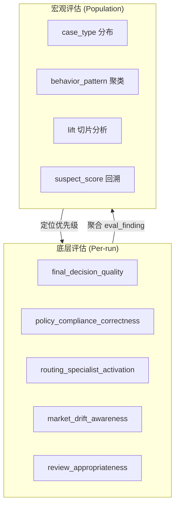
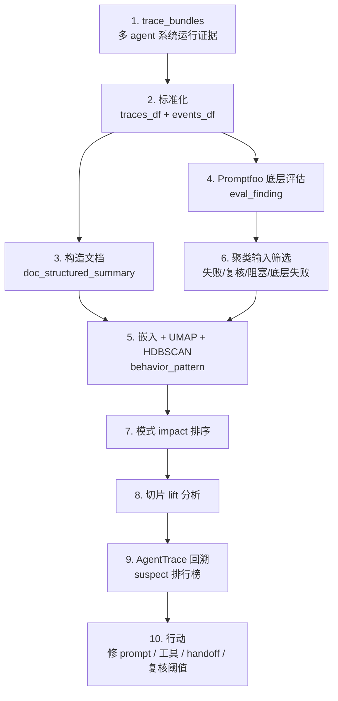

# Macro Evals for Agentic Systems：从单次评分到群体行为模式

> **原文**：[Macro Evals for Agentic Systems](https://developers.openai.com/cookbook/examples/partners/macro_evals_for_agentic_systems/macro_evals_for_agentic_systems)
> **作者**：Shikhar Kwatra (OpenAI) / Will Thieme / Bradley Strauss
> **发表**：2026-05-19，OpenAI Cookbook (Partners)
> **本 wiki 摄取**：2026-06-13
> **中文改写源文件**：`raw/articles/20-macro-evals-for-agentic-systems-zh.md`

## 核心论断

> **当一个多智能体系统出问题时，不只看某一次回答错在哪里，而是把成百上千次运行轨迹放在一起，找出反复出现的系统性行为模式。**

这是 OpenAI Cookbook 第一篇把**评估方法论本身**抬升到 agentic system 设计层的官方示例。它用一个**电动车订单处理多 Agent 系统**作案例（定价 / 合规 / 供应 / 工厂路由 / 排期 / 客户沟通 / 放行审查），1000 次合成运行 → 992 个 trace bundle 可分析，演示从原始 trace 到 macro pattern 的完整流水线。

> 与 [[concepts/Worker-Verifier-对抗循环|Worker/Verifier 对抗循环]] 的关系：Verifier 是**单次运行内**的对抗验证；macro eval 是**跨多次运行**的群体诊断——两者正交互补。

## 双层评估架构



## 四层标签：业务到模式的连贯叙事

```text
case_type → run_outcome → eval_finding → behavior_pattern
业务场景  → 运行结局   → 局部症状   → 群体模式
```

这条链是宏观评估的**心智模型骨架**。详见 [[concepts/Agent-Macro-Evaluation]]。

## 案例数据规模

| 项目 | 值 |
|------|----|
| 请求运行数 | 1,000 |
| 实际 bundle-backed 运行 | 992 |
| 业务场景类型 | 8（clean_simple / validation_block_simple / supplier_substitution_compound / pricing_exception_compound / regional_compliance_compound / clarification_needed_compound / schedule_incentive_compound / conflicting_multi_agent_compound） |
| 终态 | 4（completed / awaiting_review / blocked / failed） |
| 底层评估 rubric | 5 类（决策 / 政策 / 路由 / 市场 / 复核） |

> 离线数据 + 已保存的 Promptfoo 评分，**不需要 OpenAI API key 即可重现**——这是 cookbook 的设计选择，让方法论传播脱离 API 依赖。

## 关键技术栈

| 工具 / 方法 | 角色 |
|------------|------|
| **Promptfoo** | 底层评估层，给每次运行打 5 类 rubric 分 |
| **trace bundle** | 完整运行证据包（events + spans + environment_events + review_packet + snapshots） |
| **`doc_structured_summary`** | trace 压缩为可比较短文档，是聚类输入 |
| **UMAP** | 高维 embedding → 低维降维 |
| **HDBSCAN** | 密度聚类，离群点标 topic id `-1` |
| **class-aware tf-idf** | `score(t,k) = tf(t,k) × log((1+N)/(1+df(t)))` 提取簇内区分词 |
| **AgentTrace** 风格诊断 | 给 focus event 上游嫌疑节点打分 |

## 三个核心公式

### 1. Trace 级影响分

```text
trace_impact_score = severity_weight × (1 + findings_count) × (1 + loop_count / 4)
```

严重度权重映射：

| 终态 | 权重 |
|------|------|
| `successful_completion` | 1.0 |
| `review_escalation` | 2.0 |
| `in_progress` | 1.5 |
| `blocked` | 2.5 |
| `hard_failure` | 3.0 |

### 2. 模式级影响分（用于排序）

```text
impact_score(k) = prevalence_share(k) × severity_weighted_prevalence(k)
```

> 高 impact ≠ 缺陷证明。它的意思是：**这个模式又常见又可能有后果，值得优先排查。**

### 3. Lift（切片集中度）

```text
lift = slice_pattern_share / overall_pattern_share
```

- `lift > 1`：模式在该切片里集中
- `lift < 1`：不突出
- `lift = 1`：和整体一致

### 4. Suspect score（嫌疑节点排序）

```text
suspect_score = 0.4 × proximity + 0.3 × frequency + 0.2 × bridge + 0.1 × role
```

权重 `0.4 / 0.3 / 0.2 / 0.1` 是 OpenAI 团队给出的**经验值**，不是普适常数（见 Open Research Questions）。

## 完整流水线



## 核心可视化

| 视图 | 用途 |
|------|------|
| **Sankey 流向图** | `case_type → run_outcome → eval_finding → behavior_pattern` 共享地图 |
| **Heatmap** | 切片 × 模式集中度 |
| **Story strip** | 进入 focus event 前的代表性路径 |
| **Swimlane** | 按 agent / lane 展示锚点前后时间窗口 |
| **Suspect leaderboard** | 嫌疑节点排行榜 |

## 怎么读 suspect 排行榜

> 如果榜首是 `eval/review signal`，它通常**只是问题被发现的位置，不是根因**。

真正可操作的嫌疑：

1. 编排器是否把订单交给了正确专家？
2. 工具输出风险信号但后续没用？
3. handoff 发生得太早或太晚？
4. 专家响应误导后续决策？
5. 复核标记触发时机不合理？

阅读顺序：**模式 → 锚点 → 第一个非复核类的 operational suspect → 回到代表 trace 检查上游 → 判断改 prompt / 工具 schema / handoff 规则 / 复核阈值 / 业务政策**。

## 行动转化

### AI 工程团队

- 把最清晰的底层失败加入回归测试
- 抽样复核自动评分校准 Promptfoo 严格程度
- 按模型版本 / 提示词版本 / 编排模式持续跟踪 `behavior_pattern`
- 优先检查高影响模式里的智能体说明、工具 schema、handoff 规则、复核逻辑

### 业务团队

- 判断 `case_type` 是否覆盖真实运营风险
- 检查高影响模式是否对应真实客户影响 / 运营成本
- 校准人工复核阈值
- 用 heatmap 和 sankey 决定流程或政策调整

## 与现有 Wiki 概念的关联

| 本文概念 | 对应 Wiki |
|---------|----------|
| 宏观评估方法论 | [[concepts/Agent-Macro-Evaluation]]——本次 ingest 同步创建的 concept 页 |
| 跨 trace 群体分析 | [[concepts/Worker-Verifier-对抗循环]]——单运行 vs 群体级的正交互补 |
| Multi-agent 编排模式 | [[concepts/Multi-Agent-协作模式]]——Orchestrator + Specialist 的运行轨迹是 macro eval 的输入 |
| 事件流 + immutable audit | [[entities/ESAA]]——Event Sourcing 提供 macro eval 所需的完整 trace |
| 双层评估的元反思视角 | [[concepts/Meta-Reflection-Techniques]]——4 象限"反馈"象限的工程化实现 |
| 自动续航 + 自检评审 | [[concepts/Autonomous-AI-System]]——12 技巧中"自检评审组"在群体规模的对应 |
| 失效模式（agentic laziness/bias/drift） | [[summaries/12-a-harness-for-every-task-dynamic-workflows]]——三种失效模式正是宏观评估能发现的 behavior_pattern 候选 |
| 治理协议 | [[concepts/Agent-Harness-治理协议]]——事件时间线为 macro eval 提供原料，macro eval 的发现可反向更新概念节点 |

## 关键洞察

1. **从评分到诊断**：传统评估给单次输出打分（micro-eval），宏观评估给系统反复出现的行为模式排序——这是**评估文化的转向**。

2. **聚类只能发现文档保留的信息**：`doc_structured_summary` 的字段选择决定能发现什么模式。这是宏观评估工程化的最大设计点，类似 [[concepts/Agent-Harness-治理协议|治理协议]] 中的事件时间线压缩。

3. **嫌疑分 ≠ 因果证明**：`suspect_score` 是启发式排序，不能直接归因。诊断结果需要回到代表 trace 做人类判断。

4. **业务工程共享地图**：`case_type → run_outcome → eval_finding → behavior_pattern` 让两个团队围绕同一张 sankey 图讨论"该查什么、改什么、验证什么"。

5. **离线优先的传播策略**：cookbook 用预计算 trace + 已保存 Promptfoo 标签，**完全脱离 API 依赖**。这种设计大幅降低方法论传播门槛。

6. **OpenAI Cookbook 首次系统化 agent eval**：之前 cookbook 偏向 prompt / RAG / function calling 模式；这篇把**评估本身**作为一类工程问题展开，是 agent platform 成熟的重要标志。

## 术语表

| 术语 | 定义 |
|------|------|
| Agentic system | 多步骤、用工具、有 handoff、有状态决策的 agent 系统 |
| Specialist swarm | 处理验证/定价/合规/供应/路由/复核的领域专家 agent 群 |
| Orchestrator | 接收 case 并分发给专家的协调层 |
| Handoff | agent 之间的委派 |
| Bundle | 一次合成订单交互的证据包 |
| Trace document | trace 的紧凑文本表示，用于聚类 |
| `doc_structured_summary` | 用于 discovery 的具体文档列 |
| BERTopic-style | embedding + UMAP + HDBSCAN + class-aware tf-idf 的聚类风格 |
| AgentTrace-style | 基于执行图回溯打分的诊断风格 |
| Promptfoo | 案例中作为底层评估层的工具 |
| Focus event | 诊断锚点（review finding / awaiting_review / failed / triage / tool warning） |
| Suspect | 上游被打分排序的嫌疑节点 |
| Noise topic | HDBSCAN 标为 `-1` 的离群组 |
| Lift | 切片模式集中度比值 |
| Story strip / Swimlane | 锚点前后路径的两种可视化 |

## Open Research Questions

- `MACRO_EVALS_DISCOVERY_MIN_CLUSTER_SIZE` 在不同任务规模下的最优取值如何确定？粒度过粗会丢失小众重要模式，过细会噪声爆炸
- `suspect_score` 的 `0.4 / 0.3 / 0.2 / 0.1` 权重是 OpenAI 经验值，在其他 agent 系统上是否需要重新校准？
- BERTopic 风格 vs 直接 LLM 做主题归纳，在 agent trace 场景下哪种更稳定？前者可解释性强，后者语义敏感度高
- 宏观评估能否反向**自动生成新的底层评估 rubric**？即从 `behavior_pattern` 反推应该新增哪些 micro-eval 维度（self-extending eval）
- `behavior_pattern` 与 wow-harness v3 [[concepts/Agent-Harness-治理协议|事件时间线]] 的 concept node 演化结合，能否实现"系统级自我反思循环"？
- 1000 次合成运行 vs 真实生产数据，宏观评估发现的模式可迁移性如何？合成数据的 case_type 分布偏倚会传递到 behavior_pattern
