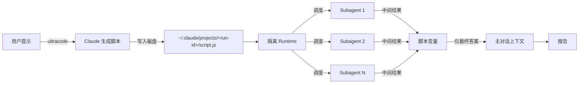

# 摘要

## 核心观点

**动态工作流**是 Claude Code 在 v2.1.154 引入的研究预览功能：Claude 把任务描述后**自动生成一个 JavaScript 脚本**，运行时在隔离的 worker 进程里执行该脚本、在后台大规模编排子代理，而主对话只接收最终结果。它把"计划"从对话上下文里搬进了可读、可重跑、可版本化的代码中。

> 与子代理、技能、agent teams 相比，工作流的最大差异是**编排器是谁**——前三种都是 Claude 在每轮决定下一步，工作流是脚本决定下一步。

## 子代理 / Skills / Agent Teams / 工作流 对比

| 维度 | 子代理 | Skills | Agent Teams | 工作流 |
| :--- | :--- | :--- | :--- | :--- |
| 是什么 | Claude 生成的工作者 | Claude 遵循的指令 | 监督对等会话的主导代理 | 运行时执行的脚本 |
| 谁决定下一步 | Claude，逐轮 | Claude，遵循提示 | 主导代理，逐轮 | **脚本** |
| 中间结果存放 | Claude 上下文窗口 | Claude 上下文窗口 | 共享任务列表 | **脚本变量** |
| 可重复的部分 | 工作者定义 | 指令 | 团队定义 | **编排本身** |
| 规模 | 每轮几个委派 | 与子代理相同 | 少数长期对等体 | **每次数十到数百个代理** |
| 中断行为 | 重启轮次 | 重启轮次 | 队友继续运行 | **同一会话内可恢复** |

核心权衡：**把计划写入代码 = 可重复的质量模式**（对抗性审查、多角度草稿）+ 可审计、可重跑、可作为命令分发。

## 触发方式

三种入口：

1. **关键词触发** — 在 prompt 中包含 `ultracode`（v2.1.160 之前为 `workflow`），如 `ultracode: audit every API endpoint under src/routes/ for missing auth checks`
2. **模式触发** — 执行 `/effort ultracode`，Claude 为本会话每个实质性任务自动规划工作流（结合 `xhigh` 推理努力）
3. **直接执行已保存的工作流命令** — 捆绑命令 `/deep-research` 或用户保存的 `/<name>`

`ultracode` 关键词在 macOS 上按 `Option+W`、Windows/Linux 上按 `Alt+W` 即可忽略高亮；彻底关闭在 `/config` 中切换 *Ultracode keyword triggers*。

## 捆绑工作流：`/deep-research`

`/deep-research <question>` 是 Claude Code 内置的多阶段工作流：

- 多个角度扇出 WebSearch
- 获取并交叉检查来源
- 对每个声明投票
- 返回**带引用的报告**，未通过交叉检查的声明已被过滤掉

```text
/deep-research What changed in the Node.js permission model between v20 and v22?
```

## 运行机制



关键点：
- **隔离执行** — 脚本运行时与对话分开，中间结果只进脚本变量、不进主上下文
- **会话目录** — 每次运行会把脚本写入 `~/.claude/projects/`，可读、可对比、可编辑后要求 Claude 重启
- **可恢复** — 运行时跟踪每个代理结果，暂停后恢复时已完成代理返回缓存结果

## 行为与硬限制

| 限制 | 原因 |
| :--- | :--- |
| 无中途用户输入 | 阶段之间需签认时，把每个阶段拆成独立工作流 |
| 脚本无直接 FS/Shell 访问 | 由子代理代为执行，脚本只做协调 |
| 最多 **16 个并发**代理 | CPU 核心少时更少 |
| 每次运行最多 **1,000 个代理** | 防止失控循环 |

权限层面：子代理始终在 `acceptEdits` 模式下运行，文件编辑自动批准；Shell/网络获取/MCP 工具仍可提示用户，需在启动前把它们加入允许列表以避免长运行中断。

## 计划批准与权限模式

启动前 CLI 提示的选项：
- **是，运行它**
- **是，不再为 `<name>` 在 `<path>` 询问**（项目级记忆）
- **查看原始脚本**（`Ctrl+G` 在编辑器中打开）
- **否**

权限模式决定何时提示：

| 权限模式 | 提示时机 |
| :--- | :--- |
| 默认（接受编辑） | 每次运行，除非已"不再询问" |
| 自动 | 仅首次；ultracode 启用时**完全跳过** |
| 绕过权限 / `claude -p` / Agent SDK | **从不**——运行立即启动 |

## 保存与重用

工作流运行后按 `s` 即可保存为命令，存放在：

- `.claude/workflows/` — 项目级，仓库共享
- `~/.claude/workflows/` — 用户级，每个项目可用、仅本人可见

项目与个人工作流同名时，**项目优先**。保存的命令以 `/<name>` 在自动完成中出现。

## 输入参数：args

保存的工作流通过 `args` 全局变量接受输入——列表、对象、字符串皆可：

```text
> Run /triage-issues on issues 1024, 1025, and 1030
```

Claude 将结构化数据直接传给脚本，无需解析。省略 `args` 时脚本内为 `undefined`。

## 运行管理

- **观看** — `/workflows` 列出运行中/已完成，进入任一运行查看阶段、代理计数、令牌、耗时；按 `Enter` 深入代理查看其提示、最近工具调用与结果
- **暂停/恢复** — `/workflows` 选中按 `p`；恢复在**同一会话**内有效，退出 Claude Code 后下次会话从头重启
- **停止** — `x` 停止选中的代理；焦点在运行时停止整个工作流
- **重启代理** — `r` 重启选中的运行中代理

## 成本与模型控制

单次工作流运行通常比对话内处理相同任务消耗**更多令牌**（生成大量子代理）。控制手段：

- 大型任务前先在小范围试跑（一个目录、狭窄问题）
- `/workflows` 视图实时显示每代理令牌，可随时停止
- 默认代理沿用会话模型；描述任务时让 Claude 为轻量阶段用小模型
- 启动前检查 `/model`，避免不必要地用大模型

## 关闭工作流

| 方式 | 生效范围 |
| :--- | :--- |
| `/config` 切换 *Dynamic workflows* 关闭 | 当前会话 |
| `~/.claude/settings.json` 设 `"disableWorkflows": true` | 当前会话 |
| 环境变量 `CLAUDE_CODE_DISABLE_WORKFLOWS=1` | 启动时读取 |
| 托管设置 / Claude Code 管理员设置 | **组织级** |

禁用后：`/deep-research` 不可用、`ultracode` 关键词不触发、`/effort` 菜单移除 ultracode。

## 与现有 wiki 概念的关联

- **计划从上下文迁移到代码** — 与 [[Agent Harness 治理协议]]的"事件时间线"思想同源：编排状态可被外部观察、可重放、可在受控条件下复现
- **质量模式**（对抗审查、多角度草稿、交叉检查）— 与 [[Worker Verifier 对抗循环]]在目标层同构：把"对单个输出的信任"换成"对多视角加权后的信任"。对抗审查直接针对 [[Self-Preferential Bias]]——Agent 偏向自己产出的结构性失效模式
- **隔离运行时 + 中间结果不污染主上下文** — 进一步推进了 [[Claude Code Subagent]] 的"独立上下文窗口"思想
- **保存为命令 + 跨项目复用** — 与 [[Claude Code Skills]] 的"可复用指令包"在分发模型上互补：Skills 是指令包、工作流是脚本

## 关键观察

1. **执行环境的隔离**是工作流能"放飞"的根本原因——把中间状态锁在脚本变量里，主上下文才能保持轻量。`/deep-research` 可以跑几十个搜索代理，主对话却只看到报告。
2. **16/1000 的硬上限是成本控制阀**——脚本会自循环，必须靠运行时限流来切断"失控循环"的可能。
3. **`ultracode` + `xhigh` 的组合**把"高推理 + 大编排"绑成预设：让用户不必为每个任务显式选择协调策略，符合"高努力 = 慢但深"的 trade-off 曲线。

## 相关资源

- 原始来源：`raw/articles/2026-06-04-claude-code-dynamic-workflows.md`（Claude Code 官方中文文档）
- 关联概念：[[Claude Code Subagent]]、[[Claude Code Skills]]、[[Agent Runtime]]、[[Multi-Agent 协作模式]]、[[Agent Harness 治理协议]]
