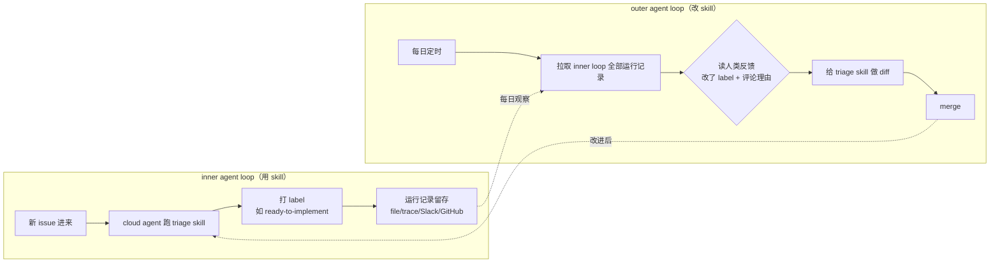

# Skills 自我提升闭环：inner loop 用、outer loop 改

> 原始作者：Zach Lloyd（@zachlloydtweets，Warp 创始人，2026-06-16）
> 本 wiki 摄取日期：2026-06-18

## 薄摄取说明：与 Thin Harness 的关系

> 本文与 [[Thin Harness, Fat Skills：套具要瘦，技能要胖]] 的 `/improve` learning loop（retrieve→diarize→rewrite the skill）是**同一机制**。增量价值是 **inner/outer agent loop 的二元命名框架 + GitHub issue triage 的工程实例 + 定时 outer agent 改 skill 的落地路径**。

## 核心：两个嵌套的 agent loop

Zach Lloyd 把 skill 的自我提升拆成两个明确的 loop：

- **inner agent loop**：实际应用 skill 的地方。issue triage 场景下，可以是手动跑，但更典型是与 task tracker 集成——每个新 issue 触发一次。每次与 skill 的交互都记录在 file / agent trace / Slack / GitHub。
- **outer agent loop**：一个**定时跑**的 agent，观察 inner loop 对 skill 的全部使用，基于这些运行的表现调整 skill。因为 **skill 就是文件**，"调整 skill"= 给文件做 diff。

## 关键洞察

1. **skill 是文件，所以可被 agent diff**——这是整个闭环成立的物理基础。改 skill 不需要重训或特殊机制，就是改 markdown。
2. **人类反馈是信号源**：人把 issue 从 "ready-to-implement" 改回 "needs-info" 并评论理由 → outer loop 读到这个 diff → 据此改 triage skill。若有明确目标无需人类，可用自动化 grader 替代。
3. **闭环方向**：outer loop 的 diff merge 后，反馈进驱动 inner loop 的 skill，下次 agent 跑得更好。
4. **工程化**：inner loop 用 GitHub Action 触发 Oz（Warp 的云 agent 平台）跑 skill；outer loop 是每日定时的 cloud agent。同构思路可用于 code review / bug fix / incident response skill。

## 与现有概念

- 同机制 → [[Thin Harness, Fat Skills：套具要瘦，技能要胖]] 的 `/improve` learning loop、YC Startup School 的 self-rewriting skill 循环
- output→lesson→skill 的"close the loop" → [[Harness Engineering 14 步路线图：从单个 agent 到自我改进系统]] 步骤 13
- skill 作为可演化文件 → [[Claude Code Skills]]
