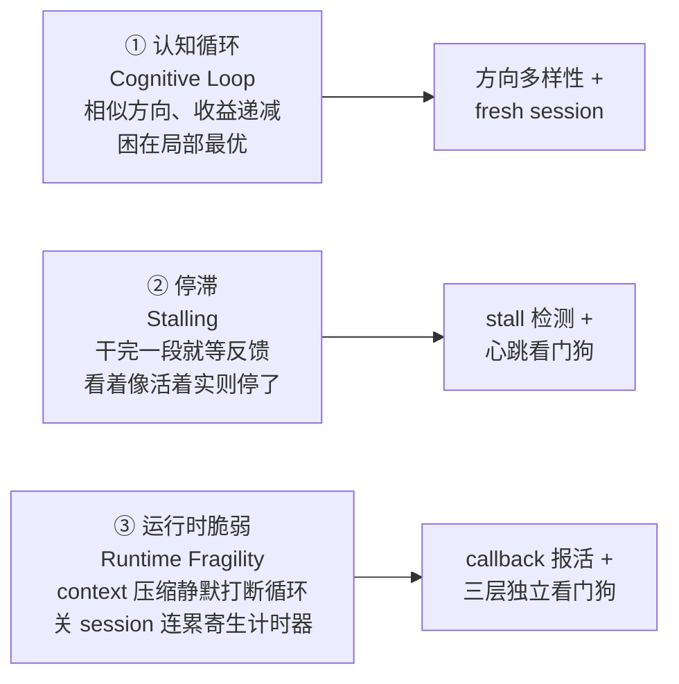

# Deli_AutoResearch：长时间自主任务的协议框架（Victor Chen）

> 原始作者：Victor Chen · 项目：Deli_AutoResearch（个人 GitHub Pages）
> 形态：一个**自包含的 SKILL.md 协议框架**，ship no code，纯约定
> 本 wiki 摄取日期：2026-06-21
> 性质说明：这是**个体经验型框架**，不是同行评议论文或大公司工程实践。它的 validation 是作者**框架内自评**（multi-persona simulated review），作者自己也诚实标注"只纵向可比、捏造引用源于 LLM 本身、职责分离靠协议约束而非模型自觉"。价值在于：它把"长时间自主 agent 怎么不停摆"这一工程问题，拆成了一套**可复用的协议约定**，与 wiki 已有的 [[Autonomous AI System]]、[[Agent Harness 治理协议]]、[[wow-harness]] 同一谱系但互补。

## 核心判断

Deli_AutoResearch 的中心论点：**长时间自主 agent 的失效，根因是缺少工程脚手架（engineering scaffolding），而不是模型能力不足。** 它 ship 任何代码，而是规定一套从实战失败中归纳出的约定：状态怎么持久化、停滞怎么检测、看门狗怎么分层、什么约束绑定 agent 行为。

框架针对三种实证失效模式，每个机制都对准其中一种：



> 关键观察：**停滞（stalling）比崩溃更常见。** 运行日志显示，agent 干完一段、输出摘要、然后等用户反馈——外部看 session 还活着、polling 还在跑，但活儿已经停了。这与 [[Autonomous AI System]]"永不停摆"原则、[[Agentic Laziness]]"过早宣布完成"是同一族问题，但切面不同（这里是**长时间单 agent 自主运行**，不是 dynamic workflow 多 agent 编排）。

## 五条行为约束（硬规则）

每条都由一次真实失败归纳而来：

| 约束 | 内容 | 命中的反模式 |
|------|------|-------------|
| **i. 零交互** | 运行期绝不向用户提问：不用 Plan Mode、不用 question 工具、不以提问收尾。自己消解歧义并把推理写入日志（`level=decision`） | 长跑任务中途等人，等于停滞 |
| **ii. Ready 即执行** | 准备好就该执行；提交/重提/修复/启动监控都是例行操作，无需确认。最常见的隐性违规是"准备全做完然后问要不要提交" | [[Agentic Laziness]] 的变体——把"等确认"当完成 |
| **iii. Callback 即报活** | context 压缩后循环会静默死亡；每个 callback 的第一个动作是更新自己的 `last_seen`，再查存活性，失败立刻重启并记日志 | 运行时脆弱的直接对治 |
| **iv. 状态持久化到文件** | 所有进度写进 `state/` 文件，而非对话记忆；每轮迭代起全新 session，只注入策展过的状态，**永不 resume** | context 累积是认知循环的主因 |
| **v. Guardian/Worker 分离** | 心跳巡检对**非自己的任务**只能做三件事：存活性检查、重启、轻推（nudge）。不读数据、不改状态、不代为汇报 | 一次巡检越界进入别的任务，导致上下文污染、汇报漂移、并发写风险 |

> 第 v 条与 [[Agent Harness 治理协议]] 的"双层验证（验证者无写权限）"和 [[Worker Verifier 对抗循环]] 的角色分离同源——**治理靠结构约束，不靠模型自觉**。作者明确：去掉约束，越界行为就会回来。

## 架构：orchestrator + 每 task 独立 fresh session

三个核心决策：
1. **执行与评估分离** —— 干活的 agent 不评判自己的进度；停滞与否由编排层按定量指标判定。
2. **fresh session 优于 resume** —— context 累积是认知循环的主因；每轮迭代用全新 context，状态经文件注入。
3. **强制方向多样性** —— 每轮迭代前读取已尝试方向列表，新方向必须与历史全部不同。

这与 Agent Harness 治理协议"无状态 session + 上下文胶囊"、[[wow-harness]] 的事件驱动完全一致，但 Deli 把"为什么不能 resume"讲得更直白：**resume 等于继承前一个 session 的偏见。**

## 状态文件系统

每任务一套 state + log 目录，三类进程各写独立日志流，调试无需跨文件关联：

```
{task}/state/
├── task_spec.md           # 目标 / 里程碑 / 成功标准
├── progress.json          # {iteration, status, stale_count, ...}
├── findings.jsonl         # 累积发现（append-only）
├── directions_tried.json  # 已尝试方向（多样性依据）
└── iteration_log.jsonl    # 每轮摘要

{task}/logs/
├── work.jsonl             # 工作 agent；决策标 level=decision
├── orchestrator.jsonl     # 编排器
└── heartbeat.jsonl        # 心跳看门狗
```

日志行格式：`{"ts","source","level":"info|warn|error|decision","event","detail"}`

> 这套文件系统与 [[ESAA]] 的 append-only event store、Agent Harness 治理协议 的事件时间线同构——**append-only JSONL 作为唯一真相源**。`level=decision` 字段把"自主决策留痕"做成了机械步骤，呼应 Autonomous AI System"状态文件 = 唯一真相源；交班产出人话汇报"。

## Stall 检测与 pivot

| 机制 | 规则 |
|------|------|
| 停滞检测 | 一轮 0 新发现 或 指标下降 → `stale_count + 1` |
| 强制 pivot | `stale_count ≥ 2` → 改**结构性约束**而非战术参数；`≥ 4` → 标记人工介入 |
| 方向多样性 | 新方向必须与所有已尝试方向不同；停滞后注入扰动（从相反假设出发、找结构相似的跨域案例） |
| 轮次上限 | 单个工作 session 上限 15 轮或 30 分钟 |

**"pivot 结构，不要 pivot 战术"**（来自实践）：当一个任务在某个框架内反复停滞，决定性的增益通常来自**修正环境/结构性约束本身**，而不是在现有框架里更使劲地调战术参数。停滞两次就该质疑环境，而不是朝一个方向更深的挖。

> 与 Autonomous AI System"意外处理矩阵 + 永不停摆"互补：阳志平讲"单条卡住跳下一条"（横向绕行），Deli 讲"同一任务内改框架"（纵向 pivot）。两者合起来才是完整的停滞对策。

## 心跳看门狗（三层）

业务循环本身不可靠，需要一层**独立的守护层**。三层互相检查，任一层死掉都能被另一层检测并恢复。详见 [[Heartbeat Watchdog]]。

| 层 | 形态 | 依赖 | 职责 |
|----|------|------|------|
| **L0** | 常驻 shell guard | 不依赖任何 session | 心跳时间戳陈旧 > 2h → 经 headless agent 拉起紧急巡检 |
| **L1** | durable 定时任务（每小时） | 依赖一个活着的交互 session | 检查每个 loop 的 `last_seen`、重启超时 loop、检测停滞并 nudge |
| **L2** | 业务循环 | 各自独立 session | 每个 callback 首行更新自己的 `last_seen` |

停滞阈值：进度超过 2h 无更新 **且** 最后输出是一个问题 → 判定停滞，启动 nudge 子 agent；连续 3 次 nudge 无进展 → 判定结构性卡死，停止 nudge 并以新方向重开。2h 阈值**故意**短于 4h 的 stuck-task 阈值——停滞是自愿停止，修起来便宜，值得更早抓。

> 三层互检是对 Autonomous AI System 技巧 10（看门狗）的工程化深化：阳志平只提"CronCreate + 定时读状态文件"，Deli 给出了"为什么要三层、为什么 L0 不能依赖 session、为什么 L1 依赖一个活 session"的失效链推理。这是 Deli 对 wiki 最独有、最可独立复用的增量，故单独成概念页 [[Heartbeat Watchdog]]。

## 四种 subagent 调度模式

| 模式 | 用途 | 关键点 |
|------|------|--------|
| **A 目标驱动** | 研究迭代 | 注入已试方向，要求可验证发现，写回 `findings.jsonl` |
| **B 并行探索** | 复杂子问题 | 一条消息里 fire 多个 agent：调查 / 反驳 / 跨域类比 |
| **C 实验运行** | 长计算任务 | 提交后立即起分钟级轮询：自动诊断错误、修复、重提 |
| **D 验证** | 迭代后 QA | 独立子 agent 审计发现的证据链 |

子 agent 提示词应包含：背景、可验证交付物、工作目录、文件/行数上限、完成标准。

> 模式 B（investigation / refutation / cross-domain 并行）与 [[Worker Verifier 对抗循环]]、Autonomous AI System"多视角对抗式自检"同源；模式 C 的"提交后立即轮询"是 [[Multi-Agent 协作模式]] 里长任务编排的具体落地。

## 六条工程约束

由实战失败的 meta-learning loop 归纳；违反它们经验性地导致停滞或回退：

1. 每轮迭代**最多 5 个大文件**；单文件不超过 300 行。
2. 状态经文件注入，而非对话历史。
3. **验证（测试/编译/check）必须在迭代间运行。**
4. 引用类内容**每 20 条验证一次**，绝不攒批。
5. 有多个候选方向时，**优先增加多样性**而非朝一个挖更深。
6. 不可解的外部依赖失败必须升级（完整报告 + 通知 owner + 轮询回复）；**绝不静默放弃**。

> 第 4 条"每 20 条机械验证引用"是对 LLM 捏造引用的对治——作者诚实承认"捏造源于 LLM 本身，框架把外部检查变成机械步骤，但**不消除错误源**"。第 6 条"绝不静默放弃"与 Autonomous AI System"永不停摆"形成张力：单条可绕行，但不可解的系统性失败必须上浮，不能假装没发生。

## Validation 与诚实标注的 limits

框架承载过若干异构长程任务，论文写作赛道产出（页数 / 引用 / 框架内自评）：

| 论文 | 页数 | 引用 | 自评 |
|------|------|------|------|
| Autonomous Research Agents | 59 | 228 | 8.0 |
| Continual Learning | 65 | 326 | 8.0 |
| Long-Horizon Decision-Making | 55 | 384 | 8.0 |
| Self-Play（285B RL 实验 + 理论加固） | 75 | 217 | 8.6 |

**limits（作者自标，值得学习）**：
1. 分数来自框架内 multi-persona 模拟评审，**只纵向可比**，不是外部质量声明。
2. 最长连续运行 **72 小时**，期间 6 次方向性人工输入——**零运维介入，保留方向性介入**。
3. 捏造引用和数据伪影源于 LLM 本身；框架把外部检查变成流程里的机械步骤，**不消除错误源**。
4. 职责分离靠**协议约束**而非模型自觉；去掉约束，越界行为就回来。

> 这种"哪些能当结论、哪些只是机械补救"的诚实标注，与 [[Agentic Code Review]] 评审里"证据自标"、[[FDE 深度分析 v4：AI 能力悬置时代的现场工程组织接口]] 的证据分级同属高质量分析的特征。"72h 零运维介入 + 6 次方向介入"这一数据点，为 Autonomous AI System 的"持续运行时长"衡量标准提供了一个具体可比样本（对照阳志平的 3h 稳定 / 9h / 36h+）。

## 与现有 Wiki 概念的关联

| Deli 内容 | Wiki 对应 |
|-----------|----------|
| 零交互协议 | Autonomous AI System"人介入点前置"的激进版——运行期完全不交互，把所有介入压到开工前 |
| Callback 报活 + 三层看门狗 | Heartbeat Watchdog（本批次新建）；补强 Autonomous AI System 技巧 10 |
| 状态持久化到文件 + append-only JSONL | [[ESAA]] Event Sourcing、Agent Harness 治理协议 事件时间线 |
| Fresh session over resume + 上下文胶囊 | Agent Harness 治理协议 无状态 session、wow-harness 上下文胶囊 |
| Guardian/Worker 分离（巡检三权限） | Agent Harness 治理协议 双层验证（无写权限）、Worker Verifier 对抗循环 角色分离 |
| 停滞 > 崩溃 | Agentic Laziness、[[Goal Drift]]（不同切面：长跑单 agent vs 多 agent 编排） |
| 模式 B 并行（调查/反驳/跨域） | Worker Verifier 对抗循环、Autonomous AI System 多视角对抗自检 |
| Pivot 结构非战术 | Autonomous AI System 意外处理矩阵（横向绕行）的纵向补充 |
| 引用每 20 条机械验证 | [[Agent Macro Evaluation]] 机械验证导向 |
| 职责分离靠约束非自觉 | [[Dive into Claude Code（论文）]]"套具比模型重要"（98.4% 基础设施）|

## 关键洞察

1. **停滞比崩溃常见**——长跑任务最大的敌人是"看着活着实则停了"，而非报错崩溃。对策是机械的 stall 检测，不是更强的模型。
2. **看门狗必须独立、且分层**——业务循环自己不可靠，单层看门狗会随 session 一起死。三层（L0 不依赖 session / L1 依赖活 session / L2 业务自报）任一死掉都能被另一层救回。
3. **Resume 是认知循环的主因**——每轮起 fresh session、状态经文件注入，是比"接着上次干"更稳的长期策略。
4. **pivot 结构，不要 pivot 战术**——反复停滞时，收益来自改框架/环境，不是在同一框架里调参数。
5. **治理靠结构约束，不靠模型自觉**——作者明确"去掉约束越界就回来"，这与 wow-harness / ESAA / 治理协议的判断一致：纪律要物理化，不能停留在 prompt 层"建议自检"。
6. **诚实标注 limits 是框架可信度的一部分**——自评只纵向可比、捏造源在 LLM 本身、职责分离靠协议——这些坦白反而让框架可被批判性地采纳。

## 术语表

| 术语 | 定义 |
|------|------|
| 认知循环（cognitive loop） | 连续迭代尝试相似方向、收益递减，无法自行逃出局部最优 |
| 停滞（stalling） | agent 干完一段、输出摘要、等反馈；外部看 alive，实则停工 |
| 运行时脆弱（runtime fragility） | context 压缩静默打断循环；关 session 连累寄生计时器 |
| 零交互（zero interaction） | 运行期不向用户提问，自己消解歧义并写入 decision 日志 |
| Guardian/Worker 分离 | 心跳巡检对非己任务只能：存活性检查 / 重启 / nudge |
| stall detection | 一轮 0 新发现或指标下降 → stale_count+1 |
| pivot structure not tactics | 停滞时改结构性约束，而非调战术参数 |
| 心跳看门狗三层 | L0 常驻 shell guard / L1 durable cron / L2 业务循环，互相检查 |
| nudge | 检测到停滞时启动的轻量子 agent，注入 task_spec 和 progress 续干 |

## Related

- Heartbeat Watchdog — 三层看门狗的独立概念页（本批次新建）
- Autonomous AI System — 同谱系的中文视角（阳志平 12 技巧），本 summary 大量交叉印证
- Agent Harness 治理协议 — 跨 session 治理层，Deli 是其"长时间运行续航"侧的工程化补充
- ESAA — append-only event store 的学术版本
- wow-harness — 治理协议的工程实现
- Worker Verifier 对抗循环 — 模式 B 并行探索的角色分离参照
- Agentic Laziness / [[Goal Drift]] — 失效模式切面对照
