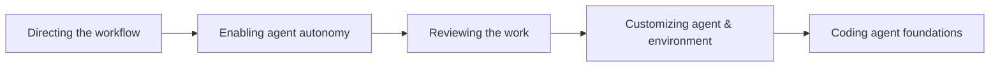

# Andrew Ng AI Engineering Skills Map（5 篇）

> 原始来源：[The Batch / Andrew's Letters](https://www.deeplearning.ai/the-batch/tag/letters) — Andrew Ng 五封信，2026-08-14 ~ 2026-09-11
> 摄取日期：2026-09-14 · 抓取方法：WebFetch（markdown 转换）+ 清理脚本 `scripts/_clean_andrew_ng.py`
> 论点反哺 [[Claude Code Skills]]、[[Claude Code Loops]]、[[Agent Runtime]]、[[Agent Macro Evaluation]]、[[Eval-Driven Development]]（Madhuguru 系列对照）、[[Thin Harness, Fat Skills]]、[[Andrew Ng AI Engineering Skills Map (5 篇)|Shaping the Build]]。

## 摘要

Andrew Ng 基于 10,000+ 招聘数据 + 数十次专家访谈 + 问卷调查，**自顶向下**合成 AI 工程师的**四大顶层技能 + 每项 4-6 个子技能**的"技能地图"。该框架不是教程，是**技能优先级图谱**——他强调"技能"（所有开发者都要会的）而非"角色"（AI engineer title），与"全栈开发者"在云时代的普及是同一逻辑。

**系列全景**：

| Part | 日期 | 顶层技能 | 子技能 |
|------|------|---------|--------|
| 1 | 2026-08-14 | 四大顶层总览 | Building & deploying AI · Software engineering fundamentals · Using coding agents · Shaping the build |
| 2 | 2026-08-21 | **Building & deploying AI applications** | LLM foundations · Grounding with data · Building agentic systems · **Evaluation-driven development** · Operating in production · ML foundations |
| 3 | 2026-08-28 | **Software engineering fundamentals** | Building full-stack apps · Managing data · Designing system architectures · Making systems secure & reliable · Scaling & operating in production |
| 4 | 2026-09-04 | **Using coding agents** | Directing the workflow · Enabling agent autonomy · **Reviewing the work** · Customizing the agent and its environment · Coding agent foundations |
| 5 | 2026-09-11 | **Shaping the build** | Driving the build loop · Making product decisions · Communicating and leading · High-agency ownership |

## 核心论点（按顶层技能）

### 1. Building & deploying AI applications（Part 2）

Ng 的核心论断：**AI 应用与非 AI 软件的本质差异 = 输出不可预测**。结果，传统软件的"先规划再实现"工作流被打破——AI 工程必须**反复构建、检验、决定下一步**，强迭代。他把这个迭代引擎的核心抽象为 **eval-driven development loop**（与 Madhuguru 系列[[Eval-Driven Development]] 同源）。

六个子技能按工程深度递进：

```text
LLM foundations → Grounding with data → Building agentic systems
  → Evaluation-driven development → Operating in production → ML foundations
```

**Eval-driven 子技能（Ng 自评"最区分优秀 AI 工程师"的特征）**：
- 看系统 trace + 产出，做 exploratory data analysis
- 综合产品/业务洞察决定**测什么**
- 知道菜单：何时用确定性（code-based）/ LLM-as-judge / 人类 in loop / hybrid
- 知道**如何评估你的 evals**——避免 evaluator 失真

**Agentic systems 子技能**：在 workflow（预定 LLM 调用链）与 agent harness（LLM 反复自决下一步）之间选型；agent 内部决定工具集（含 MCP/CLI/sandbox）、memory 架构、context 管理、何时升级到 multi-agent；从 prototype 到 production 要叠加 guardrails / 对抗输入 / data exfiltration 防护 / 治理。

### 2. Software engineering fundamentals（Part 3）

Ng 论断：**即使让 agent 写所有代码，理解软件工程基础仍是必要的**——原因不是记忆语法，而是**知道 tradeoffs 存在**。不懂 tradeoffs 的"vibe coder"会让 agent 选错 latency / availability / consistency / reliability / maintainability / cost。

五个子技能 = 经典软件工程 + AI 时代的偏移：

| 子技能 | AI 时代新增点 |
|--------|--------------|
| Full-stack | 单一开发者覆盖前端+后端（agent 帮忙填不熟的部分）；理解 UI / 缓存 / 渲染 / API / 鉴权 / 状态 / 异步 / 持久化 / 测试 / 安全 / 可访问性 |
| Managing data | "**给 agent 的数据架构**" 是新方向——数据架构选错，agent "不知道 what it doesn't know" |
| System architecture | 选型必须**随项目阶段动**——prototype / first production / scale 不同 |
| Secure & reliable | "shift left" 安全 + AI 漏洞扫描 / 依赖供应链审查 / 云配置 attack surface |
| Scaling & operating | release strategy、CI/CD、IaaS、observability、incident response、technical debt |

### 3. Using coding agents（Part 4）

Ng 给出**通用高层 workflow**——Planning → Execution → Deploy/monitor，每步都可在 project 间缩放/跳过/反向回溯迭代。**与编码 agent 合作的关键技能**：



| 子技能 | 关键决策点 |
|--------|-----------|
| **Directing the workflow** | 多少人工/agent effort；何时回上一步；研究/规划前置多少；spec 写多细；拆多少 verifiable step |
| **Enabling agent autonomy** | 实时交互 vs 大块委托 vs 设目标 loop；何时让多个 agent 并行；如何 gate 权限 |
| **Reviewing the work** | behavioral vs functional verification；test 自动化比例；agentic code review；人审 vs 自动化；screenshot 验证；**LLM-as-judge for qualitative** |
| **Customizing agent & environment** | Skills / plugins / MCP servers / hooks / AGENTS.md / CLAUDE.md / 多 session state / 团队内跨开发者 agent 协调 |
| **Coding agent foundations** | 理解 agent 黑盒——retrieval / context window / tool call / MCP 副作用 / subagent 互动 / harness 内部；识别 overengineering / 缺验证 / 提前终止 / 破坏性动作 |

Ng 的反 hype 提醒：**长 horizon autonomous task（数小时 / 数百万 token）的实际效用被社交媒体放大**——多数有效用法仍是"高度迭代 + 高判断力干预"。

### 4. Shaping the build（Part 5）

Ng 论断：**给定清晰 spec，coding agent 越来越胜任；工程师的工作从"按 spec 实现"转向"决定 spec 里写什么"**。PM / designer / engineer 的角色边界在模糊。

四个子技能：

| 子技能 | 关键点 |
|--------|--------|
| **Driving the build loop** | "写 → 反馈 → 下一步" 循环 = 工程师核心；决定何时建 prototype vs MVP vs enterprise-grade；ship in small batches；何时收集用户反馈 vs 跑技术实验 |
| **Making product decisions** | 不一定要当 PM，但要能"在没有 spec 时写出 spec"；产品 sense + 基本 design sense + 基本 business sense（go-to-market / 市场规模 / unit economics / P&L） |
| **Communicating and leading** | 跨职能（市场/财务/法务）协作；向上下说明 AI 边界 |
| **High-agency ownership** | 在"上级的 AI 认知"还没追上时主动识别机会 + 提案 + 执行；end-to-end 拥有 + 对结果问责 |

## 与本 Wiki 的关联

| Ng 框架 | 反哺 / 对照 Wiki 概念 |
|---------|---------------------|
| **Eval-driven development**（Part 2 子技能 4）| 与 [[Eval-Driven Development]]（Madhuguru 10 篇）同源；与 [[Agent Macro Evaluation]]（OpenAI 聚类诊断）互补；与 [[Agent Evaluation Methodology]]（Anthropic 元方法论）正交 |
| **Building agentic systems**（Part 2 子技能 3）| 反哺 [[Agent Runtime]]、[[Multi-Agent 协作模式]]、[[Claude Code Dynamic Workflows Practical Guide]]、[[Claude Code Loops]] |
| **Using coding agents**（Part 4 整体）| 反哺 [[Claude Code Skills]]（customizing agent）、[[Claude Code Subagent]]（agent autonomy）、[[Thin Harness, Fat Skills]]（Ng 的"Coding agent foundations" ↔ Thin harness） |
| **Customizing agent & environment**（Part 4 子技能 4）| 反哺 [[Claude Code Skills]]、`CLAUDE.md` / AGENTS.md 实践；与 [[Harness Cybernetics]] 的"前馈 Guides"对偶 |
| **Reviewing the work**（Part 4 子技能 3）| 反哺 [[Agentic Code Review]]（Addy Osmani）、[[Worker Verifier 对抗循环]]（"human on the loop + automated verification"） |
| **Software engineering fundamentals**（Part 3 整体）| 反哺 [[Agent Runtime]] 的 98.4% 基础设施法则（[[Dive into Claude Code（论文）]]）；强调"vibe coder vs skilled engineer"差异 = "懂 tradeoffs 的人才有真正的判断力" |
| **Shaping the build**（Part 5 整体）| 反哺 [[Forward Deployed Engineering]]（高 agency + 客户/用户 empathy）；与 [[Meta Reflection Techniques]] 的"反馈象限"同向 |

## 关键洞察

1. **"技能"比"角色"对**：Ng 拒绝谈"AI engineer 角色"（会被限定为单一职业路径），而谈"AI engineering 技能"（所有开发者都要会）——这与 Karpathy 的 llm-wiki 模式"wiki 不是产品，是底座"同一思路。
2. **四大顶层技能的内部权重不均**：Ng 反复强调"Using coding agents"**演化最快**（harness 和模型同步迭代）、"Shaping the build"**最反直觉**（产品 sense + business sense 进入工程师核心素养）。其余两个（AI 应用 + 软件基础）相对稳定。
3. **Ng 的 spec-driven 视角与 OpenAI / Anthropic 的 harness-driven 视角互补**：Ng 假设 spec 已经写好；OpenAI / Anthropic 把 spec 生成 + 迭代纳入 harness。本 wiki 现有的 [[Claude Code Dynamic Workflows Practical Guide]]、[[Thin Harness, Fat Skills]] 同时涵盖两个视角。
4. **Ng 提醒的长 horizon 反 hype**：与 [[Trajectory Handoff]] 的"first-edit gate"（绝望 → cheating 暴跌）和 [[Agent Reliability vs Capability]] 的"frontier model meltdown rate 更高（MOP paradox）"形成跨源呼应——三者都说"长 horizon autonomous ≠ 越长越好"。

## 抓取与限制

- 5 篇通过 DeepLearning.AI 文章直链抓取
- Part 2 直链 typo（`he-` 而非 `the-`），已通过索引页交叉验证
- WebFetch markdown 转换保留 "Dear friends" / "Keep building!" 信件风格——刻意保留（Ng 写作风格）
- 图片仅保留 URL 引用，未下载 / 嵌入
